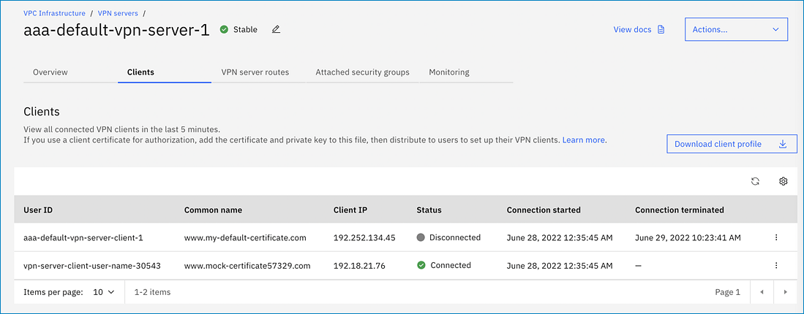

---

copyright:
  years: 2021, 2022
lastupdated: "2022-07-07"

keywords:

subcollection: vpc

---

{{site.data.keyword.attribute-definition-list}}

# Disconnecting VPN clients
{: #vpn-client-to-site-connections}

Connections are VPN sessions that are established by VPN clients. After a VPN client connects to the VPN server, you can view all VPN clients that connected to the server in the last hour. VPN client information includes the client IP, user ID, status, remote IP, remote port, and session start/end time (if applicable).

## Disconnecting VPN clients in the UI
{: #vpn-client-to-site-ending-connections}
{: ui}

To disconnect a VPN client from the VPN server, follow these steps:

1. Navigate to the [VPNs for VPC](https://cloud.ibm.com/vpc-ext/network/vpngateways){: external} page and click the **Client-to-site servers** tab.
1. Click the name of the VPN server to display its details.
1. Click the Clients tab to view VPN clients that connected in the last 5 minutes.
1. Click the Actions menu  next to the client that you want to disconnect, then click **Disconnect**. The disconnected VPN client is automatically deleted after one hour.

   {: caption="VPN clients" caption-side="bottom"}

   You can also specify to **Delete** the VPN client, which deletes the client session immediately.
   {: note}

## Disconnecting VPN clients from the CLI
{: #vpn-client-to-site-ending-connections-cli}
{: cli}

Before you begin, [set up your CLI environment](/docs/vpc?topic=vpc-set-up-environment&interface=cli).

To disconnect a VPN client from the CLI, enter the following command:

The disconnected VPN client is automatically deleted after one hour. To automatically delete a VPN client, use the **ibmcloud is vpn-server-client-delete** command.
{: note}

```sh
ibmcloud is vpn-server-client-disconnect VPN_SERVER_ID (CLIENT_ID1 CLIENT_ID2 ...) [-f, --force] [-q, --quiet]
```
{: pre}

Where:

- **VPN_SERVER_ID**: is the ID of the VPN server.
- **CLIENT_ID1**: is the ID of the VPN route.
- **CLIENT_ID2**: is the ID of the VPN route.
- **--force, -f**: is the force operation without confirmation.
- **--quiet, -q**: suppresses verbose output.

For example:

```sh
ic is vpn-server-client-disconnect r006-46ca4654-fe57-431c-9f5a-1c82773b6e83 86b1f0cc-6e83-45e5-bd78-1bef291be6e7
This will disconnect VPN client 86b1f0cc-16b0-45e5-bd78-1bef291be6e7 and cannot be undone. Continue [y/N] ?> y
Disconnect VPN client 86b1f0cc-16b0-45e5-bd78-1bef291be6e7 under account IBM as user terry@ibm.com...
OK
Disconnection request for VPN client 86b1f0cc-6e83-45e5-bd78-1bef291be6e7 has been accepted.
```
{: screen}

## Disconnecting VPN clients with the API
{: #vpn-client-to-site-ending-connections-api}
{: api}

To disconnect a VPN client with the API, follow these steps:

The disconnected VPN client is automatically deleted after one hour.
{: note}

1. Set up your [API environment](/docs/vpc?topic=vpc-set-up-environment#api-prerequisites-setup) with the right variables.

1. Store any additional variables to be used in the API commands; for example:

   ```sh
   export vpnServerID=<your_vpn_server_id>
   export vpnClientID=<your_vpn_client_id>
   ```
   {: pre}

1. When all variables are initiated, disconnect the VPN client:

   ```sh
      curl -X POST "$vpc_api_endpoint/v1/vpn_servers/$vpnServerID/clients/$vpnClientID/disconnect?version=$api_version&generation=2" \
        -H "Authorization: $iam_token"
   ```
   {: codeblock}
