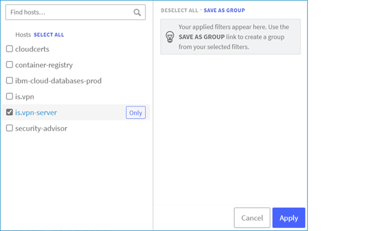

---

copyright:
  years: 2021
lastupdated: "2021-08-26"

keywords:

subcollection: vpc

---

{:shortdesc: .shortdesc}
{:codeblock: .codeblock}
{:screen: .screen}
{:important: .important}
{:new_window: target="_blank"}
{:pre: .pre}
{:tip: .tip}
{:beta: .beta}
{:note: .note}
{:table: .aria-labeledby="caption"}
{:download: .download}

# Using IBM Log Analysis to view VPN server logs (Beta)
{: #client-vpn-log-analysis-c2s}

Client VPN for VPC is available to all IBM Cloud users. After the Beta period ends, you will be given a time period to migrate your VPN servers to the standard pricing plan to avoid disruption of service.
{: beta}

You can use {{site.data.keyword.la_full}} to view application and client logs from your {{site.data.keyword.cloud}} {{site.data.keyword.vpn_vpc_short}} server.
{: shortdesc}

## Before you begin
{: #log-analysis-preparation-c2s}

To initiate sending VPN logs to {{site.data.keyword.la_full_notm}}, you need the following first:

* An {{site.data.keyword.la_full_notm}} instance (log retention is recommended)
* A VPN server

   After the VPN server gets provisioned, note the ID and region.
   {: tip}

## Sending VPN logs to {{site.data.keyword.la_full_notm}} by using the UI
{: #sending-vpn-logs-c2s}
{: ui}

To send {{site.data.keyword.cloud_notm}} {{site.data.keyword.vpn_vpc_short}} logs in to an instance of {{site.data.keyword.la_full_notm}}, follow these steps:

1. From the {{site.data.keyword.cloud_notm}} console, click the **Menu** icon  &gt; **Observability** to access the Observability dashboard.
1. Select **Logging**. The list of logging instances appears.
1. Click **Options** &gt; **Edit platform**.
1. Select the region where the VPN server is provisioned and the logging instance that the logs should be sent to. This ensures logs from all VPN servers in the selected region are sent to the chosen logging instance.
1. Confirm that you want to stop receiving platform logs to the previous region.
1. Click **Select**.

## Viewing VPN server logs in {{site.data.keyword.la_full_notm}}
{: #viewing-vpn-logs-c2s}

To view the {{site.data.keyword.cloud_notm}} {{site.data.keyword.vpn_vpc_short}} server logs in the {{site.data.keyword.la_full_notm}} instance:

1. Open the {{site.data.keyword.la_full_notm}} instance dashboard.
1. Apply the source filter for **is.vpn-server** to filter logs from {{site.data.keyword.vpn_vpc_short}}.
1. Click the **Sources** filter menu.

   

1. Click **Apply**.

Additionally, you can enter the VPN server ID in the Search field to filter the logs specific to a VPN server.
