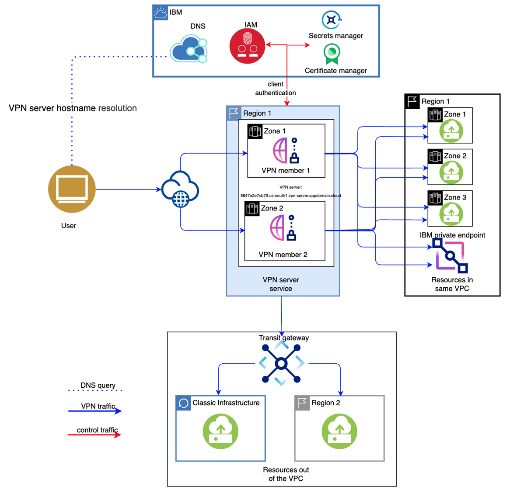
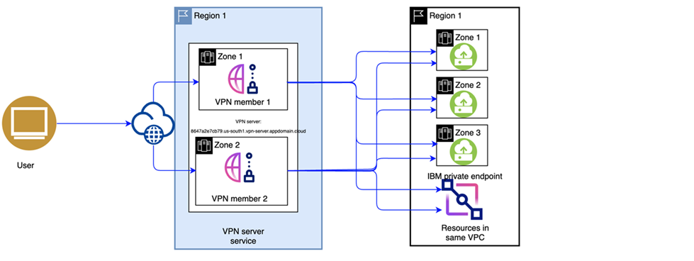
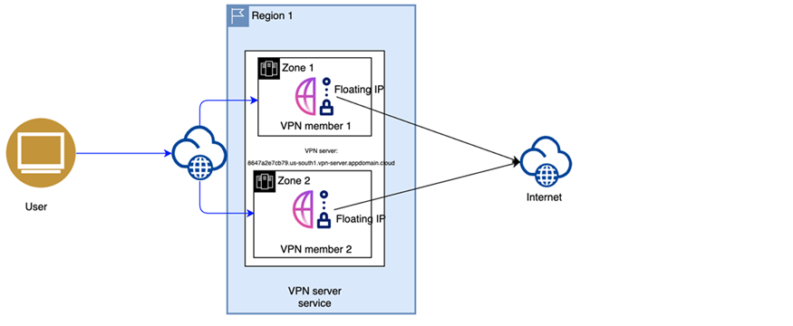
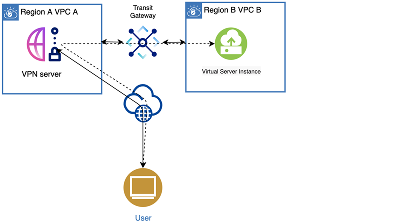
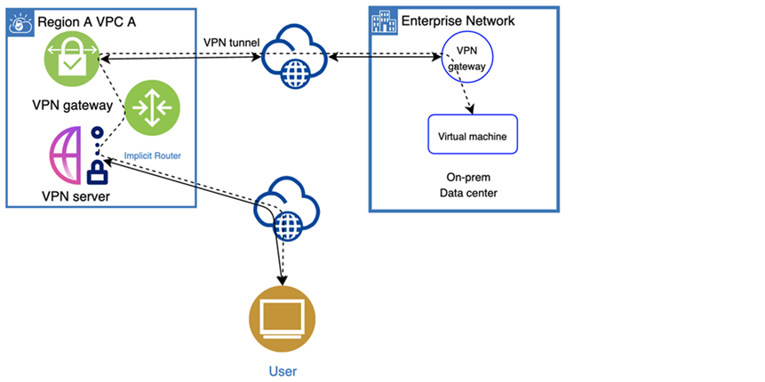

---

copyright:
  years: 2021, 2024
lastupdated: "2024-07-08"

keywords:

subcollection: vpc

---

{{site.data.keyword.attribute-definition-list}}

# About client-to-site VPN servers
{: #vpn-client-to-site-overview}

Client VPN for VPC provides client-to-site connectivity, which allows remote devices to securely connect to the VPC network using an OpenVPN software client. This solution is useful for telecommuters who want to connect to the IBM Cloud from a remote location, such as a home office, while still maintaining secure connectivity.

Highlights include:

* TLS 1.2/1.3-based secure/encrypted connectivity over the internet
* Supports both stand-alone (pilot) and high availability (production) deployments
* Privately interconnect Classic IaaS and VPCs on IBM Public Cloud
* Availability in all [MZRs world wide](/docs/vpc?topic=vpc-creating-a-vpc-in-a-different-region)
* High availability spanning across zones, providing better performance and resiliency
* Provides added layers of security with integrated authentication methods

## Architecture
{: #vpn-client-to-site-architecture}

Figure 1 illustrates an example VPN server setup to connect resources in and out of the VPC. The VPN server is provisioned on two subnets within a user's VPC. There are also two VPN server members that work in Active/Active High Availability (HA) mode. All of the VPN server members can communicate with target resources. There is one public IP address assigned to each of the members, and a DNS hostname record is created for the VPN server. The hostname is resolved to the VPN member's public IP address. VPN clients get two public IP addresses via DNS resolution and try two IP addresses randomly to connect with one of the VPN members. The VPN client attempts to reconnect and switch to an active VPN server member if one member is down.

A DNS service is deployed as part of the VPN service. The DNS name provided ends with `appdomain.cloud`.
{: note}

{: caption="Figure 1. Client-to-site VPN server architecture" caption-side="bottom"}

## Getting started
{: #vpn-client-to-site-getting-started}

To get started using Client VPN for VPC, follow these steps:

1. Review [Planning considerations for VPN servers](/docs/vpc?topic=vpc-client-to-site-vpn-planning).
1. Complete all prerequisites in [Before you begin](/docs/vpc?topic=vpc-vpn-create-server#vpn-client-to-site-prerequisites).
1. Provision a stand-alone VPN server in a subnet, or provision a high availability VPN server in the two subnets. For instructions, see [Creating a VPN server](/docs/vpc?topic=vpc-vpn-create-server).
1. [Create VPN routes](/docs/vpc?topic=vpc-vpn-client-to-site-routes).
1. [Set up a VPN client environment and connect to the VPN server](/docs/vpc?topic=vpc-vpn-client-environment-setup).

## VPN server use cases
{: #vpn-client-to-site-use-cases}

Here are some ways that you can implement the IBM Cloud Client VPN for VPC service:

### Use case 1: Access VPC within a deployed MZR
{: #access-vpc-within-deployed-mzr}

The VPN server is deployed in a selected Multi-zone Region (MZR) and VPC. All virtual server instances are accessible from the VPN client in the single VPC.

{: caption="Figure 2. Network topology: A VPN client can access a virtual server instance within a deployed MZR through the VPN server" caption-side="bottom"}

### Use case 2: A VPN client can access the internet through the VPN server
{: #access-internet-use-case}

When the administrator enforces the VPN server in full-tunnel mode, all traffic from customer devices is sent to the VPN server, including internet traffic. The VPN server forwards the traffic to the internet through the IBM Cloud infrastructure.

{: caption="Figure 3. Network topology: A VPN client can access the internet through the VPN server" caption-side="bottom"}

### Use case 3: Integrating with a transit gateway
{: #integrate-transit-vpn-gateway}

Generally, it is recommended to provision VPC resources in multiple regions for redundancy. To access the resources in all regions from personal devices, one approach is to create one client-to-site VPN server per VPC, per region, and establish the VPN connection to all VPN servers. You must also maintain multiple VPN servers with this approach. This might be an inconvenience, but it is a more secure method. Another approach is to use a transit gateway to connect all these VPCs. As a result, only one VPN server is required to access the VPCs.

{: caption="Figure 4. Network topology: Integrating with a transit gateway" caption-side="bottom"}

When you integrate the client-to-site VPN server with the transit gateway, you must add one or more VPN routes with the destination set to the CIDR of the subnet in other VPCs or classic networks, and set the route action to `Deliver` or `Translate`. For more information, see [Managing VPN routes](/docs/vpc?topic=vpc-vpn-client-to-site-routes).
{: note}

### Use case 4: Integrating with a site-to-site VPN gateway
{: #integrating-with-site-to-site-vpn-gateway}

Integrate with a site-to-site VPN gateway if you want to access your on-premises private network at the same time as when you connect to IBM VPCs. This use case removes the requirement to maintain multiple VPN servers simultaneously. You can access your on-premises private network from a client-to-site VPN server directly.

{: caption="Figure 5. Network topology: Integrating with a site-to-site VPN gateway" caption-side="bottom"}

## Related links
{: #vin-client-to-site-related-links}

* [Quotas](/docs/vpc?topic=vpc-quotas#vpn-server-quotas)
* [Required permissions](/docs/account?topic=account-iam-service-roles-actions#is.vpn-server-roles)
* [Activity Tracker events](/docs/vpc?topic=vpc-at_events#events-vpn-server)
* [VPC CLI reference](/docs/vpc?topic=vpc-vpc-reference#vpn-server-clis)
* [VPC API reference](/apidocs/vpc)
* [FAQs for client-to-site VPN servers](/docs/vpc?topic=vpc-faqs-vpn-server)
* [Troubleshooting client-to-site VPN servers](/docs/vpc?topic=vpc-troubleshooting-authentication-error)
