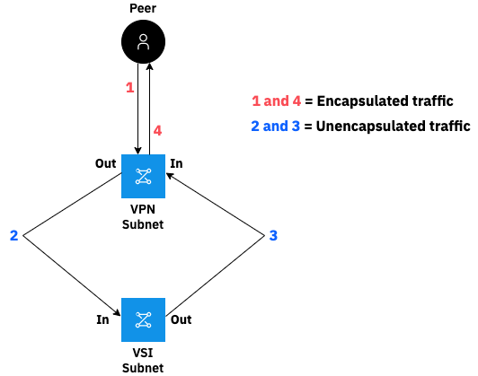

---

copyright:
  years: 2020, 2025
lastupdated: "2025-04-29"

keywords: VPN, network, encryption, authentication, algorithm, IKE, IPsec, policies, gateway

subcollection: vpc

---

{{site.data.keyword.attribute-definition-list}}

# Configuring ACLs for use with VPN
{: #configuring-acls-vpn}

An access control list (ACL) is a built-in, virtual firewall, similar to a security group. In contrast to security groups, ACL rules control traffic to and from the _subnets_, rather than to and from the _instances_.

You can configure ACLs on the VPN gateway's subnet where the VPN gateway is deployed, and other VPC subnets that communicate over the VPN tunnel.

The following diagram illustrates packet flow through VPC network ACLs.

{: caption="Packet flow through VPC ACLs" caption-side="bottom"}

1. Encapsulated, bidirectional traffic flows from the peer gateway to the VPC resources that are a part of the encrypted domain.
1. Unencapsulated packets then leave the VPN subnet and enter the virtual server instance subnet.
1. These unencapsulated packets travel back to the VPN subnet.
1. Finally, the packets return to the peer gateway from the VPN subnet.

If you configure ACLs on the VPN gateway's subnet, make sure that the following rules are in place to allow management traffic and VPN tunnel traffic. For more information, see [Setting up network ACLs](/docs/vpc?topic=vpc-using-acls).

| Inbound/Outbound Rules | Protocol | Source IP | Source Port | Destination IP | Destination Port |
|--------------|------|------|------|------|------------------|
| Inbound | All | Peer gateway public IP[^IP] | N/A | VPN gateway's subnet | N/A
| Inbound | All | On-premises, private CIDR | N/A | VPC CIDR | N/A
| Inbound (optional) | ICMP | Any | N/A | Any | N/A
| Outbound | All  | VPN gateway's subnet | N/A | Peer gateway public IP[^IP2] | N/A
| Outbound | All  | VPC CIDR | N/A | On-premises, private CIDR | N/A
{: caption="Inbound and outbound rules on VPN gateway's subnet" caption-side="bottom"}

If you use ACLs on the VPC subnets that communicate over the VPN tunnel, make sure that ACL rules are in place to allow traffic between virtual server instances in your VPC and the other network.
{: important}

| Inbound/Outbound Rules | Protocol | Source IP | Source Port | Destination IP | Destination Port |
|--------------|------|------|------|------|------------------|
| Inbound | All | On-premises, private CIDR | N/A | VPC CIDR | N/A
| Outbound | All | VPC CIDR | N/A | On-premises, private CIDR | N/A
{: caption="Inbound and outbound rules on VPC subnets" caption-side="bottom"}

[^IP]: Set the source IP to the peer gateway public IP address. This setting allows traffic from the VPC and the on-premises subnets.

[^IP2]: Set the source IP to the peer gateway public IP address. This setting allows traffic from the VPC and the on-premises subnets.

## Rules for VPN traffic using NACLs
{: #rules-vpn-traffic-using-nacls}

There are two types of NACLs: one attached to the subnet where you create the VPN gateway, and the other attached to the subnet where you create the virtual server instance.

### NACL attached to the subnet that you chose to create the VPN gateway
{: #nacl-vpn-gateway}

The following rules apply to NACLs attached to the subnet where the VPN gateway is deployed.

#### Rules scenario 1
{: #rules-1}

Inbound/Outbound Rules|Protocol| Source IP| Destination|
|---------------------|--------|----------|------------|
|Inbound |ALL |Your on-premises gateway public IP|Subnet CIDR that you choose to create the VPN gateway.|
|Outbound |ALL |Subnet CIDR that you choose to create the VPN gateway|Your on-premises gateway public IP.|
{: caption="Allow IPsec protocol packet between the IBM gateway and your on-premises gateway" caption-side="bottom"}

#### Rules scenario 2
{: #rules-2}

Inbound/Outbound Rules|Protocol| Source IP| Destination|
|---------------------|--------|----------|------------|
|Inbound |ALL |Your on-premises subnets|Subnet CIDR that you choose to create the VPC virtual server instance.|
|Outbound |ALL |Subnet CIDR in which you choose to create the VPC virtual server instance|Your on-premises subnets.|
{: caption="Allow traffic between your on-premises private subnet and the VPC subnet where the virtual server instance is deployed" caption-side="bottom"}

#### Rules scenario 3
{: #rules-3}

Allow ICMP traffic to the VPN gateway for troubleshooting. (Optional)

### NACL attached to create the virtual server instance
{: #nacl-vsi}

These rules are the same as those listed in [Table 4](#rules-2).
