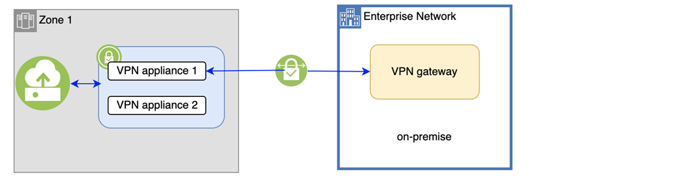
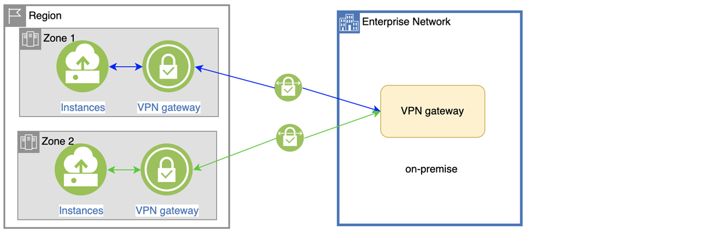

---

copyright:
  years:  2022, 2025
lastupdated: "2025-02-09"

keywords: VPN, vpn gateways, HA, High availability, Redundancy

subcollection: vpc

---

{{site.data.keyword.attribute-definition-list}}

# Understanding high availability for VPN for VPC
{: #vpn-ha}

[High availability](#x2284708){: term} (HA) is the ability for a service to remain operational and accessible in the presence of unexpected failures. 

VPN for VPC is a regional service and you can find the available region and data center locations in the [Service and infrastructure availability by location](/docs/overview?topic=overview-services_region) documentation. As a regional service, VPN for VPC fulfills the defined [Service Level Objectives (SLO)](/docs/resiliency?topic=resiliency-slo) with the Standard plan. The SLO is not a warranty and IBM will not issue credits for failure to meet an objective.

## High availability architecture
{: #ha-architecture-vpn}

This section provides an overview of the high availability architecture for a VPN gateway, starting with a depiction of a single-zone configuration followed by a discussion of a multi-zone region setup for enhanced redundancy and fault tolerance.

### VPN gateway high availability in a single-zone
{: #vpn-ha-in-single-zone}

A VPN gateway is composed of two back-end instances within the same zone to ensure high availability. The VPN service continuously monitors these instances and automatically fails over to the other instance in the event of a failure. Routine maintenance of the VPN is conducted through rolling upgrades of the two back-end instances. During maintenance, the VPN’s private IP address might change, but the public IP addresses remain unaffected, and your VPN connections will automatically switch to the available instance.

{: caption="VPN gateway HA in single zone" caption-side="bottom"}

### VPN gateway high availability in a multizone region
{: #vpn-gateway-ha-in-multiple-zones}

In the event of a network outage in a specific [zone](#x2070723){: term}, you might lose network access to all resources within that zone, including the VPN gateway. To ensure high availability, it is recommended to distribute your workload across multiple zones, with a VPN gateway in each zone, and implement load balancing between zones.

The following diagram illustrates how to distribute your workload across [multizone regions](#x9774820){: term}. ach VPN gateway is dedicated to providing access to the VPC network within the same zone, ensuring resilience and minimizing the impact of localized outages.

{: caption="VPN gateway HA in multiple zones" caption-side="bottom"}
 
