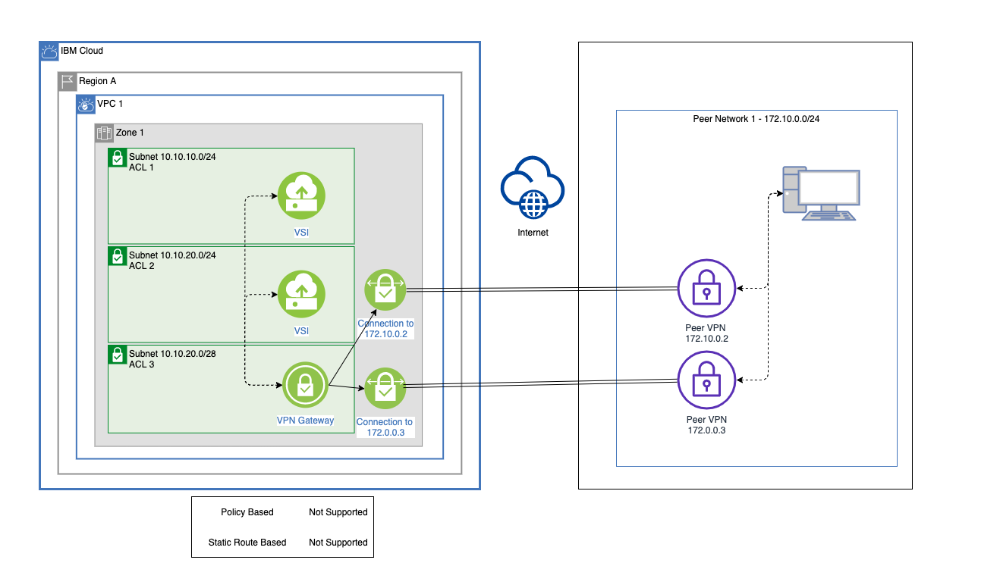

---

copyright:
  years: 2019, 2022
lastupdated: "2022-04-12"

keywords:

subcollection: vpc

---

{{site.data.keyword.attribute-definition-list}}

# VPN gateway limitations
{: #vpn-limitations}

Lists known limitations for IBM Cloud VPN for VPC.
{: shortdesc}

* A VPN gateway for VPC accepts VPN packets with [NAT-Traversal Encapsulation (NAT-T)](https://tools.ietf.org/html/rfc3947){: external} only. The [IP Encapsulating Security Payload (ESP)](https://tools.ietf.org/html/rfc4303){: external} is not accepted. Make sure that the NAT-T feature is enabled on your on-premises VPN device. Also, make sure that UDP ports 500 and 4500 are allowed for both IBM VPC NACL and peer networks.

* When multiple networks, subnets, or both are associated with either an {{site.data.keyword.cloud_notm}} VPN gateway or an on-premises device, avoid mixing policy-based and route-based VPNs. Policy-based VPNs create a tunnel for each target network range. However, route-based VPNs route everything to a peer device through a single tunnel. Therefore, when multiple network ranges are configured, only a single tunnel that is associated with a single-network range can be established. Combining contiguous subnets into a single superset CIDR is a valid workaround to this limitation.

* An {{site.data.keyword.cloud_notm}} static, route-based VPN does not support an AWS route-based VPN as a peer device. Because an {{site.data.keyword.cloud_notm}} custom route does not allow more than one route for a destination using a VPN connection, only one AWS tunnel IP can be used as the peer IP. However, a single AWS tunnel cannot be used to communicate with both active members of an {{site.data.keyword.cloud_notm}} static, route-based VPN, so traffic is disrupted when either side performs maintenance operations causing fail-over from the only active tunnel to the other unusable tunnel.

* Peer subnets of a VPN gateway connection cannot overlap.

* An {{site.data.keyword.cloud_notm}} static, route-based VPN does not support redundant peer devices that are associated with the same set of peer networks. For each peer network, VPC allows only one custom route by using a VPN connection as the next hop. Therefore, all traffic to the designated peer network must be routed through the single peer device that is specified in the VPN connection that is used in the static route.

   {: caption="Figure 1. Redundant peers use case" caption-side="bottom"}

* When connecting a policy-based VPN with a route-based peer (or static, route-based VPN with a policy-based peer), use only a single network range for both sides. A policy-based VPN uses one tunnel for each associated network. However, a route-based VPN requires only a single tunnel. Therefore, a connection between different types of VPNs associated with multiple network ranges on either side might result in a connection that only works for a single-network range.

   {: caption="Figure 2. Mixed VPN Types use case" caption-side="bottom"}

   If possible, combine contiguous subnets into a single network range in a VPN configuration. For example, subnets `192.168.0.0/24` and `192.168.1.0/24` can be defined as `192.168.0.0/23` in a VPN or routing configuration.
   {: tip}

* VPN gateways are supported as the next hop only in the same VPC as the source prefix in the custom routing table. Selecting a VPN gateway as the next hop of a different zone than the source prefix does not work. Though the custom routing table might allow you to select this configuration, it is not supported.

   {: caption="Figure 3. Mixed VPN Types Workaround use case" caption-side="bottom"}

* An {{site.data.keyword.cloud_notm}} policy-based VPN gateway resides in the zone that is associated with the subnet that you select during provisioning. The VPN gateway serves only the virtual server instances in the same zone of the VPC. Therefore, instances in other zones can't use the VPN gateway to communicate with an on-premises private network. For zone fault tolerance, you must deploy one VPN gateway per zone.

* An {{site.data.keyword.cloud_notm}} route-based VPN gateway resides in the zone that is associated with the subnet that you select during provisioning. It is recommended that a VPN gateway serves only virtual server instances in the same zone of the VPC. Instances in other zones can use the route-based VPN gateway to communicate with an on-premises private network, but this is not recommended. For zone fault tolerance, you must deploy one VPN gateway per zone.
