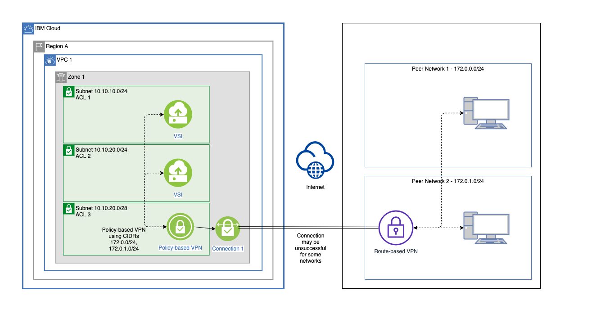

---

copyright:
  years: 2019, 2024
lastupdated: "2024-04-30"

keywords:

subcollection: vpc

---

{{site.data.keyword.attribute-definition-list}}

# VPN gateway limitations and known issues
{: #vpn-limitations}

Lists known limitations and issues for IBM Cloud VPN for VPC.
{: shortdesc}

## Limitations
{: #limitations-vpn-gateway}

* A VPN gateway for VPC accepts VPN packets with [UDP Encapsulation of IPsec ESP Packets](https://datatracker.ietf.org/doc/html/rfc3948){: external} only. The [Encapsulating Security Payload (ESP)](https://datatracker.ietf.org/doc/html/rfc4303){: external} is not accepted. Make sure that the NAT-T feature is enabled on your on-premises VPN device. Also, make sure that UDP ports 500 and 4500 are allowed for both IBM VPC NACL and peer networks.
* When multiple networks, subnets, or both are associated with either an {{site.data.keyword.cloud_notm}} VPN gateway or an on-premises device, avoid mixing policy-based and route-based VPNs. Policy-based VPNs create a tunnel for each target network range. However, route-based VPNs route everything to a peer device through a single tunnel. Therefore, when multiple network ranges are configured, only a single tunnel that is associated with a single-network range can be established. Combining contiguous subnets into a single superset CIDR is a valid workaround to this limitation.
* Peer subnets of a VPN gateway connection cannot overlap.
* When connecting a policy-based VPN with a route-based peer (or static, route-based VPN with a policy-based peer), use only a single network range for both sides. A policy-based VPN uses one tunnel for each associated network. However, a route-based VPN requires only a single tunnel. Therefore, a connection between different types of VPNs associated with multiple network ranges on either side might result in a connection that only works for a single-network range.

   {: caption="Figure 2. Mixed VPN Types use case" caption-side="bottom"}

   If possible, combine contiguous subnets into a single network range in a VPN configuration. For example, subnets `192.168.0.0/24` and `192.168.1.0/24` can be defined as `192.168.0.0/23` in a VPN or routing configuration.
   {: tip}

* An {{site.data.keyword.cloud_notm}} policy-based VPN gateway resides in the zone that is associated with the subnet that you select during provisioning. The VPN gateway serves only the virtual server instances in the same zone of the VPC. Therefore, instances in other zones can't use the VPN gateway to communicate with an on-premises private network. For zone fault tolerance, you must deploy one VPN gateway per zone.
* An {{site.data.keyword.cloud_notm}} route-based VPN gateway resides in the zone that is associated with the subnet that you select during provisioning. It is recommended that a VPN gateway serves only virtual server instances in the same zone of the VPC. Instances in other zones can use the route-based VPN gateway to communicate with an on-premises private network, but this is not recommended. For zone fault tolerance, you must deploy one VPN gateway per zone.
* When you configure and optimize site-to-site IPsec VPN connections, you might encounter network performance issues, one of which is related to Maximum Transmission Unit (MTU) and Maximum Segment Size (MSS) clamping. For more information, see [IBM site-to-site VPN Maximum Transmission Unit (MTU) clamping](/docs/vpc?topic=vpc-about-mtu).
* When the next hop of a route is a VPN gateway connection, this route must be present in an egress routing table, meaning that the route table must be associated with the VPC subnets. Additionally, when the VPN gateway forwards traffic to the VPN tunnel, it also checks if the source IP of this traffic is within the subnet attached to the routing table. If the source IP is not within the subnet attached to the routing table, the traffic will not be encrypted and forwarded through the VPN tunnel to the peer gateway. For instance, if the VPN gateway receives traffic routed through the ingress routing table, this traffic is not forwarded into the VPN tunnel because its source IP is not within the subnet attached to the routing table.

   Creating a route in an ingress routing table with a next hop being a VPN gateway connection is not supported.
   {: note}

## Known issue
{: #known-issues-vpn-gateway}

* Updating the `peer.address` or `peer.fqdn` of a VPN gateway connection - If the `local.ike_identities` and `peer.ike_identity` properties are not set explicitly when you created the VPN gateway connection, when you [update a VPN gateway connection](/apidocs/vpc/latest#update-vpn-gateway-connection) and specify either `peer.address` or `peer.fqdn` the property value will be changed to match the updated value, instead of being left unchanged. Conversely, if the `local.ike_identities` and `peer.ike_identity` properties are set explicitly when you created the VPN gateway connection, the values cannot be changed without deleting the VPN gateway connection.
