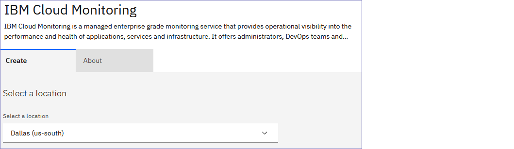
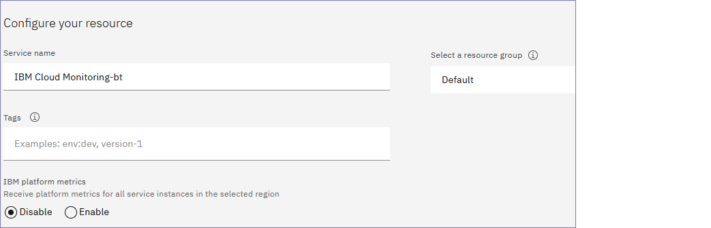
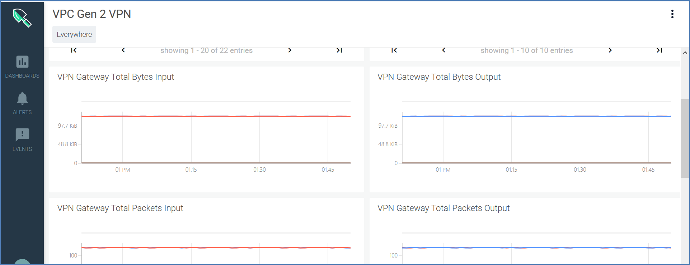
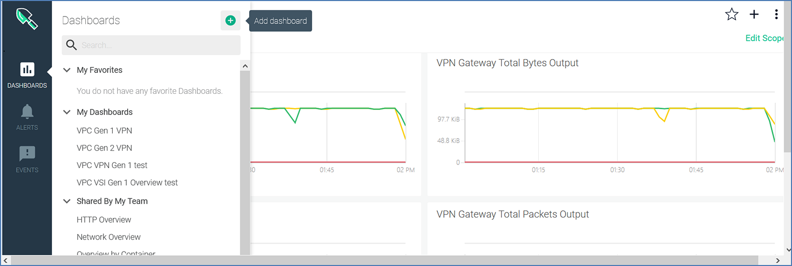
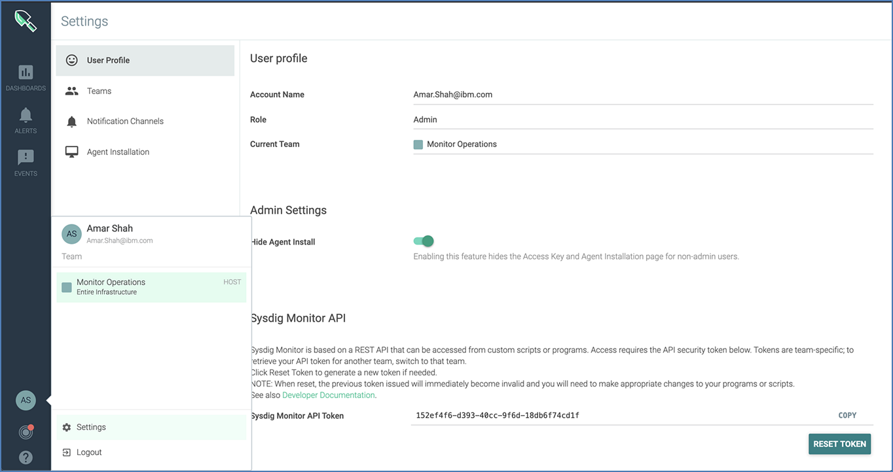
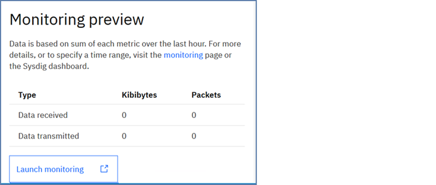
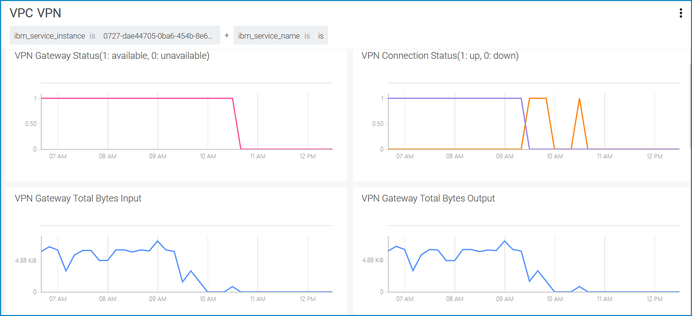
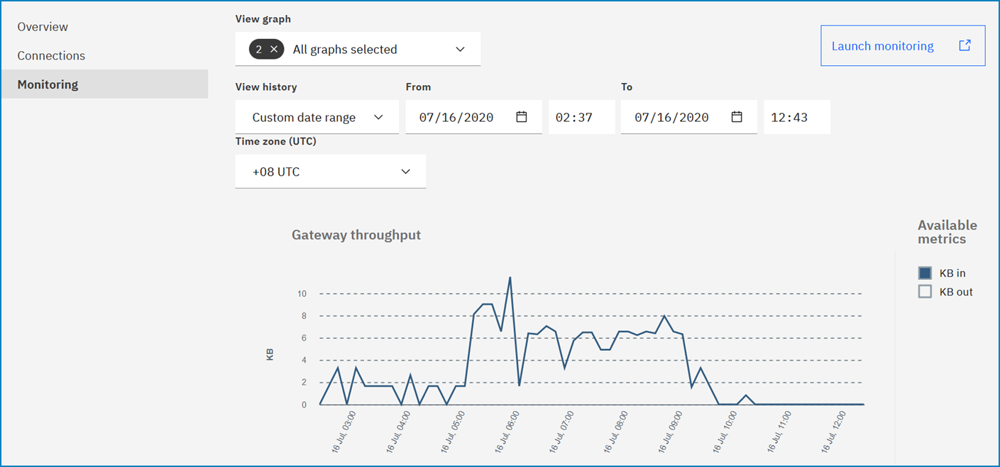

---

copyright:
  years:  2020, 2021
lastupdated: "2021-03-30"

keywords:

subcollection: vpc

---

{:new_window: target="_blank"}
{:shortdesc: .shortdesc}
{:screen: .screen}
{:pre: .pre}
{:table: .aria-labeledby="caption"}
{:codeblock: .codeblock}
{:tip: .tip}
{:download: .download}
{:important: .important}
{:note: .note}

# Monitoring {{site.data.keyword.vpn_vpc_short}} metrics
{: #vpn-monitoring-metrics}

{{site.data.keyword.mon_full}} collects basic VPN metrics on {{site.data.keyword.cloud_notm}} for VPC, such as VPN gateway status, VPN gateway packets input/output, and VPN connection bytes input/output. These metrics are stored in {{site.data.keyword.mon_full_notm}}. You can access metrics through the prebuilt dashboard.
{:shortdesc}

## Platform metrics overview
{: platform-metrics-overview}

You can view platform metrics when you enable {{site.data.keyword.mon_full_notm}} on your {{site.data.keyword.cloud_notm}} platform. An {{site.data.keyword.mon_full_notm}} instance must be configured in a region to monitor these metrics. For more information, see [Enabling platform metrics](/docs/Monitoring-with-Sysdig?topic=Monitoring-with-Sysdig-platform_metrics_enabling).

Before you enable {{site.data.keyword.mon_full_notm}} on your platform, keep the following information in mind:

* You can configure only one instance of the {{site.data.keyword.mon_full_notm}} service per region to collect platform metrics.
* Platform metrics are regional. Metrics are monitored only from {{site.data.keyword.mon_full_notm}} services, which are in the same region of the instance that you want to monitor.
* Metrics are collected automatically and are available for monitoring through the {{site.data.keyword.mon_full_notm}}-enabled instance.

## Metrics available by service plan
{: metrics-by-plan}

Metrics available by plan names are as follows:

* [VPN gateway bytes received](#ibm_is_vpn_gateway_bytes_in)
* [VPN gateway bytes sent](#ibm_is_vpn_gateway_bytes_out)
* [VPN gateway packets received](#ibm_is_vpn_gateway_packets_in)
* [VPN gateway packets sent](#ibm_is_vpn_gateway_packets_out)
* [VPN gateway status](#ibm_is_vpn_gateway_status)
* [VPN connection bytes received](#ibm_is_vpn_connection_bytes_in)
* [VPN connection bytes sent](#ibm_is_vpn_connection_bytes_out)
* [VPN connection packets received](#ibm_is_vpn_connection_packets_in)
* [VPN connection packets sent](#ibm_is_vpn_connection_packets_out)
* [VPN connection status](#ibm_is_vpn_connection_status)

These metrics help track the traffic and status for your VPN gateways and can provide insight about peak traffic per minute and overall usage status.

Each metric is composed of the following metadata types:

* **Metric name** - Name of the collected metric.
* **Metric type** - Determines whether the metric value is a counter metric or a gauge metric. Each of these metrics is `gauge` type, which represents a single numerical value that can arbitrarily fluctuate over time.
* **Value type** - A unit of measurement for a specific metric. Examples include bytes or counts. A value type of `none` means that the metric value represents individual occurrences of that metric type.
* **Segment** - How you want {{site.data.keyword.mon_full_notm}} to divide and display the monitoring metrics.

## VPN metric definitions
{: metric-definitions}

The following tables define the basic VPN metrics on {{site.data.keyword.cloud_notm}} for VPC.

### VPN gateway bytes received
{: #ibm_is_vpn_gateway_bytes_in}

Bytes per minute received for a VPN gateway

| Metadata | Description |
|----------|-------------|
| `Metric name` | `ibm_is_vpn_gateway_bytes_in`|
| `Metric type` | `gauge` |
| `Value type`  | `byte` |
| `Segment by` | `Service instance, Service instance name, VPN name, IBM IS Generation 2` |
{: caption="Table 1: VPN gateway bytes received" caption-side="top"}

### VPN gateway bytes sent
{: #ibm_is_vpn_gateway_bytes_out}

Bytes sent per minute for a VPN gateway

| Metadata | Description |
|----------|-------------|
| `Metric name` | `ibm_is_vpn_gateway_bytes_out`|
| `Metric type` | `gauge` |
| `Value type`  | `byte` |
| `Segment by` | `Service instance, Service instance name, VPN name, IBM IS Generation 2` |
{: caption="Table 2: VPN gateway bytes sent" caption-side="top"}

### VPN gateway packets received
{: #ibm_is_vpn_gateway_packets_in}

Packets received per minute for a VPN gateway

| Metadata | Description |
|----------|-------------|
| `Metric name` | `ibm_is_vpn_gateway_packets_in`|
| `Metric type` | `gauge` |
| `Value type`  | `none` |
| `Segment by` | `Service instance, Service instance name, VPN name, IBM IS Generation 2` |
{: caption="Table 3: VPN gateway packets received" caption-side="top"}

### VPN gateway packets sent
{: #ibm_is_vpn_gateway_packets_out}

Packets sent per minute for a VPN gateway

| Metadata | Description |
|----------|-------------|
| `Metric name` | `ibm_is_vpn_gateway_packets_out`|
| `Metric type` | `gauge` |
| `Value type`  | `none` |
| `Segment by` | `Service instance, Service instance name, VPN name, IBM IS Generation 2` |
{: caption="Table 4: VPN gateway packets sent" caption-side="top"}

### VPN gateway status
{: #ibm_is_vpn_gateway_status}

Status for a VPN gateway (for example, `1`=available, `0`=unavailable)

| Metadata | Description |
|----------|-------------|
| `Metric name` | `ibm_is_vpn_gateway_status`|
| `Metric type` | `gauge` |
| `Value type`  | `none` |
| `Segment by` | `Service instance, Service instance name, VPN name, IBM IS Generation 2` |
{: caption="Table 5: VPN gateway status" caption-side="top"}

### VPN connection bytes received
{: #ibm_is_vpn_connection_bytes_in}

Bytes received per minute for a VPN gateway's connection

| Metadata | Description |
|----------|-------------|
| `Metric name` | `ibm_is_vpn_connection_bytes_in`|
| `Metric type` | `gauge` |
| `Value type`  | `byte` |
| `Segment by` | `Service instance, VPN name, Connection name, Connection ID, IBM IS Generation 2` |
{: caption="Table 6: VPN connection bytes received" caption-side="top"}

### VPN connection bytes sent
{: #ibm_is_vpn_connection_bytes_out}

Bytes sent per minute for a VPN gateway connection

| Metadata | Description |
|----------|-------------|
| `Metric name` | `ibm_is_vpn_connection_bytes_out`|
| `Metric type` | `gauge` |
| `Value type`  | `byte` |
| `Segment by` | `Service instance, VPN name, Connection name, Connection ID, IBM IS Generation 2` |
{: caption="Table 7: VPN connection bytes sent" caption-side="top"}

### VPN connection packets received
{: #ibm_is_vpn_connection_packets_in}

Packets received per minute for a VPN gateway connection

| Metadata | Description |
|----------|-------------|
| `Metric name` | `ibm_is_vpn_connection_packets_in`|
| `Metric type` | `gauge` |
| `Value type`  | `none` |
| `Segment by` | `Service instance, VPN Name, Connection Name, Connection ID, IBM IS Generation 2` |
{: caption="Table 8: VPN connection packets received" caption-side="top"}

### VPN connection packets output
{: #ibm_is_vpn_connection_packets_out}

Packets sent per minute for a VPN gateway connection

| Metadata | Description |
|----------|-------------|
| `Metric name` | `ibm_is_vpn_connection_packets_out`|
| `Metric type` | `gauge` |
| `Value type`  | `none` |
| `Segment by` | `Service instance, VPN name, Connection name, Connection ID, IBM IS Generation 2` |
{: caption="Table 9: VPN connection packets sent" caption-side="top"}

### VPN connection status
{: #ibm_is_vpn_connection_status}

Status of a VPN gateway connection (for example, `1`=up, `0`=down)

| Metadata | Description |
|----------|-------------|
| `Metric name` | `ibm_is_vpn_connection_status`|
| `Metric type` | `gauge` |
| `Value type`  | `none` |
| `Segment by` | `Service instance, VPN name, Connection name, Connection ID, IBM IS Generation 2` |
{: caption="Table 10: VPN connection status" caption-side="top"}

## Metric segmentation
{: attributes}

You can split the metrics that {{site.data.keyword.mon_full_notm}} presents into various visualizations in the {{site.data.keyword.mon_full_notm}} dashboard, allowing views of different metrics based on your preference. For example, if you have multiple VPN gateways or accounts with different VPN gateways in each account, you might want to focus on a particular gateway by name.

As an example, you can segment the `VPN Gateway Bytes Input` by `IBM {{site.data.keyword.vpn_vpc_short}} gateway name` to show how many bytes per minute are received for a VPN gateway. The dashboard shows different lines in different colors where each line represents received bytes per minute for a VPN gateway.


### Global attributes
{: global-attributes-vpn}

The following attributes are available for segmenting all of the VPN metrics:

| Attribute | Attribute name | Attribute description |
|-----------|----------------|-----------------------|
| `Cloud type` | `ibm_ctype` | A value of public, dedicated, or local |
| `Location` | `ibm_location` | The location of the monitored resource - a region, data center, or global |
| `Resource` | `ibm_resource` | The resource that is measured by the service - typically an identifying name or GUID |
| `Resource type` | `ibm_resource_type` | The type of resource that is measured by the service |
| `Resource group` | `ibm_resource_group_name` | The resource group where the service instance was created |
| `Scope` | `ibm_scope` | The scope of the account, organization, or space GUID that is associated with this metric |
| `Service name` | `ibm_service_name` | Name of the service that generated this metric |
{: caption="Table 11: VPN metric attributes" caption-side="top"}

### Additional attributes
{: #additional-attributes-vpn}

The following attributes are available for segmenting one or more attributes as described in the previous reference. See the individual metrics for segmentation options.

| Attribute | Attribute name | Attribute description |
|-----------|----------------|-----------------------|
| `Connection ID` | `ibm_is_vpn_connection_id` | IBM {{site.data.keyword.vpn_vpc_short}} gateway connection ID |
| `Connection name` | `ibm_is_vpn_connection_name` | IBM {{site.data.keyword.vpn_vpc_short}} gateway connection name |
| `IBM IS generation 2` | `ibm_is_generation` | IBM IS Generation; for example, 2  |
| `Service instance` | `ibm_service_instance` | Identifies the instance that the metric is associated with |
| `Service instance name` | `ibm_service_instance_name` | Provides the user-provided name of the service instance. This name isn't necessarily a unique value that depends on the name that is provided. |
| `VPN gateway name` | `ibm_is_vpn_gateway_name` | IBM {{site.data.keyword.vpn_vpc_short}} gateway name |
{: caption="Table 12: VPN segmentation metric attributes" caption-side="top"}

The displayed metrics contain a timestamp in UNIX epoch time and the metric value for the time intervals that end at that timestamp. You can specify different scopes, and the time interval over which to report the metrics.

You can also specify the time interval over which to report your metrics. The following time intervals that are supported in the {{site.data.keyword.mon_full_notm}} dashboard:

* 10 seconds
* 1 minute
* 10 minutes
* 1 hour
* 6 hours
* 2 weeks
* Custom

## Enabling metrics monitoring
{: #enable-metrics-monitoring}

To receive monitoring metrics, you must set up your {{site.data.keyword.mon_full_notm}} instance.

To receive monitoring metrics, use the following steps:

1. Navigate to the [metrics monitoring portal](https://cloud.ibm.com/observe/monitoring) and click **Create a monitoring instance**.

2. Select a region for your {{site.data.keyword.mon_full_notm}} instance.

   If you do not have an existing VPN gateway, see [Creating a VPN gateway](/docs/vpc?topic=vpc-creating-a-vpc-using-the-ibm-cloud-console#vpn-ui
) to provision one.
   {: tip}

   

   The region needs to match the location of your existing VPN gateway.
   {: important}

3. Choose your pricing plan.

   Pricing plan details are explained in the selection window. Select the plan that best meets your requirements.

4. Provide a unique service name for your instance. The name can be any name that you want. The name has no impact on functionality.

   Do not give multiple {{site.data.keyword.mon_full_notm}} instances the same name.
   {: important}

5. Optionally, select a resource group. A resource group organizes account resources in customizable groupings. Any account resource that is managed by using IBM Cloud Identity and Access Management (IAM) access control belongs to a resource group within your account.

   

   If you do not have any pre-configured resource groups, or have no reason to share this resource selectively, use the default selection.
   {: note}

   If your account has multiple resource groups, you can choose which group has access to this {{site.data.keyword.mon_full_notm}} instance. By using this selective access, metrics can be available to some resource groups and not to others.
   {: tip}

6. Check the **Enable Platform Metrics** checkbox. You must select this option to receive metrics from your VPN gateway.

7. Click **Create**. You are taken back to the monitoring metrics home page.

Within a few minutes, your new {{site.data.keyword.mon_full_notm}} instance displays with several configurations. You might have to refresh your browser to see it.

## Working with the {{site.data.keyword.mon_full_notm}} dashboard

To view and work with your {{site.data.keyword.mon_full_notm}} metrics, follow these steps:

1. Navigate to the [metrics monitoring portal](https://cloud.ibm.com/observe/monitoring).

2. Click **Open Dashboard** next to the service name of the {{site.data.keyword.mon_full_notm}} instance that you want to work with.

   The first time that you access your {{site.data.keyword.mon_full_notm}} instance, several windows display as part of the internal setup. Keep the default entries, and click through the pages until you reach the main {{site.data.keyword.mon_full_notm}} page.
   {: note}

3. Open the IBM {{site.data.keyword.vpn_vpc_short}} Monitoring Metrics dashboard by selecting **Dashboards**.

4. Click **Default Dashboards > IBM > VPC Gen 2 VPN**. The default dashboard is not editable.

5. Ten main metrics in the dashboard are shown. These metrics include Gateway/Connection status, Gateway/Connection bytes input/output, and Gateway/Connection packets input/output. If you want to modify parameters and segment your metrics by VPN gateway name and VPN connection name, you must create a custom dashboard.

   

   You can choose what time window that you'd like to see your metrics by using the time selection bar.<!--directional words such as top, bottom, right, left are not to be used - these words violate accessibility standards-->
   {: tip}

## Creating a custom metrics dashboard

You can create your own dashboard to customize your monitoring metrics, such as viewing information about particular VPN gateways, or seeing traffic that comes through only a VPN connection.

To customize your dashboard, use the following steps:

1. Navigate to the [metrics monitoring portal](https://cloud.ibm.com/observe/monitoring).

2. Click **Open Dashboard** next to the service name of the {{site.data.keyword.mon_full_notm}} instance you want to work with. You now see the dashboard.

3. Select **Dashboards** and click the **+** in the panel.

   

4. Select **Blank dashboard** and select the type of visual representation that you want.

   {{site.data.keyword.mon_full_notm}} offers eight different visualizations for your dashboard. Read the description for each visualization and choose the one that best meets your requirements.

   The line **View trends over time** is the most frequently selected option. The following examples show a line-based visualization.
   {: note}

5. Configure your custom dashboard.

   * In the **Metrics** field, enter `ibm_is` to display the ten IBM {{site.data.keyword.mon_full_notm}} {{site.data.keyword.vpn_vpc_short}} metrics: `ibm_is_vpn_gateway_status`, `ibm_is_vpn_connection_status`, `ibm_is_vpn_gateway_bytes_in`, `ibm_is_vpn_gateway_bytes_out`, `ibm_is_vpn_gateway_packets_in`, `ibm_is_vpn_gateway_packets_out`, `ibm_is_vpn_connection_bytes_in`, `ibm_is_vpn_connection_bytes_out`, `ibm_is_vpn_connection_packets_in`, and `ibm_is_vpn_connection_packets_out`.

   * You can choose a scope to display in your dashboard by clicking **Override Dashboard Scope**. For example, you can display the metrics for a particular VPN gateway.

   * You can also set a segment to compare metrics across the scope that you define. For example, you can look at the connection status for a particular VPN gateway that is segmented by gateway name and connection name.

6. Click **Save**.

   By default, the dashboard is named "blank dashboard". You can change the name by selecting **Dashboards** from the sidebar and clicking the Pencil icon next to the name.
   {: tip}

To return to the default {{site.data.keyword.mon_full_notm}} dashboard at any time, select **Dashboards > Default Dashboards > IBM > VPC Gen 2 VPN**.

## Working with {{site.data.keyword.mon_full_notm}} by using APIs
{: #metric-query-api}

You can also work with the {{site.data.keyword.mon_full_notm}} instance by using metric query APIs. You might want to use APIs if you need raw data points or want to consume your metrics from a command-line interface rather than using the {{site.data.keyword.mon_full_notm}} dashboard.

After you create your {{site.data.keyword.mon_full_notm}} instance, you must collect the following two pieces of information.

* The Monitor API token
* The endpoint of your {{site.data.keyword.mon_full_notm}} instance

To collect this information and work with your {{site.data.keyword.mon_full_notm}} instance by using metric query API, follow these steps:

1. Access the [Monitoring home page](https://cloud.ibm.com/observe/monitoring).

2. Click **Open Dashboard** next to the instance that you want to work with.

3. After the {{site.data.keyword.mon_full_notm}} dashboard is displayed, select your Account Profile icon on the sidebar and select **Settings**. You now see your account settings.

  

4. Your Monitor API token is an alphanumeric string that is located in the **Monitor API Token** field. Click the **Copy** button to copy the token to your clipboard.

    Do not share this API token. Anyone who has this API token has full access to your metrics.
    {: important}

5. To get the endpoint of your {{site.data.keyword.mon_full_notm}} instance, go to your main {{site.data.keyword.mon_full_notm}} dashboard in your browser. Then, select the URL to the dashboard, which appears similar to the following example:

  ```
  https://us-south.monitoring.cloud.ibm.com/#/default-dashboard/ibm_vpc_vpn_gen2?last=1209600
  ```

  The first part of the URL (in this example, `us-south.monitoring.cloud.ibm.com`) is your endpoint. Make note of this URL.

6. After you have both the API token and the endpoint, you can format your POST request. The following POST request is an example, with all the parameters that you can modify. The following are parameters:

  * The Monitor API token.
  * The endpoint of your {{site.data.keyword.mon_full_notm}} instance.
  * The value for `ibm_is_vpn_gateway_name` (the VPN gateway name that you want to see metrics for).

   If you want to see this metric for all of your VPN gateways, do not enter a value for the `scope` attribute. For example, use `"scope" : ""`.
   {: note}

  * The metric type that you want to see the results for. This example uses `ibm_is_vpn_gateway_status`.
  * The `from` and `to` attributes define the timeframe to focus the scan, set in epoch time, and in microseconds.
  * The `sampling` and `value` attributes set the granularity of the data that is returned in the POST request.

   Because a large volume of data is stored in {{site.data.keyword.mon_full_notm}}, choosing the specific level of granularity is important. {{site.data.keyword.mon_full_notm}} can return only 600 data points at a time per request. As a result, the `sampling` and `value` attributes are important. Leaving these two lines out of your request returns an aggregate sum over that time period instead.

   If the time range that is specified by `from` and `to` is large (for example, 4 days), but you define a `sampling` and `value` of 10 seconds, it means that you receive 4 days worth of data that is split into 10-second chunks. This sample is not useful because of the large amount of data that is returned. Specifying a larger chunk is recommended (for example, 1 hour instead of 10 seconds).
   {: tip}


   ```
   curl \
   -H 'Authorization: Bearer <API_TOKEN>’ \
   -H 'Content-Type: application/json' \
   https://us-south.monitoring.cloud.ibm.com/api/data/batch  \
   -d '{
     "requests": [
         {
             "format": {
                 "type": "data"
             },
             "scope": "ibm_is_vpn_gateway_name = \"test-001\"",
             "metrics": {
                 "k0": "timestamp",
                 "v1": "ibm_is_vpn_gateway_status"
             },
             "time": {
                 "from": 1589877054000000,
                 "to": 1589877114000000,
                 "sampling": 60000000
             },
             "group": {
                 "by": [
                     {
                        "metric": "k0",
                         "value" : 60000000
                     }
                 ],
                 "aggregations": {
                     "v1": "avg"
                 },
                 "groupAggregations": {
                     "v1": "avg"
                 }
             }
         }
     ]
 }'
```
{: codeblock}

## Working with {{site.data.keyword.mon_full_notm}} by using {{site.data.keyword.vpn_vpc_short}} UI

You can view individual VPN gateway metrics and launch the {{site.data.keyword.mon_full_notm}} dashboard from the VPN UI.

1. Navigate to the [VPN UI](https://cloud.ibm.com/vpc-ext/network/vpngateways).

2. Click a VPN gateway name whose {{site.data.keyword.mon_full_notm}} metrics that you want to view and go to its **Overview** page.

   The **Monitoring preview** panel displays the sum of every metric over the last hour.
   

   You can click **Launch monitoring** to launch the VPN gateway's default {{site.data.keyword.mon_full_notm}} dashboard.
   

3. Open the VPN gateway's **Monitoring** page.

    The page displays a VPN gateway's throughput and packets in a time range.
   

   Similarly, you can also launch the VPN gateway's default {{site.data.keyword.mon_full_notm}} dashboard by clicking **Launch monitoring**.
