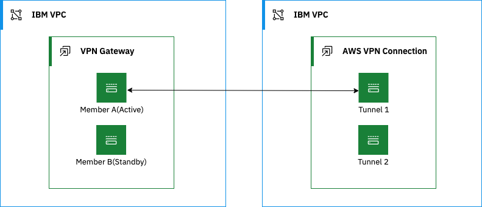
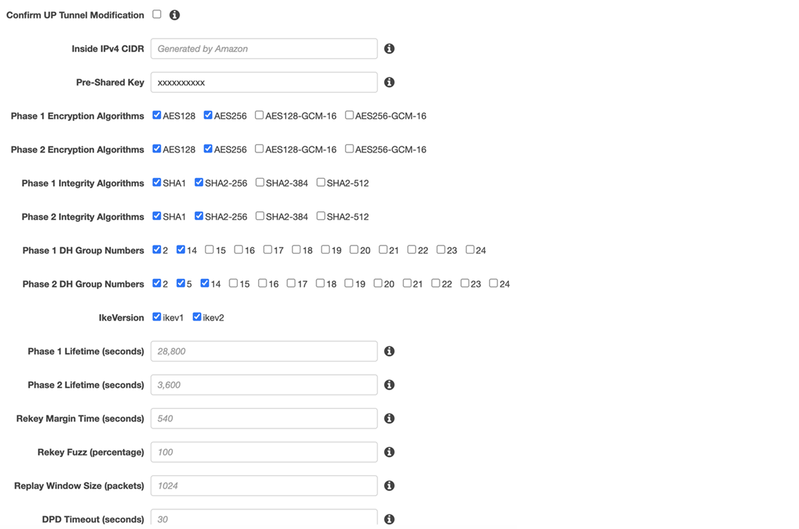
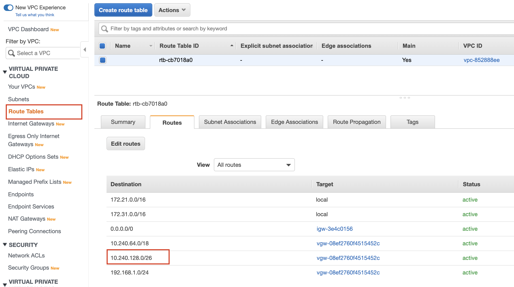
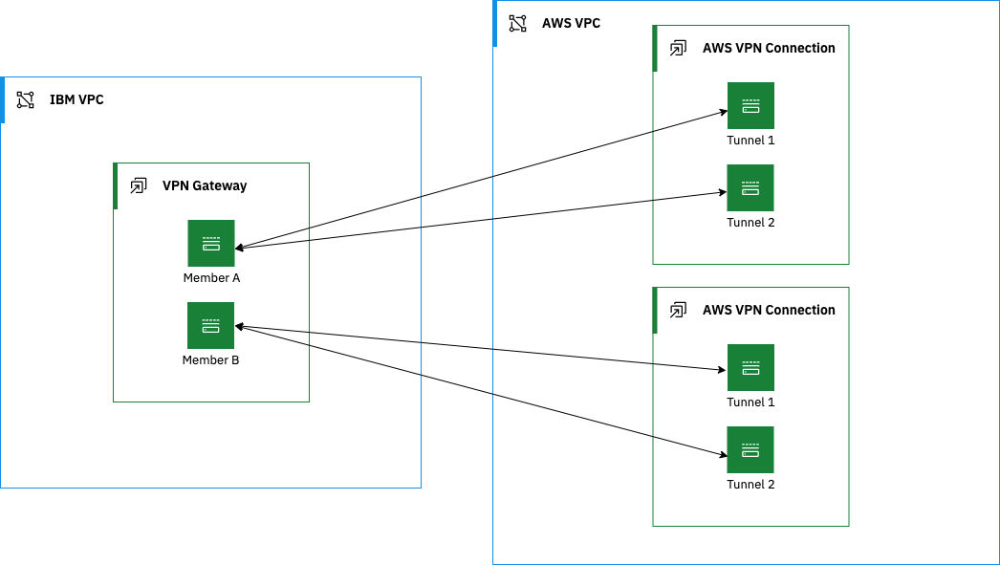
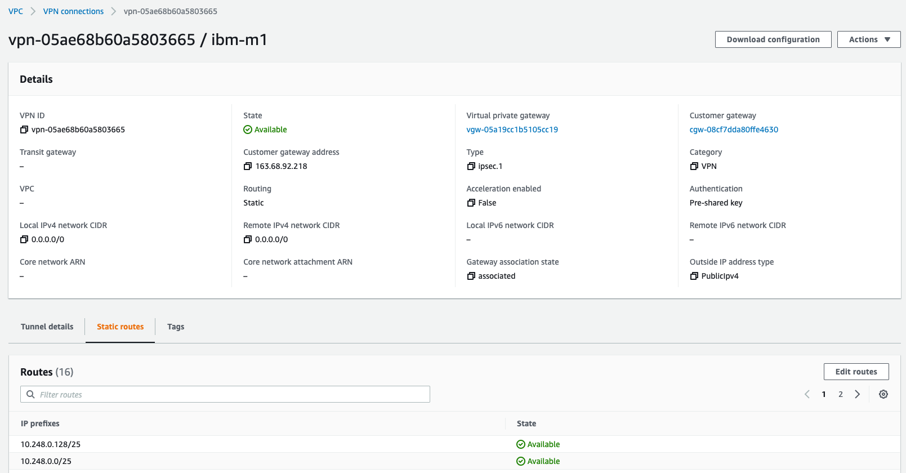
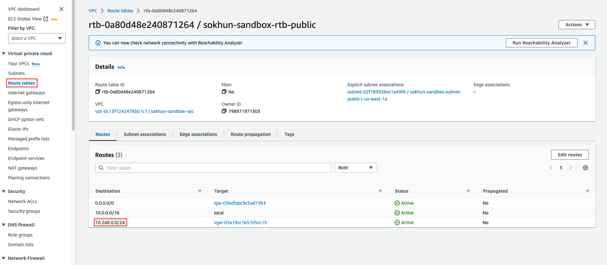
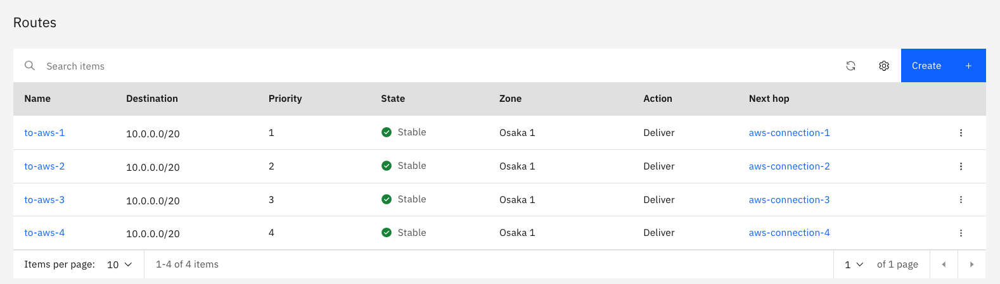

---

copyright:
  years: 2020, 2023
lastupdated: "2023-05-31"

keywords: aws peer, vpn aws

subcollection: vpc

---

{{site.data.keyword.attribute-definition-list}}

# Connecting to an AWS peer
{: #aws-config}

You can use IBM Cloud VPN for VPC to securely connect your VPC to an on-prem network through a VPN tunnel. This topic provides guidance about how to configure your AWS VPN gateway to connect to VPN for VPC.
{: shortdesc}

Because AWS requires PFS to be enabled in Phase 2, you must create a custom IPsec policy to replace the default policy for the VPN in your VPC. See [Creating an IPsec policy](/docs/vpc?topic=vpc-creating-ipsec-policy) for more details.
{: important}

When the AWS VPN receives a connection request from VPN for VPC, AWS VPN uses IPsec Phase 1 parameters to establish a secure connection and authenticate the {{site.data.keyword.vpn_vpc_short}} gateway. Then, if the security policy permits the connection, the AWS VPN establishes the tunnel by using IPsec Phase 2 parameters and applies the IPsec security policy. Key management, authentication, and security services are negotiated dynamically through the IKE protocol.

Review the [VPN gateway limitations](/docs/vpc?topic=vpc-vpn-limitations) before you connect to your on-prem peer. 
{: note}

To support these functions, you must perform the following general configuration steps on the AWS VPN:

* Define the Phase 1 parameters that the AWS VPN requires to authenticate the remote peer and establish a secure connection.
* Define the Phase 2 parameters that the AWS VPN requires to create a VPN tunnel with {{site.data.keyword.vpn_vpc_short}}.

## Connecting an IBM policy-based VPN to an AWS peer
{: #aws-config-policy-based}

You can use a {{site.data.keyword.vpn_vpc_short}} policy-based VPN to connect to an AWS route-based VPN. However, policy-based VPNs require separate Security Associations (SAs) for each subnet, while route-based VPNs use a single SA for all encrypted traffic. Therefore, a connection between a policy-based VPN to a route-based VPN is limited to one SA associated with a single CIDR range.
{: important}

If you have multiple subnets with a contiguous address range, you can create a connection with a CIDR that is a superset of your subnets. For example, `192.168.0.0/24` and `192.168.1.0/24` are covered by CIDR `192.168.0.0/23`.
{: tip}

{: caption="Figure 1: Connecting an IBM policy-based VPN to an AWS peer" caption-side="bottom"}

### Configuring AWS
{: #aws-to-policy-based-aws-config}

To configure an AWS peer, follow these steps:

1. Create an AWS Customer Gateway using an IBM policy-based VPN IP address.
1. Create an AWS Virtual Private Gateway and attach it to the AWS VPC that must send traffic to the IBM VPC.
1. Create a single AWS site-to-site connection:
   * Set the **Virtual Private Gateway** to the gateway you created in Step 2.
   * Set the **Customer Gateway** to the customer gateway you created in Step 1.
   * Set **Routing Option** to **Static**.
   * Add the single CIDR on the IBM side to **Static IP Prefixes**.

     To reach multiple contiguous subnets in IBM VPC, use a larger CIDR range that covers all the required subnets.
     {: tip}
     
   * Enter a pre-shared key for both **tunnel1** and **tunnel2**.
   * For both AWS tunnels, choose **Edit tunnel x options** and select the wanted security parameters. You can choose multiple values for each parameter if they are also supported by the IBM VPN.

     {: caption="Figure 2: AWS tunnel options" caption-side="bottom"}

1. After the status for the AWS site-to-site connection is **Available**, go to the **Static routes** tab to verify that the correct route was added automatically. Make manual adjustments if necessary.

   The following screen shows that networks `10.240.128.0/27` and `10.240.128.32/27` on the IBM VPC side are routed with the new destination `10.240.128.0/26`.

   {: caption="Figure 3: AWS connection static routes" caption-side="bottom"}   

1. Go to AWS **Route tables** in the **Virtual private cloud** section and find the route table that is associated with the VPC where the VPN was attached. Click **Edit routes** and add the same route to the route table.

   {: caption="Figure 4: AWS route table" caption-side="bottom"}

1. Verify the connection status on the **Site-to-Site Connection** page.
1. Verify that the AWS ACL and security group rules are adjusted to allow the traffic you need.

### Configuring the IBM policy-based VPN
{: #aws-to-policy-based-ibm-config}

To configure an IBM policy-based VPN for an AWS peer, follow these steps:

1. Create a new connection for one of the AWS tunnel IPs. Use a single CIDR for both **Local Subnets** and **Peer Subnets**.
 
   Because AWS requires PFS to be _enabled_ in Phase 2, you must create a custom IPsec policy to replace the default policy for the VPN in your VPC. For more information, see [Creating a custom IPsec policy in {{site.data.keyword.vpn_vpc_short}}](/docs/vpc?topic=vpc-creating-ipsec-policy).
   {: important}

1. After the status for the connection is **Active**, verify the traffic between your subnets.

## Connecting an IBM route-based VPN to an AWS peer
{: #aws-config-static-route-based}

You must have one IBM VPN gateway and two AWS VPN connections (a total of four tunnels) for this setup.
{: note}

{: caption="Figure 5: Connecting an IBM route-based VPN to an AWS peer" caption-side="bottom"}

### Configuring AWS
{: #aws-to-route-based-aws-config}

To configure an AWS peer, follow these steps:

1. Create two AWS Customer Gateways using each of the IBM route-based VPN members IP addresses.
1. Create an AWS Virtual Private Gateway and attach it to the AWS VPC that must send traffic to the IBM VPC.
1. Create the first AWS site-to-site connection.
   * Set the **Virtual Private Gateway** to the gateway you created in Step 2.
   * Set the **Customer Gateway** to the first customer gateway you created in Step 1.
   * Set **Routing Option** to **Static**.
   * Divide the IBM VPC subnet into two smaller subnets and add them to **Static IP Prefixes**. This way, the first connection is preferred over the second connection.
   * Enter a pre-shared key for both **tunnel1** and **tunnel2**
   * For both AWS tunnels, choose **Edit Tunnel X Options** and select the security parameters you need. You can choose multiple values for each parameter if they are also supported by the IBM VPN.
1. Create the second AWS site-to-site connection.
   * Set the **Virtual Private Gateway** to the gateway you created in Step 2.
   * Set the **Customer Gateway** to the second customer gateway you created in Step 1.
   * Set **Routing Option** to **Static**.
   * Add the IBM VPC subnet to **Static IP Prefixes**.
   * Enter a pre-shared key for both **tunnel1** and **tunnel2**
   * For both AWS tunnels, choose **Edit Tunnel X Options** and select the security parameters you need. You can choose multiple values for each parameter if they are also supported by the IBM VPN.

   {: caption="Figure 6: AWS tunnel options" caption-side="bottom"}

1. After the AWS site-to-site connections are in **Available** state, go to the **Static Routes** tab of each site-to-site connection to verify that the correct routes were added automatically. Make manual adjustments if necessary. The following screens show that the network `10.248.0.0/24` is routed on both connections.

   {: caption="Figure 7: AWS connection static routes" caption-side="bottom"} 

   {: caption="Figure 8: AWS connection static routes" caption-side="bottom"} 

1. Go to AWS **Route Tables** under **VIRTUAL PRIVATE CLOUD** and find the route table that is associated with the VPC where the VPN is attached. Click **Edit Routes** and add the same route to the route table.

   {: caption="Figure 9: AWS route table" caption-side="bottom"}

1. Verify the connection status on the **Site-to-Site Connection** page.
1. Verify that the AWS ACL and security group rules are adjusted to allow the traffic you need.

### Configuring the IBM route-based VPN
{: #configure-route-based-vpn}

To configure an IBM route-based VPN for an AWS peer, follow these steps:

1. Create four new connections, one for each AWS tunnel IP. 

   Because AWS requires PFS to be enabled in Phase 2, you must create a custom IPsec policy to replace the default policy for the VPN in your VPC. For more information, see [Creating a custom IPsec policy in {{site.data.keyword.vpn_vpc_short}}](/docs/vpc?topic=vpc-creating-ipsec-policy).
   {: important}
   
1. Create four routes for each peer subnet with the **Next hop** option pointing to each connection you created in Step 1. Then set each route to a different **Priority** value. 

   The route with the lowest **Priority** value is the priority route. 
   {: note}
   
   {: caption="Figure 5: IBM routing table" caption-side="bottom"}
   
1. After the status for both connections shows **Active**, verify the traffic between your subnets.

   Verify that the preferred connection on AWS is the same as on IBM to avoid asymmetric routing.
   {: note}
