---

copyright:
  years: 2019, 2025
lastupdated: "2025-06-27"

keywords: check point peer

subcollection: vpc

---

{{site.data.keyword.attribute-definition-list}}

# Connecting to a Check Point Security Gateway peer
{: #check-point-config}

You can use IBM Cloud VPN for VPC to securely connect your VPC to an on-prem network through a VPN tunnel. This topic provides guidance about how to configure your Check Point Security Gateway to connect to {{site.data.keyword.vpn_vpc_short}}.
{: shortdesc}

These instructions are based on Check Point Security Gateway, Software Release [R81.10]. Earlier versions of Check Point software are not supported.
{: note}

Read [Known issues for VPN gateways](/docs/vpc?topic=vpc-vpn-limitations) before you continue to connect to your on-premises peer.
{: tip}

Because Check Point Security Gateway uses IKEv1 by default, you must create a custom IKE and IPsec policy to replace the default auto-negotiation policy for the VPN in your VPC.
{: important}

To support these functions, the following general configuration steps must be performed on the Check Point Security Gateway.

## Connecting an IBM policy-based VPN to a Check Point Security Gateway peer
{: #check-point-config-policy-based}

Here's an example of how to connect an IBM policy-vased VPN to a Check Point Security Gateway peer:

1. To configure the security gateways that are internally managed, follow these steps:
   * Go to **SmartConsole > Gateways & Services** and click the name of security gateway to open the Security Gateway configuration page.
   * Go to the **Network Management** page to define the topology.
   * Go to the **Network Management > VPN Domain** page to define the VPN domain.
1. To create an interoperable device on the Check Point SmartConsole, follow these steps:
   * Go to Object Explorer and click **New > More > Network Object > More > Interoperable Device** to open the new interoperable device page.
   * Go to the **General Properties** page and enter the IBM VPN gateway name and public IP address.
   * Go to the **Topology** page and add the IBM VPN gateway public IP address and IBM VPC subnets. Add the IBM VPN public IP address as an external network with netmask `255.255.255.255`. Add the IBM VPC subnets as an internal network.
1. To add the VPN Community, follow these steps.

   These instructions are based on the `Star Community` type, but the `Meshed Community` type is also an option.
   {: note}

   * Go to **SmartConsole > Security Policies > Access Tools > VPN Communities**, click `Star Community` to open the new VPN community page.
   * Enter the new community name.
   * Go to the **Gateways > Center Gateways** page, click the `+` icon, and add the Check Point Security Gateway.
   * Go to the **Gateways > Satellite Gateways** page, click the `+` icon, and add the IBM VPN gateway.
   * Go to the **Encryption** page and use the default `Encryption Method` and `Encryption Suite`.
   * Go to the **Tunnel Management** page and select `One VPN tunnel per subnet pair`.
   * Go to the **Shared Secret** page and set the pre-shared key.
   * Click **OK** and publish the changes.
1. To add relevant access rules in the Security Policy page, follow these steps:
   * Add the community in the VPN column, the services in the Service & Applications column, the wanted action, and the appropriate track option.
   * Install the access control policy.

## Connecting an IBM route-based VPN to a Check Point Security Gateway peer
{: #check-point-config-route-based}

These example steps are referred to in the [CheckPoint Administration Guide](https://sc1.checkpoint.com/documents/R81/WebAdminGuides/EN/CP_R81_Gaia_AdminGuide/Topics-GAG/VPN-Tunnel-Interfaces.htm?tocpath=Network%20Management%7CNetwork%20Interfaces%7C_____8)
{: tip}

To connect an IBM route-based VPN to a Check Point Security Gateway peer, follow these steps:

1. To enable the IPsec VPN, select **SmartConsole > Gateways & Services**, then click the name of security gateway to open the Security Gateway configuration page. In the **General Properties** tabbed view, click **IPsec VPN**.

   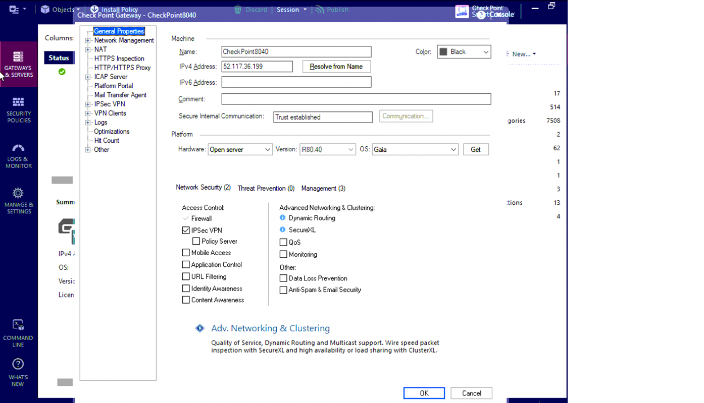{: caption="Figure 1: CheckPoint connection enable IPsec" caption-side="bottom"}

1. To enable the route-based VPN, follow these steps:

   * Select **SmartConsole > Gateways & Services**, then click the name of security gateway to open the Security Gateway configuration page.
   * Click **Network Management > VPN Domain**.
   * Select **User defined**.
   * Click the [...] button.
   * Click **New > Group > Simple Group** and enter a name.
   * Click **OK** (leave the Group object empty).

   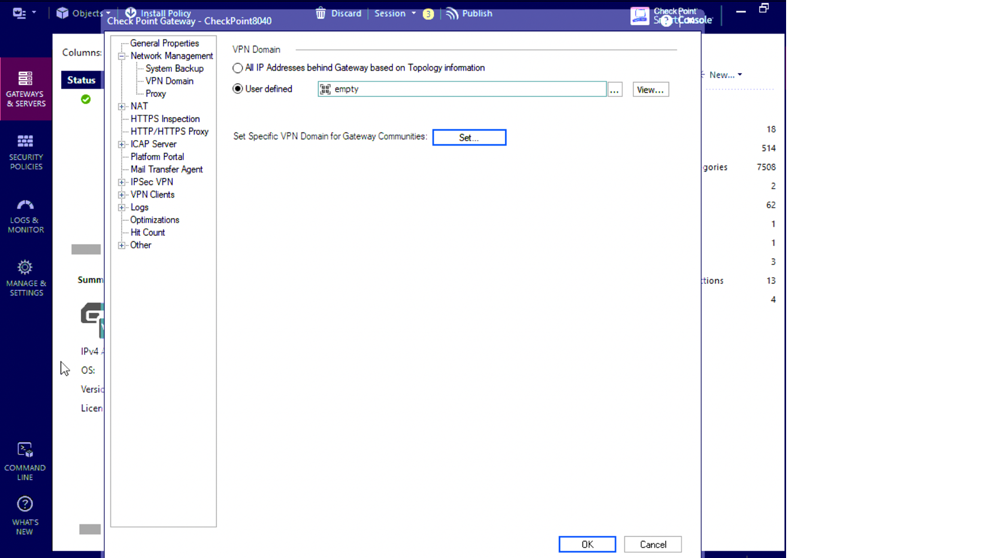{: caption="Figure 2: CheckPoint connection enable IPsec" caption-side="bottom"}

1. To add the IBM VPN gateway as the interoperable device, go to Object Explorer. Then, click **New > More > Network Object > More > Interoperable Device** to open the new interoperable device page. Enter the small public IP address of the IBM route-based VPN gateway in the IPv4 address field.

   For more information about the small public IP, see this [important notice](/docs/vpc?topic=vpc-using-vpn#important-notice).
   {: note}

   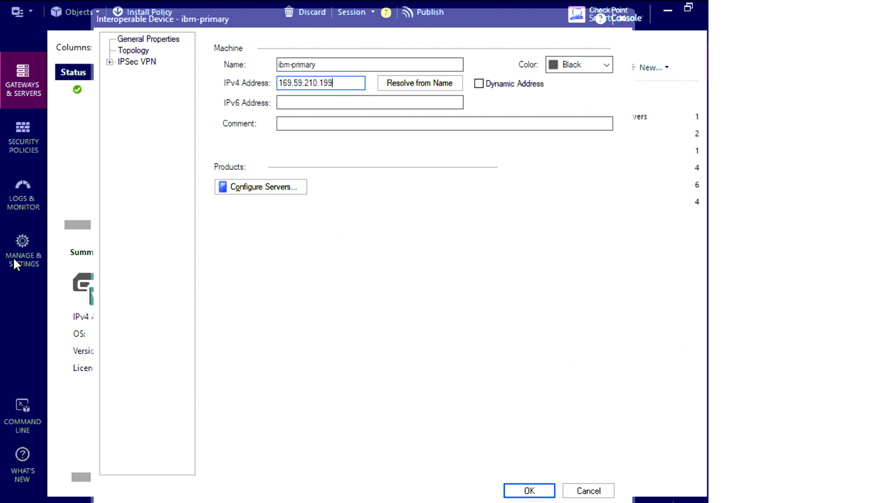{: caption="Figure 3: CheckPoint connection add interoperable device" caption-side="bottom"}

1. To create the VPN community, select **SmartConsole > Security Policies > Access Tools > VPN Communities**. Then, click **Star Community** to open the new VPN community page. Add the CheckPoint gateway and IBM route-based VPN gateway.

   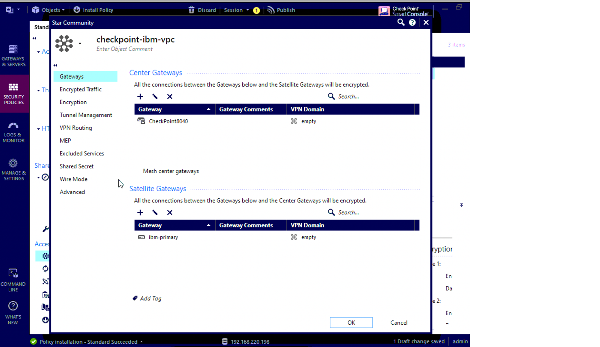{: caption="Figure 4: CheckPoint connection create the VPN community" caption-side="bottom"}

1. To configure encrypted traffic, click **Encrypted Traffic** on the VPN community, then select **Accept all encrypted traffic**.

   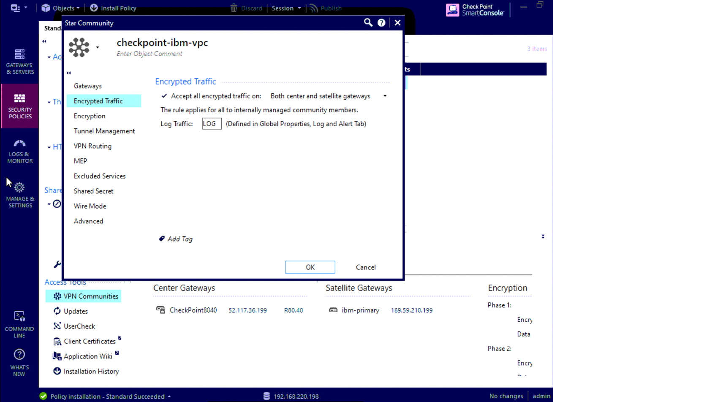{: caption="Figure 5: CheckPoint connection configure the encrypted traffic" caption-side="bottom"}

1. To configure IKE and IPsec proposals, click **Encryption** on the VPN community. Then, select an encryption method, suits, and perfect forward secrecy. These values must match the IBM route-based VPN configuration.

   {: caption="Figure 6: CheckPoint connection configure the IKE and IPsec proposals" caption-side="bottom"}

1. To configure tunnel management, click **Tunnel Management** on the VPN community. Then, select **On all tunnels in the community** and **One VPN tunnel per Gateway Pair**.

   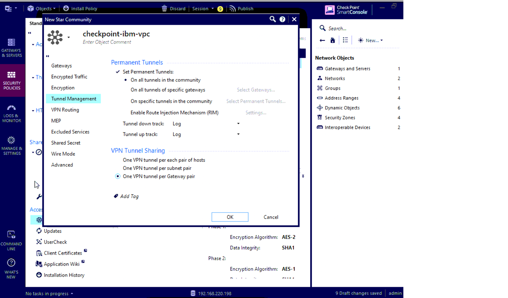{: caption="Figure 7: CheckPoint connection configure tunnel management" caption-side="bottom"}

1. To configure the pre-shared key, click **Shared Secret** on the VPN community. Set the same pre-shared key as the IBM VPN route-based gateway.

   {: caption="Figure 8: CheckPoint connection configure pre-shared key" caption-side="bottom"}

1. To enable directional match, select **Menu > Global properties > VPN > Advanced**, then click **Enable VPN Directional Match in VPN Column**.

   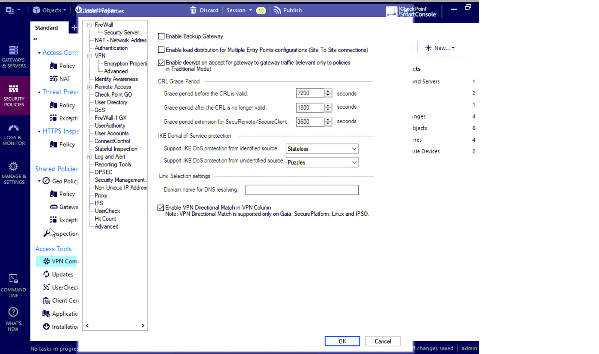{: caption="Figure 9: CheckPoint connection enable directional match" caption-side="bottom"}

1. To add directional matching VPN rules, select **SmartConsole > Security Policies  > Access Control > Policy**, then add a new VPN rule. The directional rule must contain these directional matching conditions:

   * Your VPN community > Your VPN community
   * Your VPN community > Internal_Clear
   * Internal_Clear > Your VPN community

   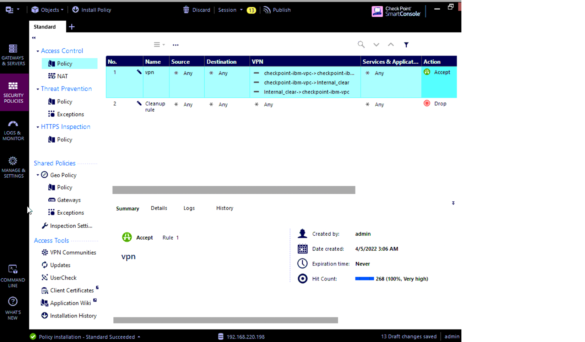{: caption="Figure 10: CheckPoint connection add directional matching VPN rules" caption-side="bottom"}

1. To install the policy, select **SmartConsole > Security Policies**, then click **Install Policy**.

   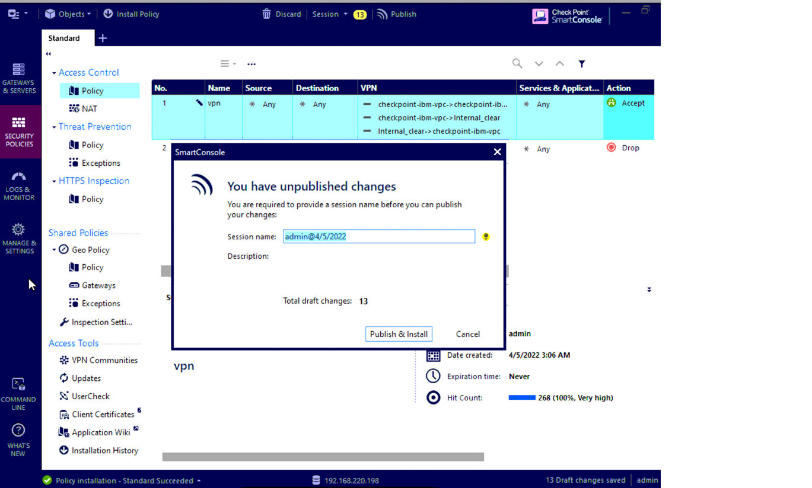{: caption="Figure 11: CheckPoint connection install policy" caption-side="bottom"}

1. To add a Virtual Tunnel Interface (VTI), select **Gaia Portal > Network Management > Network Interfaces**, then click **Add > VPN Tunnel**.

   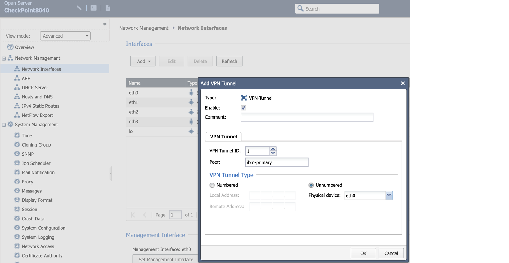{: caption="Figure 12: CheckPoint connection add VPN tunnel" caption-side="bottom"}

1. To add the static route, select **Gaia Portal > Network Management > IPv4 Static Routes**, then click **Add**. The destination CIDR is the IBM VPC subnet.

   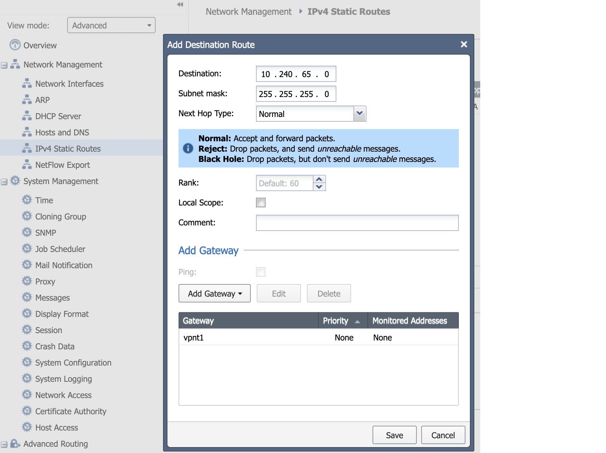{: caption="Figure 13: CheckPoint connection add static route" caption-side="bottom"}

1. To refresh the network topology, follow these steps:
   * Select **SmartConsole > Gateways & Services**, then click the name of security gateway to open the Security Gateway configuration page.
   * Select **Network Management**, then click **Get Interfaces > Get Interfaces with Topology**.

   {: caption="Figure 14: CheckPoint connection refresh network topology" caption-side="bottom"}

## Creating a custom IKE policy for a Check Point Security Gateway
{: #custom-ike-policy-with-cp}

By default, Check Point Security Gateway uses IKEv1; therefore, you must create a custom IKE policy to replace the default policy for the VPN in your VPC. In the following policy example, you must use matched IKE and IPsec policy.

To use a custom IKE policy in {{site.data.keyword.vpn_vpc_short}}:

1. On the {{site.data.keyword.vpn_vpc_short}} page in the IBM Cloud console, select the **IKE policies** tab.
1. Click **New IKE policy** and specify the following values:
   * For the **IKE Version** field, select **1**.
   * For the **Authentication** field, select **sha256**.
   * For the **Encryption** field, select **aes256**.
   * For the **DH Group** field, select **19**.
   * For the **Key lifetime** field, specify **86400**.
1. When you create the VPN connection in your VPC, select this custom IKE policy.

## Creating a custom IPsec policy for Check Point Security Gateway
{: #custom-ipsec-policy-with-cp}

To use a custom IPsec policy in {{site.data.keyword.vpn_vpc_short}}:

1. On the {{site.data.keyword.vpn_vpc_short}} page in the IBM Cloud console, select the **IPsec policies** tab.
1. Click **New IPsec policy** and specify the following values:
   * For the **Authentication** field, select **sha256**.
   * For the **Encryption** field, select **aes256**.
   * For the **Key lifetime** field, specify **3600**.
1. When you create the VPN connection in your VPC, select this custom IPsec policy.

## Ensuring NAT-T is always on
{: #checkpoint-defaults}

Make sure that the NAT-T feature is enabled on your on-premises VPN device. The following list shows the default behaviors:

* NAT-T is enabled when a NAT device is detected.
* **offer_nat_t_initator** is set to `false` (initiator sends NAT-T traffic).
* **offer_nat_t_responder_for_known_gw** is set to `true` (responder accepts NAT-T traffic from known gateways).
* **force_nat_t** is set to `false` (forces NAT-T, even if there is no NAT-T device).

It is recommended to change these default settings to the following:

* Enable NAT-T.
* Set **offer_nat_t_initator** to `true`.
* If you know that there's no NAT device in the environment, set **force_nat_t** to `true`.

You can view and change these variables by using the GuiDBedit Tool. Refer to the Check Point documentation for your particular version to confirm these steps.
{: note}

1. In the upper-left pane, click **TABLE > Network Objects > network_objects**.
1. In the upper-right pane, select the applicable Security Gateway object.
1. In the lower pane, see the VPN section.
1. To save the changes, click **File > Save All**.
1. In SmartConsole, install the Access Control Policy on this Security Gateway object.

For more information, see [NAT-T Compatibility With Check Point Devices](https://support.cohesive.net/support/solutions/articles/31000156433-nat-t-compatibility-with-check-point-devices){: external}.
