---

copyright:
  years: 2020, 2024
lastupdated: "2024-06-20"

keywords: firepower, firepower peer, vpn

subcollection: vpc

---

{{site.data.keyword.attribute-definition-list}}

# Connecting to a Cisco Firepower Thread Defense peer (policy-based)
{: #cisco-ftd-policy-based-config}

You can use IBM Cloud VPN for VPC to securely connect your VPC to an on-premises network through a VPN tunnel. This topic provides guidance about how to configure your Cisco FTDv to connect to VPN for VPC.

Review [VPN gateway limitations](/docs/vpc?topic=vpc-vpn-limitations) before you connect to your on-premises peer.
{: important}

These instructions are based on Cisco FTDv, Cisco Firepower Thread Defender Version **7.0.4**.

## Before you begin
{: #cisco-policy-before-you-begin}

The first step in configuring your Cisco FTDv for use with VPN for VPC is to ensure that the following prerequisite conditions are met:

- Cisco FTDv is online and functional with a proper license.
- You have a credential for accessing the Firepower Device Manager Web UI.
- You have at least one configured and verified functional internal interface.
- You have at least one configured and verified functional external interface.

## Procedure
{: #cisco-policy-procedure}

To connect to a Cisco Firepower Thread Defense peer, follow these steps:

1. Log in to the Firepower Device Manager and click **Device** in the menu bar to view the Device Summary page. Then, click **View Configuration** in the Site-to-Site VPN group.

   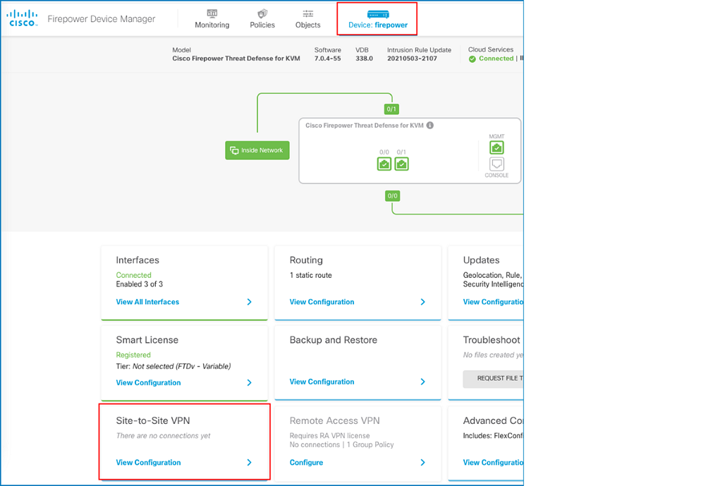{: caption="Device Summary" caption-side="bottom"}

1. Create the first IPsec tunnel. On the Site-to-Site VPN page, click the **+** button to create a site-to-site VPN connection or, if there are no connections yet, you can click the **CREATE SITE-TO-SITE CONNECTION** button.

1. On the New Site-to-site VPN page, define the endpoints of the point-to-point VPN connection. To do so, configure the following settings:

   - **Connection Profile Name** - Provide a name for this connection, up to 64 characters without spaces. You cannot use an IP address as the name.
   - **Type** - Select **Policy Based**.
   - **Local VPN Access Interface** - Select the interface to which the remote peer can connect. Provide a link-local address.
   - **Local Network** - Create new network objects for on-prem subnets.
   - **Remote IP Address** - Select **Static**.
   - **Remote Network** - Create new network objects for VPN subnets.

   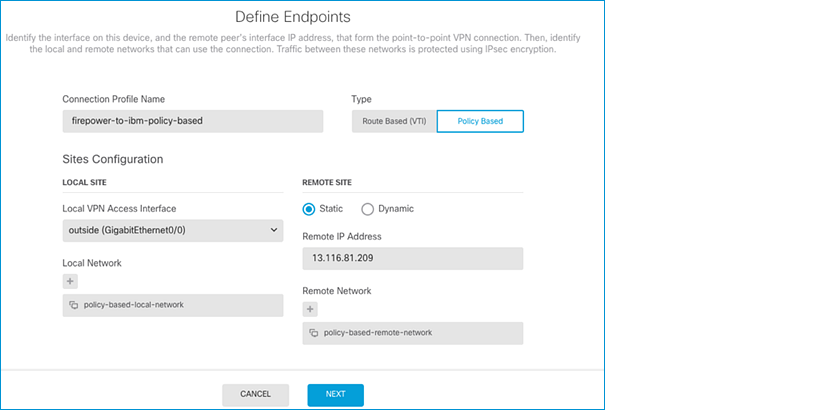{: caption="Define Endpoints" caption-side="bottom"}

1. Click **NEXT**. On the Privacy Configuration page, define the privacy configuration for the VPN.

   * Enable the **IKE VERSION 2** toggle button and configure the Internet Key Exchange (IKE) Policy.

      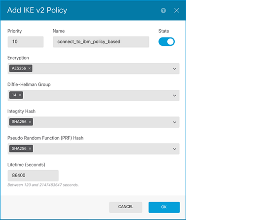{: caption="Add IKE v2 Policy" caption-side="bottom"}

   * Configure the **IPSec Proposal** settings, which define the combination of security protocols and algorithms that secure traffic in an IPsec tunnel.

      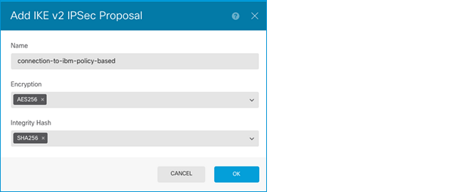{: caption="Add IKE v2 IPSec Proposal" caption-side="bottom"}

   * Specify the **Pre-shared Key** that is defined on both the local and remote device. The key can be 1-127 alphanumeric characters. Then, click **NEXT**.

      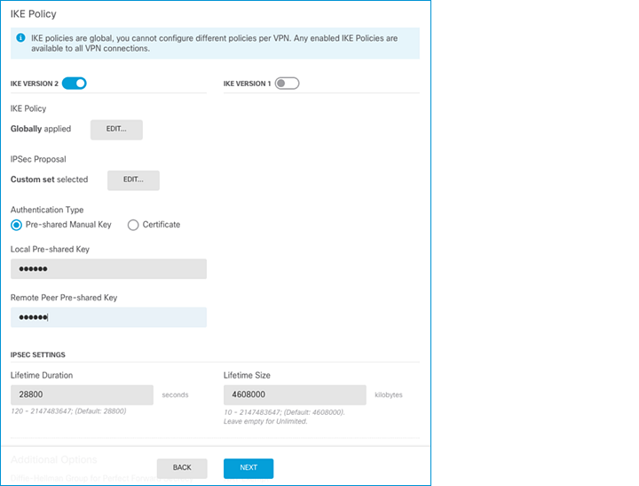{: caption="Pre-shared Key" caption-side="bottom"}

1. Review the summary and click **FINISH**.

1. Create an access control policy to permit traffic across the VPN. To do so, follow these steps:

      1. Click **Policies** from the menu bar.
      1. Click the **+** button to add an access rule. Select your local network object for **Source**, and your remote network object as **Destination**. You can create network objects for the Source and the Destination.
      1. Select **Allow** for Action, and then click **OK**.

   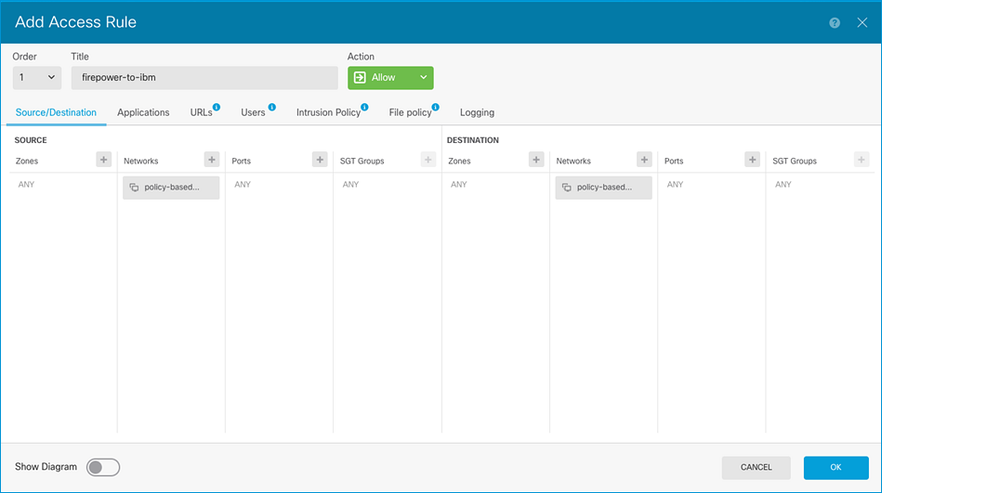{: caption="Create access control policy" caption-side="bottom"}

1. Repeat step 6 to create another access control policy for the returning traffic. This time, the remote network object is the **Source**, and the local network object is the **Destination**.

1. Configure TCP MSS clamping to avoid unnecessary fragmentation. Go to **Device** > **Advanced Configuration** > **FlexConfig** > **FlexConfig Objects** > **+ button** and create a FlexConfig Object with the `sysopt connection tcpmss 1360` command.

   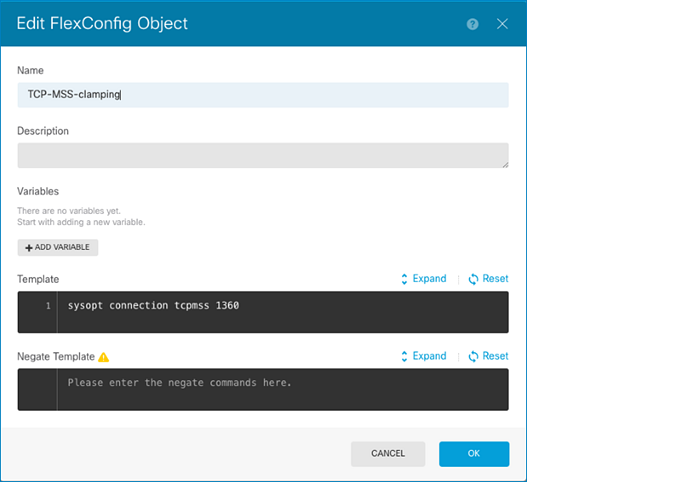{: caption="FlexConfig Policy" caption-side="bottom"}

1. Go to **Device** > **Advanced Configuration** > **FlexConfig** > **FlexConfig Policy** and add the FlexConfig object that you created. Click **SAVE**.

   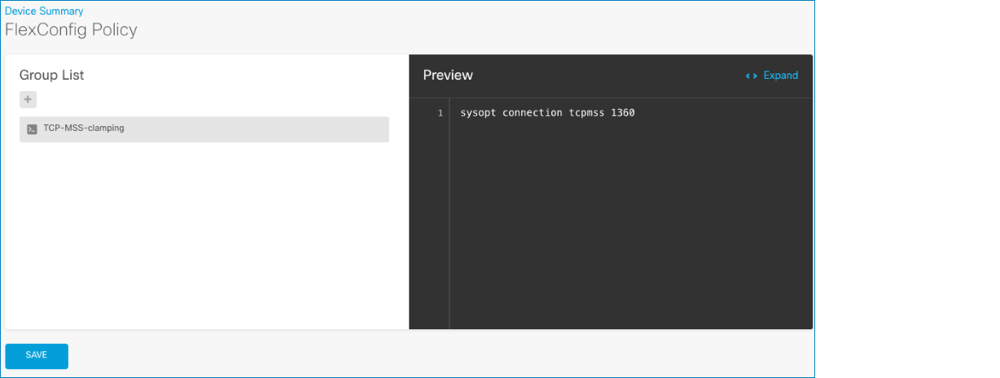{: caption="Edit FlexConfig Object" caption-side="bottom"}

1. Deploy your changes:

   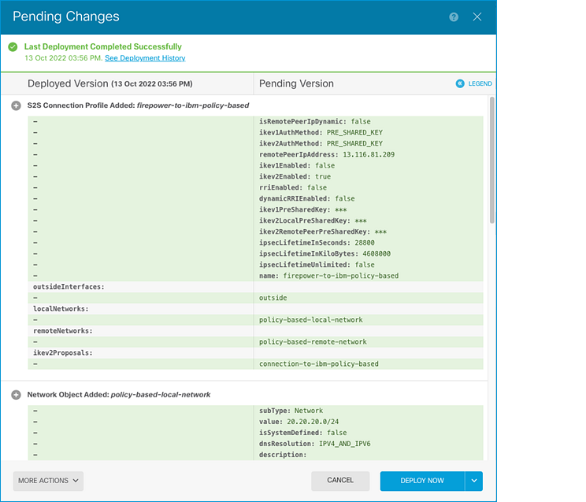{: caption="Deploy Changes" caption-side="bottom"}

1. To verify that the IPSec VPN is working, run the `show crypto ikev2 sa` command from the CLI console, and make sure that hosts from both subnets can reach one another.

   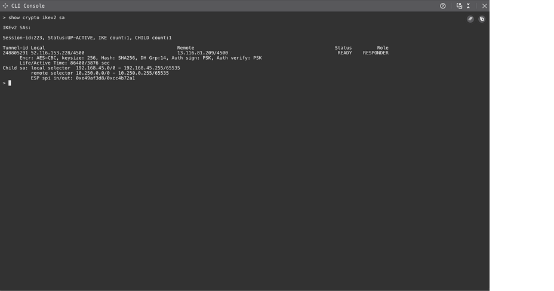{: caption="CLI command" caption-side="bottom"}

   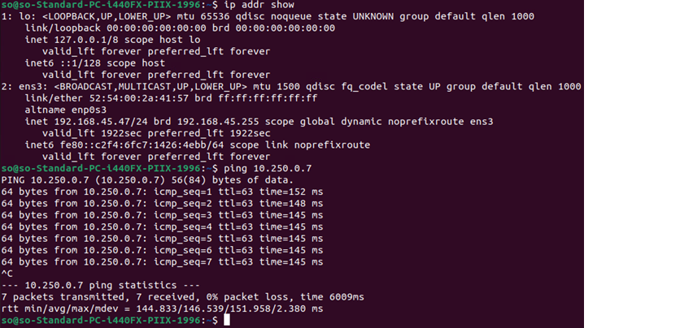{: caption="CLI output" caption-side="bottom"}
