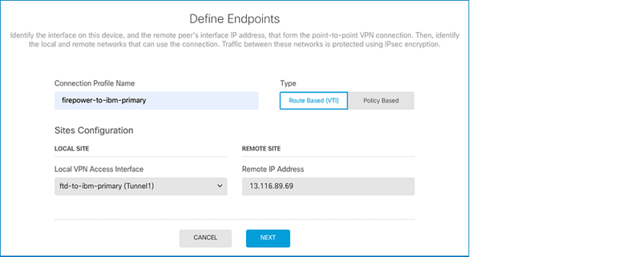
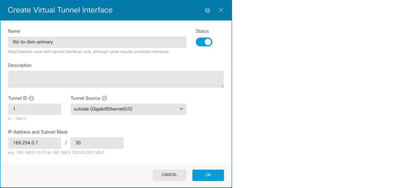
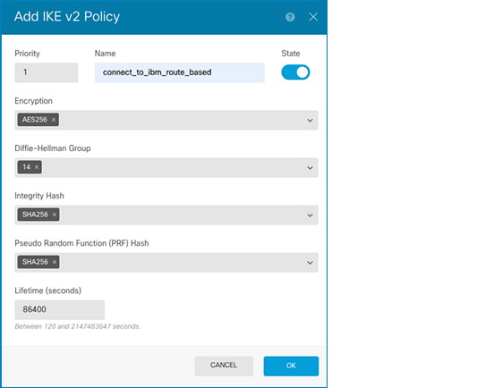
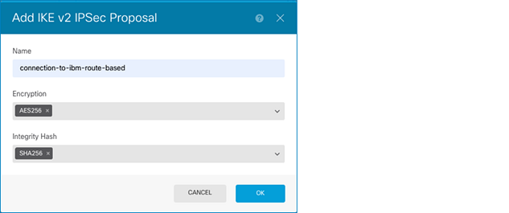
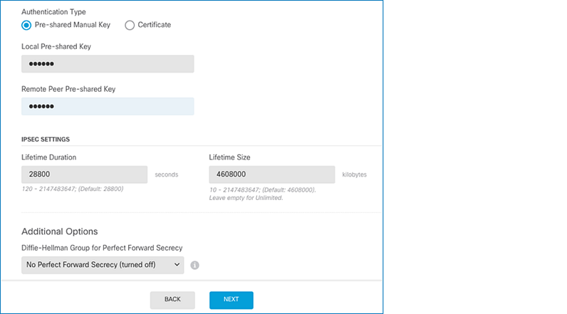
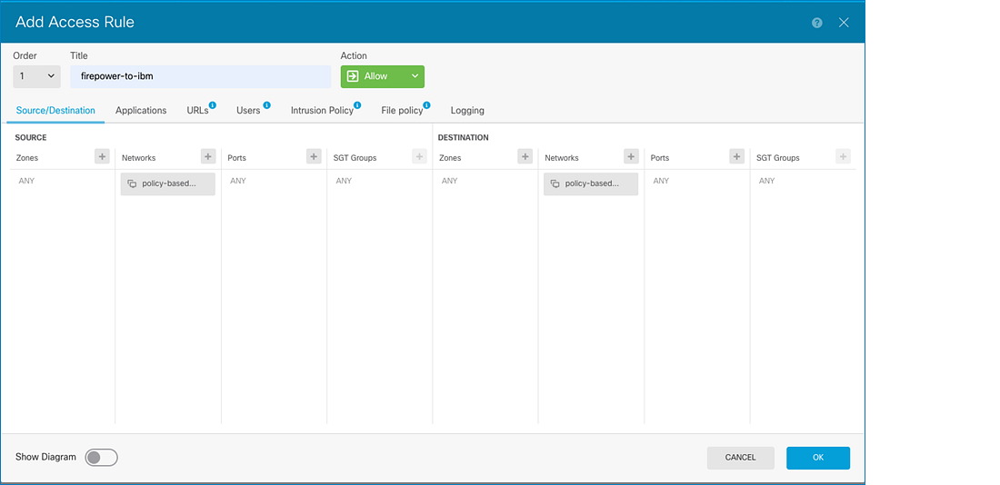
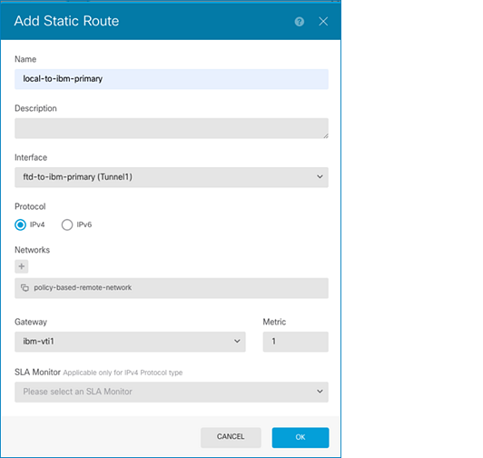
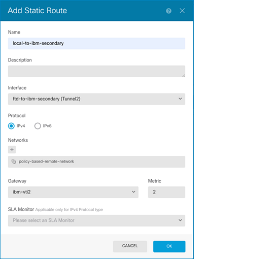
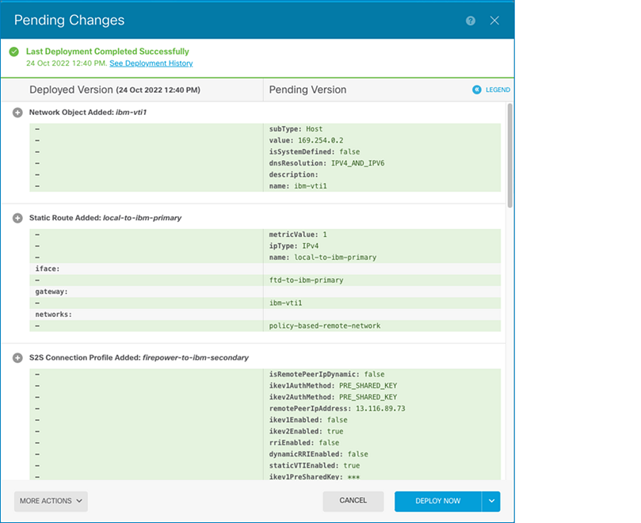
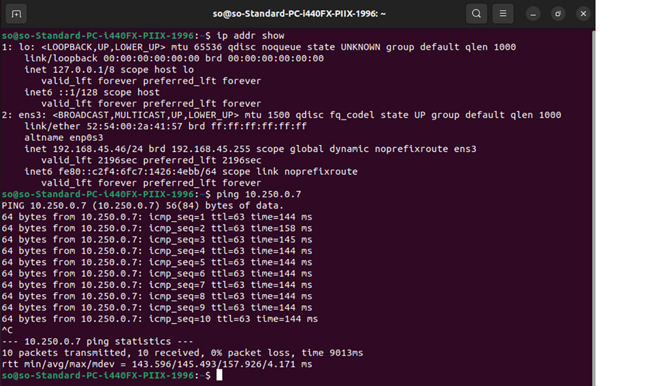

---

copyright:
  years: 2020, 2024
lastupdated: "2024-06-20"

keywords: firepower, firepower peer, vpn

subcollection: vpc

---

{{site.data.keyword.attribute-definition-list}}

# Connecting to a Cisco Firepower Thread Defense peer (route-based)
{: #cisco-ftd-route-based-config}

You can use IBM Cloud VPN for VPC to securely connect your VPC to an on-premises network through a VPN tunnel. This topic provides guidance about how to configure your Cisco FTDv to connect to VPN for VPC.

Review [VPN gateway limitations](/docs/vpc?topic=vpc-vpn-limitations) before you connect to your on-premises peer.
{: important}

These instructions are based on Cisco FTDv, Cisco Firepower Thread Defender, Version **7.0.4**.

## Before you begin
{: #cisco-ftd-before-you-begin}

The first step in configuring your Cisco FTDv for use with VPN for VPC is to ensure that the following prerequisite conditions are met:

- Cisco FTDv is online and functional with a proper license.
- You have a credential for accessing the Firepower Device Manager Web UI.
- You have at least one configured and verified functional internal interface.
- You have at least one configured and verified functional external interface.

## Connecting an IBM route-based VPN to a Cisco Firepower Thread Defense peer
{: #cisco-ftd-procedure}

To connect to a Cisco Firepower Thread Defense peer, follow these steps:

1. Log in to the Firepower Device Manager and click **Device** in the menu bar to view the Device Summary page. Then, click **View Configuration** in the Site-to-Site VPN group.

   {: caption="Device summary" caption-side="bottom"}

1. Create the first IPsec tunnel. On the Site-to-Site VPN page, click the **+** button to create a site-to-site VPN connection or, if there are no connections yet, you can click the **CREATE SITE-TO-SITE CONNECTION** button.
1. On the New Site-to-site VPN page, define the endpoints of the point-to-point VPN connection. To do so, configure the following settings:

   - **Connection Profile Name** - Provide a name for this connection, up to 64 characters without spaces. You cannot use an IP address as the name.
   - **Type** - Select **Route Based (VTI)** to use the routing table, primarily static routes, to define the local and remote networks that should participate in the tunnel.
   - **Local VPN Access Interface** - Select the interface to which the remote peer can connect. Provide a link-local address.
   - **Remote IP Address** - Enter the smaller IBM gateway members public IP for the primary IPsec tunnel.

   {: caption="Define endpoints" caption-side="bottom"}

      You can create a virtual tunnel interface (VTI) by clicking the **Create new Virtual Interface** link in the **Local VPN Access Interface** menu. Be careful to choose the link-local address and make sure that it is not overlapping with other addresses on the device. In this example, we used `169.254.0.0/30` for our primary tunnel. There are two available IP addresses `169.254.0.1` and `169.254.0.1` in this subnet with a 30-bit netmask. The first IP address `169.254.0.1` was used as the VTI on the FTDv. The second IP address `169.254.0.2` was used as the IBM VPN gateway VTI address.
      {: note}

      {: caption="Create Virtual Tunnel Interface" caption-side="bottom"}

1. Click **NEXT**. On the Privacy Configuration page, define the privacy configuration for the VPN.

   * Enable the **IKE VERSION 2** toggle button and configure the Internet Key Exchange (IKE) Policy.

      {: caption="Add IKE v2 Policy" caption-side="bottom"}

   * Configure the **IPSec Proposal** settings, which define the combination of security protocols and algorithms that secure traffic in an IPsec tunnel.

      {: caption="Add IKE v2 IPSec Proposal" caption-side="bottom"}

   * Specify the **Pre-shared Key** that is defined on both the local and remote device. The key can be 1-127 alphanumeric characters. Then, click **NEXT**.

      {: caption="Pre-shared Key" caption-side="bottom"}

1. Review the summary and click **FINISH**.
1. To create the secondary IPsec tunnel, follow these steps:

   1. Click the **+** button from the Device Summary page.
   1. Repeat steps 3 through 5 with the following exceptions:

      * For the Remote IP Address, use the greater IBM Gateway members public IP for the secondary IPsec tunnel.
      * Use the same **IKE VERSION 2** configuration and IPSec Proposals as the primary tunnel.

1. Create an access control policy to permit traffic across the VPN. To do so, follow these steps:

      1. Click **Policies** from the menu bar.
      1. Click the **+** button to add an access rule. Select your local network object for **Source**, and your remote network object as **Destination**. You can create network objects for the Source and the Destination.
      1. Specify the rule **Title**. Select **Allow** for Action, and then click **OK**.

         {: caption="Add Access Rule" caption-side="bottom"}

1. Repeat step 7 to create another access control policy for the returning traffic. This time, the remote network object is the **Source**, and the local network object is the **Destination**.
1. Add a static route to allow your local networks to pass through the primary IPsec VPN tunnel. To do so, go to **Device** > **Routing** > **+ button** and complete the following information:

   - **Name** - Specify a name for the status route.
   - **Interface** - Select the primary virtual tunnel interface that you already created.
   - **Networks** - Specify the network object that you created for the remote subnet.
   - **Gateway** - Create a network object with an IP from the same subnet as the primary virtual tunnel.
   - **Metric** - Specify the metric for the primary tunnel. This metric must be less than the secondary tunnel.

   {: caption="Create access control policy" caption-side="bottom"}

1. Click **OK**.

1. Add a static route to allow your local networks to pass through the secondary IPsec VPN tunnel. To do so, go to **Device** > **Routing** > **+ button** and complete the following information:

   - **Name** - Specify a name for the status route (for example, `local-to-ibm-secondary`).
   - **Interface** - Select the secondary virtual tunnel interface that you already created.
   - **Networks** - Specify the network object that you created for the remote subnet.
   - **Gateway** - Create a network object with an IP from the same subnet as the secondary virtual tunnel.
   - **Metric** - Specify the metric for the secondary tunnel. This metric must be greater than the primary tunnel.

   {: caption="Add Static Route" caption-side="bottom"}

1. Click **OK**.

1. Configure TCP MSS clamping to avoid unnecessary fragmentation. Go to **Device** > **Advanced Configuration** > **FlexConfig** > **FlexConfig Objects** >**+ button** and create a FlexConfig object with the `sysopt connection tcpmss 1360` command.

   {: caption="FlexConfig Policy" caption-side="bottom"}

1. Go to **Device** > **Advanced Configuration** > **FlexConfig** > **FlexConfig Policy** and add the FlexConfig object that you created. Click **SAVE**.

   {: caption="Edit FlexConfig Object" caption-side="bottom"}

1. Deploy your changes:

   {: caption="Pending Changes" caption-side="bottom"}

1. To verify that the IPsec VPN is working, run the `show crypto ikev2 sa` command from the CLI console, and make sure that the hosts from both subnets can reach one another.

   {: caption="The `show crypto ikev2 sa` command" caption-side="bottom"}

   {: caption="Command output" caption-side="bottom"}
