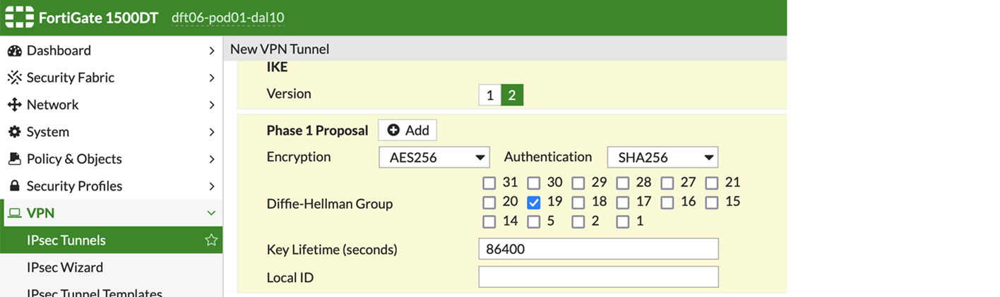
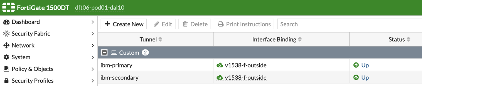
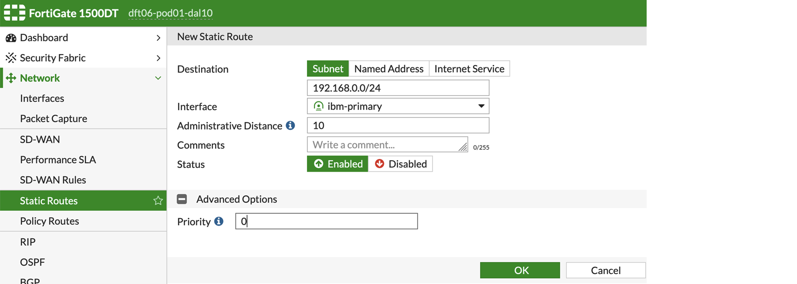
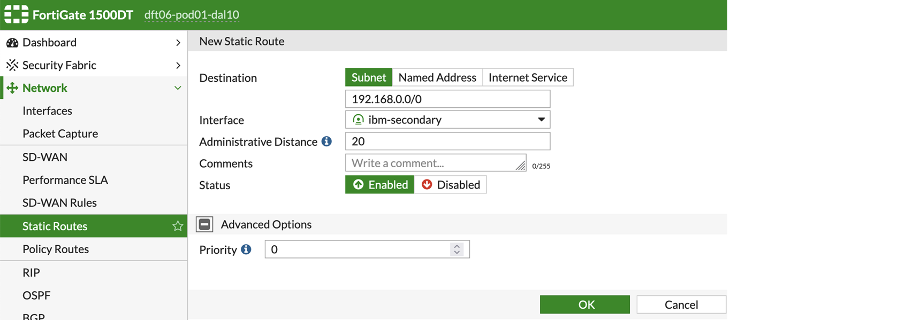
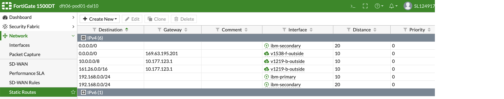

---

copyright:
  years: 2020, 2025
lastupdated: "2025-08-18"

keywords: fortigate, fortigate peer

subcollection: vpc

---

{{site.data.keyword.attribute-definition-list}}

# Connecting to a FortiGate peer
{: #fortigate-config}

You can use IBM Cloud VPN for VPC to securely connect your VPC to an on-prem network through a VPN tunnel. This topic provides guidance about how to configure your FortiGate VPN gateway to connect to VPN for VPC.
{: shortdesc}

These instructions are based on FortiGate 300C, Firmware Version v5.2.13, build762 (GA) and are written considering that you use the default (Auto) IPsec and IKE policies for your VPN gateway. If you create custom IKE and IPsec policies for your VPN gateway, some of the values that are suggested in the following sections for Diffie-Hellman, authentication, encryption, and key lifetime can change.
{: note}

See [Known issues for VPN gateways](/docs/vpc?topic=vpc-vpn-limitations) before you continue to connect to your on-premises peer.
{: tip}

## Connecting an IBM policy-based VPN to a FortiGate peer
{: #fortigate-policy-based-vpn}

Select **VPN > IPsec Tunnels** and create a new custom tunnel, or edit an existing tunnel.

When a FortiGate VPN receives a connection request from {{site.data.keyword.vpn_vpc_short}}, FortiGate uses IPsec Phase 1 parameters to establish a secure connection and authenticate {{site.data.keyword.vpn_vpc_short}}. Then, if the security policy permits the connection, the FortiGate VPN establishes the tunnel by using IPsec Phase 2 parameters and applies the IPsec security policy. Key management, authentication, and security services are negotiated dynamically through the IKE protocol.

To support these functions, the following general configuration steps must be performed for the FortiGate VPN:

* Define the Phase 1 parameters that the FortiGate VPN requires to authenticate {{site.data.keyword.vpn_vpc_short}} and establish a secure connection.
* Define the Phase 2 parameters that the FortiGate VPN requires to create a VPN tunnel with {{site.data.keyword.vpn_vpc_short}}.
* Create security policies to control the permitted services and permitted direction of traffic between the IP source and destination addresses.

An example configuration is as follows:

1. Choose IKEv2 in authentication.
1. Enable `DH-group 19` in the Phase 1 proposal.
1. Set `lifetime = 36000` in the Phase 1 proposal.
1. Disable PFS in the Phase 2 proposal.
1. Set `lifetime = 10800` in the Phase 2 proposal.
1. Input your subnet's information in Phase 2.
1. The remaining parameters keep their default values.

## Connecting an IBM static, route-based VPN to a FortiGate peer
{: #fortigate-route-based-vpn}

The following steps show how to connect an IBM static, route-based VPN to a FortiGate peer.

1. To configure a primary tunnel, select **VPN > IPsec Tunnels** and create a new custom template type tunnel, or edit an existing tunnel.

   {: caption="FortiGate connection primary tunnel creation" caption-side="bottom"}

1. To configure a peer IP of a primary tunnel, use the small public IP address of the IBM route-based VPN gateway as the remote gateway IP address.

   For more information about the small public IP, see this [important notice](/docs/vpc?topic=vpc-using-vpn#important-notice). Also, keep in mind that in some cases, when you configure the Fortigate peer, set the NAT Traversal option to **Forced** instead of **Enabled** to avoid experiencing packet drop issues.
   {: note}

   {: caption="FortiGate connection with peer IP of primary tunnel" caption-side="bottom"}

1. To configure an IKE proposal, use the matched IKE version and proposals.

   {: caption="FortiGate connection IKE proposal" caption-side="bottom"}

1. To configure an IPsec proposal, use the matched IPsec proposals.

   {: caption="FortiGate connection IPsec proposal" caption-side="bottom"}

When you connect FortiGate to a third-party VPN peer, Phase 1 authentication might fail if the local ID is sent in the wrong format. By default, FortiGate sends its local ID as a fully qualified domain name (FQDN), even if an IP address is configured. However, some third-party VPN gateways expect the local ID in IP address format instead. A mismatch in identity types might cause the VPN tunnel to fail with the error: `AUTHENTICATION_FAILED`. On the peer side, logs might show this error: `Failed to locate an item in the database – Peer identity type is FQDN`.
{: note}

To resolve this error, use the FortiGate CLI and set the `localid-type` to `address` and `localid` to the FortiGate public IP.

```text
config vpn ipsec phase1-interface
    edit <tunnel_name>
        set localid-type address
        set localid <your FortiGate public IP>
    next
end
```
{: codeblock}

### Configuring a secondary tunnel
{: #configure-secondary-tunnel}

To configure a secondary tunnel, follow these steps:

1. Repeat the preceding steps to create the secondary tunnel. Use the large public IP address of the IBM route-based VPN gateway as the remote gateway IP address.

   {: caption="FortiGate connection secondary tunnel Creation" caption-side="bottom"}

1. Create the primary route where the destination is your VPC subnet and the interface is the primary tunnel.

   {: caption="FortiGate connection primary route" caption-side="bottom"}

1. To configure a secondary route, create the backup route where the destination is your VPC subnet and the interface is the secondary tunnel. Make sure that the administrative distance is greater than the one on the primary route.

   {: caption="FortiGate connection secondary route" caption-side="bottom"}

1. To verify configurations, list all the routes and verify the route configurations. Then, check that the route distance and primary are configured properly on the primary and secondary routes.

   {: caption="FortiGate connection configuration verification" caption-side="bottom"}
