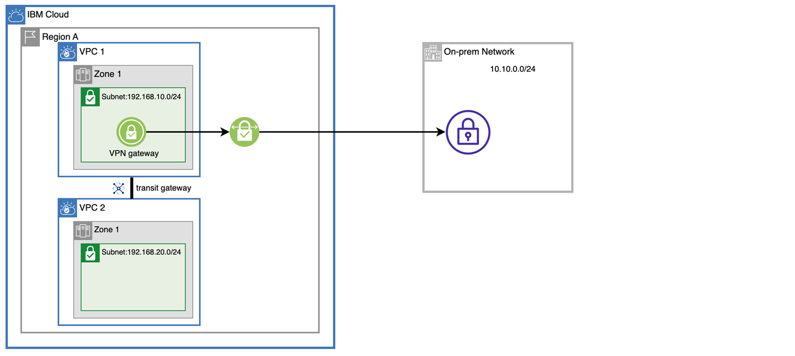

---

copyright:
  years: 2023
lastupdated: "2023-05-22"

keywords:  network, VPN, VPN gateways, encryption

subcollection: vpc

---

{{site.data.keyword.attribute-definition-list}}

# Policy-based ingress routing integration
{: #vpn-policy-based-ingress-routing-integration-example}

Policy-based VPN gateways can work with ingress routing to forward incoming VPC traffic (for example, traffic from {{site.data.keyword.tg_full}}) to a customer on-prem site by leveraging a VPN gateway.
{: shortdesc}

The following example describes a customer that has multiple VPCs in {{site.data.keyword.cloud_notm}} and wants to connect their on-prem site and an {{site.data.keyword.cloud_notm}} VPC with a single policy-based VPN gateway.

{: caption="Policy-based VPN gateway ingress routing table integration" caption-side="bottom"}

## Prerequisites
{: #policy-based-routing-prereq}

Make sure to satisfy the following prerequisites:

1. Ensure that VPC 1 and VPC 2 on IBM Cloud are connected using {{site.data.keyword.tg_full_notm}}. Also, make sure that there is communication between VPC 1 and VPC 2. For more information and setup instructions, see the [{{site.data.keyword.tg_full_notm}} documentation](/docs/transit-gateway).
1. Ensure that a policy-based VPN gateway has been created in the {{site.data.keyword.cloud_notm}} VPC 1 zone. For more information, see [Creating a VPN gateway](/docs/vpc?topic=vpc-vpn-create-gateway).

## Configuration steps
{: #config-steps}

To integrate a policy-based VPN gateway with an ingress routing table, follow these steps:

1. On the VPC 1 overview page, click **Manage routing tables**, then click **Create**. Select your region, and enter a routing table **Name**. Then, select **Ingress** for **traffic type**, and select **Transit gateway** for **Ingress properties**.
1. Enter the following command to allow routes propagation from the VPN gateway.

    ```sh
    ibmcloud is vpc-routing-table-update <vpc-id> <routing-table-id> --ar-rtf vpn_gateway
    ```
    {: pre}

   Where `vpc-id` is the ID of VPC 1 and `routing-table-id` is the ID of ingress routing table that you created.

1. On the VPN gateway overview page, click **Create** to create a connection. For **Local IBM CIDRs**, enter `192.168.10.0/24` and `192.168.20.0/24`; for **Peer CIDRs**, enter `10.10.0.0/24`.
1. On the VPC 1 details page, click **Manage address prefixes**.
1. Click **Create** to create an address prefix. Enter the on-prem site CIDR **`10.10.0.0/24`** as the IP range, then select the zone where the VPN gateway is located.
1. On the Transit Gateway details page, click the **Routes** tab, then click **Generate report**. Check that the routes were generated and ensure that the entry for `10.10.0.0/24` shows.
1. Go to the on-prem side of the VPN gateway. Then, create a connection to the IBM Cloud side VPN gateway. For the local CIDRs, enter `10.10.0.0/24` and for remote CIDRs, enter `192.168.10.0/24` and `192.168.20.0/24`.
1. On the {{site.data.keyword.cloud_notm}} console, wait for the connection to state **Active**. Then, go to overview page of the ingress routing table. Ensure that routes with destination `10.10.0.0/24` and a name that is prefixed with `ibm-vpn-gateway-` are shown.
