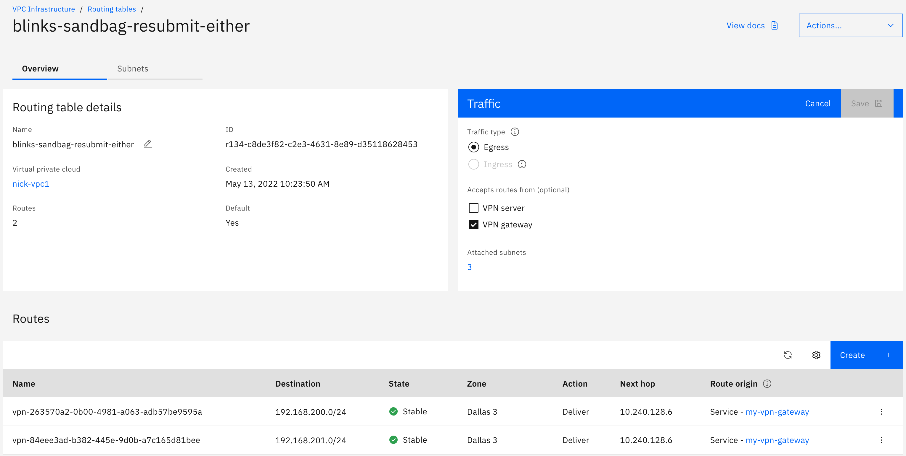

---

copyright:
  years: 2023
lastupdated: "2023-01-04"

keywords:  network, VPN, VPN gateways, encryption

subcollection: vpc

---

{{site.data.keyword.attribute-definition-list}}

# Configuring route propagation for VPN gateways
{: #vpn-site-to-site-routes-propagating}  

Peer CIDRs configured for policy-based VPN gateway connections are added to VPC routing tables as the destination. The VPC routing table attribute `Accepts routes from` controls whether a routing table accepts routes that were added by the VPN gateway. If `VPN gateway` is selected for this attribute, the VPN gateway propagates routes to this routing table.
{: shortdesc}

Select `VPN gateway` in the following cases:

1. If you want to tunnel traffic to or from a virtual server instance in subnets, you must select `VPN gateway`for the routing table that is associated with this subnet.
1. For troubleshooting purposes, you can select or deselect `VPN gateway` to check routes that were added by the VPN gateway.

VPN gateway route propagation supports both the default routing table and custom routing tables. When you create a routing table, make sure to select `VPN gateway` if you want VPN gateway routes propagated to it. For the default routing table, `VPN gateway` is selected by default.

{: caption="Policy-based VPN gateway accepts routes from" caption-side="bottom"}
