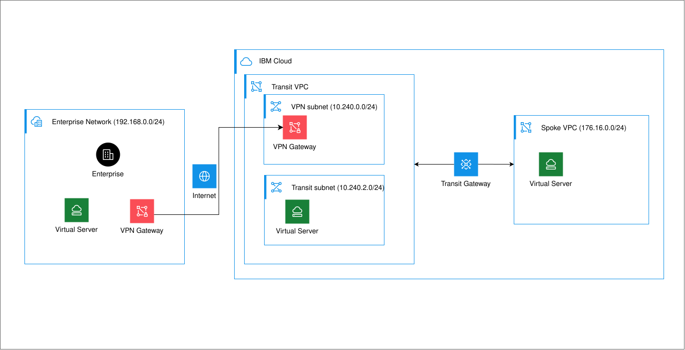

---

copyright:
  years: 2024, 2026
lastupdated: "2026-06-25"

keywords: network, VPN, VPN gateways, encryption

subcollection: vpc

---

{{site.data.keyword.attribute-definition-list}}

# Configuring route propagation for VPN gateways (WIP)
{: #advertise-routes-s2s}

Route propagation enables a VPC routing table to automatically learn routes from a site-to-site VPN gateway. Route advertisement enables those learned routes to be advertised to a transit gateway so they can be shared with other VPCs and connected networks.
{: shortdesc}

## Before you begin
{: #vpn-route-propagation-prerequisites}

Before you configure route propagation for VPN gateways, review the following considerations:

* Review [planning considerations](/docs/vpc?topic=vpc-planning-considerations-vpn&interface=ui) and [known issues for VPN gateways](/docs/vpc?topic=vpc-vpn-limitations&interface=ui).
* Review [routing tables and routes](/docs/vpc?topic=vpc-about-custom-routes&interface=ui).
* In the VPC ingress routing table, the **Accepts routes from** setting for policy-based VPN determines whether routes that are learned from a VPN gateway are added to the routing table.
* Additionally, you must select **VPN gateway** in the **Accepts routes from** setting in the following cases:
   * The routing table is associated with a subnet that must route traffic through the VPN gateway.
   * You are using a policy-based VPN and want VPN-learned routes to be propagated to the routing table.
* The VPN gateway route propagation for policy-based VPN is supported by both default and custom routing tables:
   * For the default routing table, **VPN gateway** is selected by default in the **Accepts routes from** setting.
   * For custom routing tables, you must manually select **VPN gateway** to enable route propagation.
* For ingress routing tables, the **Advertise to** setting advertises the propagated routes to a transit gateway, when the transit gateway is selected as the traffic source.

## VPN gateway modes and route propagation
{: #vpn-gateway-modes-and-routes}

Route propagation and route advertisement behavior differ based on the VPN gateway mode and connection type.

| VPN type | Route behavior | Transit Gateway support |
| --- | --- | --- |
| **Policy-based VPN** | No manual route configuration required. Traffic that matches the configured local and remote CIDR ranges and defined security policies pass through the VPN. | Supported. To configure a transit gateway with a policy-based VPN connection, see [Setting up a transit gateway with policy-based VPN](/docs/vpc?topic=vpc-advertise-routes-s2s&interface=ui#setup-tg-with-vpn-vpc). |
| **Static route-based VPN** | You must configure routes manually in the routing table. Traffic is forwarded through the VPN tunnel based on routing table entries that point to the VPN connection. | Supported. To configure a transit gateway with a static route-based connection, see [Setting up a transit gateway with static route-based VPN for VPC](/docs/vpc?topic=vpc-advertise-routes-s2s#setup-tg-with-static-vpn-vpc). |
| **Dynamic route-based VPN** | No manual route configuration required. BGP automatically learns and propagates routes. | Supported with automatic route advertisement. For more information, see [planning considerations](/docs/vpc?topic=vpc-planning-considerations-vpn&interface=ui#dynamic-route-based-connection-considerations). |
{: caption="VPN gateway modes and route propagation behavior" caption-side="bottom"}

## Setting up a transit gateway with policy-based VPN for VPC
{: #setup-tg-with-vpn-vpc}

To set up this configuration, follow these steps:

1. [Create a transit gateway](/docs/transit-gateway?topic=transit-gateway-ordering-transit-gateway&interface=ui) to connect the VPCs.
1. [Create a policy-based VPN gateway](/docs/vpc?topic=vpc-vpn-create-gateway) and select the VPC that is attached to the transit gateway.
1. [Create an ingress routing table](/docs/vpc?topic=vpc-create-vpc-routing-table) in the VPC where the VPN gateway exists.

   * Enable the **VPN gateway** toggle in the **Accepts routes from** section to allow routes learned through the VPN gateway to be added to the routing table.
   * Enable the **Advertise to** toggle for the transit gateway so that on-premises routes that are learned from the VPN gateway are advertised to other connected networks.

After the connection with the transit gateway is established, the route shows **On** in the Advertise column of the routing table. On-premises routes are automatically advertised through the transit gateway after the ingress routing table accepts routes from the VPN gateway.

For troubleshooting purposes, you can select or deselect **VPN gateway** to check routes that were added by the VPN gateway to the routing table.
{: tip}

### Migrating to advertised routes in policy-based VPN for VPC
{: #migrate-to-advertise-routes-s2s}

For a policy-based VPN, you can migrate from manually defined address prefixes to automatically advertised routes. Existing policy-based VPN customers who use address prefixes can choose from the following options:

* Keep using address prefixes in your VPC. No further action is required.

* To migrate to advertised routes, follow these steps:
   1. Go to the ingress routing table in the VPC where the policy-based VPN gateway exists.
   1. In the **Traffic source** section, set **Advertise to** to **On**.
   1. Wait for the route's **Advertise** status to change to **On**.
   1. Delete the address prefix from the VPC.

   A brief traffic disruption is expected during the migration. To minimize interruptions, plan the migration during a maintenance window.
   {: important}

## Setting up a transit gateway with static route-based VPN for VPC
{: #setup-tg-with-static-vpn-vpc}

This configuration applies only to static route-based VPN. A dynamic route-based VPN automatically propagates routes and doesn't require manual configuration with transit gateway.
{: note}

To set up this configuration, follow these steps:

1. [Create a transit gateway](/docs/transit-gateway?topic=transit-gateway-ordering-transit-gateway&interface=ui) to connect the VPCs.
1. [Create a route-based VPN](/docs/vpc?topic=vpc-vpn-create-gateway&interface=ui), and select the VPC that is attached to the transit gateway.
1. [Create an ingress routing table](/docs/vpc?topic=vpc-create-vpc-routing-table&interface=ui) in the VPC where the VPN gateway exists.

   * In the routing table, create a route and set the next hop to **VPN connection**, which enables direct routing to the VPN tunnel. For more information, see [Creating a route](/docs/vpc?topic=vpc-create-vpc-route&interface=ui).
   * While creating a route, select the VPN gateway and VPN connection to define the next hop for traffic.
   * Enable the **Advertise** toggle so that on-premises routes that are learned from the VPN gateway are advertised to the transit gateway.

   When you create a route with a VPN connection as the next hop, the route advertisement setting is configured during route creation. If you want to change this setting, you must delete and recreate the route with the updated preference.
   {: note}

After the connection with the transit gateway is established, the route shows **On** in the Advertise column of the routing table. On-premises routes are then automatically advertised through the transit gateway.

### Use case: Static route-based VPN connection with transit gateway using ingress routing and VPN as the next hop
{: #use-case-static-vpn}

With a static route-based VPN, you can establish a VPN connection between your VPC and your on-premises private network using a transit gateway. You can route traffic based on its source by using the ingress routing table and configure routes that use the VPN connection as the next hop.

In this configuration, the enterprise network connects to a VPN gateway located in the transit VPC. The transit VPC is attached to a transit gateway, which provides connectivity to a spoke VPC. When route advertisement is enabled, incoming traffic from the VPN is forwarded to the transit gateway, which then routes traffic to the appropriate spoke VPC.

The ingress routing table in the transit VPC advertises on-premises CIDR ranges to the transit gateway and evaluates return traffic that is received from it. Return traffic follows the reverse path, flowing from the spoke VPC through the transit gateway, back to the transit VPC, then through the VPN gateway, and finally to the enterprise network.

{: caption="Static route-based VPN with transit gateway" caption-side="bottom"}

## Related links
{: #propagating-routes-s2s-related}

* [Use case 4: Integrating with a site-to-site VPN gateway](/docs/vpc?topic=vpc-vpn-client-to-site-overview#integrating-with-site-to-site-vpn-gateway)
* [Why did the advertised route creation fail in my VPN gateway?](/docs/vpc?topic=vpc-troubleshoot-s2s-advertise-routes-over-quota)
* [Why is the route advertisement to ingress sources not working?](/docs/vpc?topic=vpc-troubleshoot-advertise-route-does-not-work-s2s)
* [Why can't I access my classic virtual server instance privately after I configure route propagation for VPN gateways?](/docs/vpc?topic=vpc-troubleshoot-s2s-cannot-access-classic-vsi)
