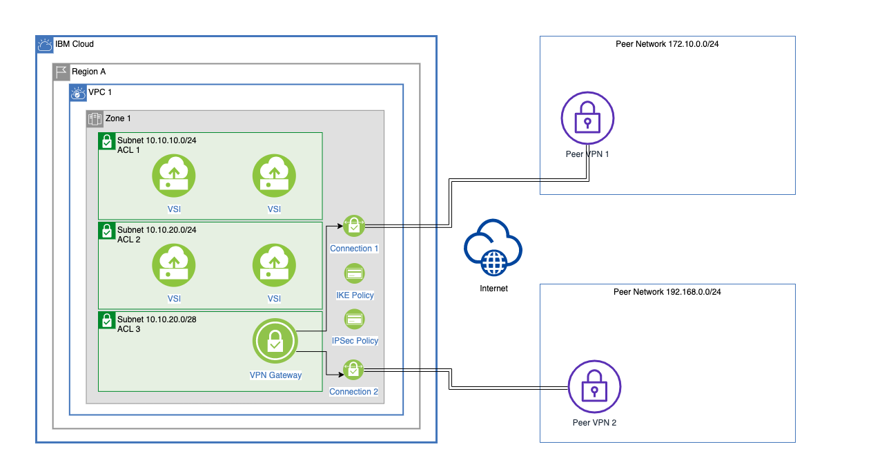
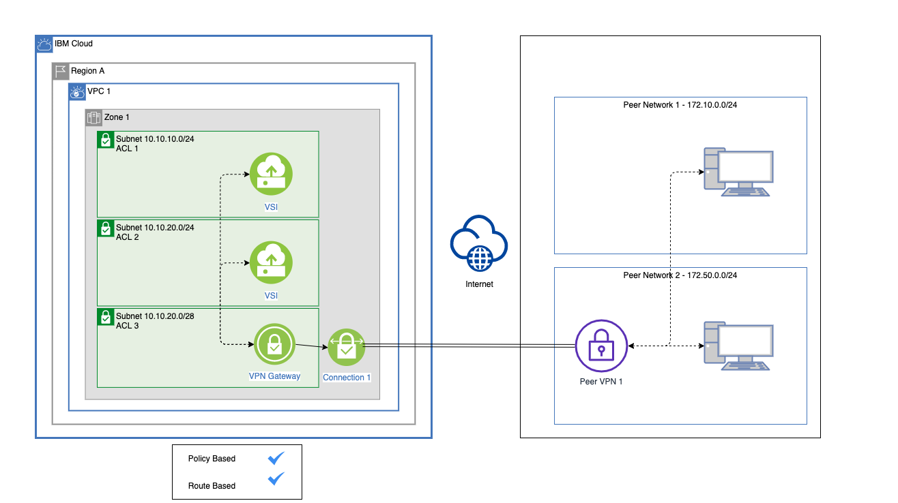
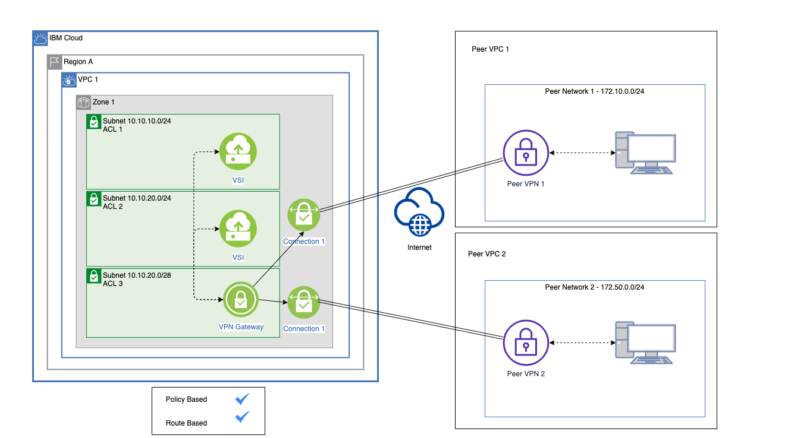
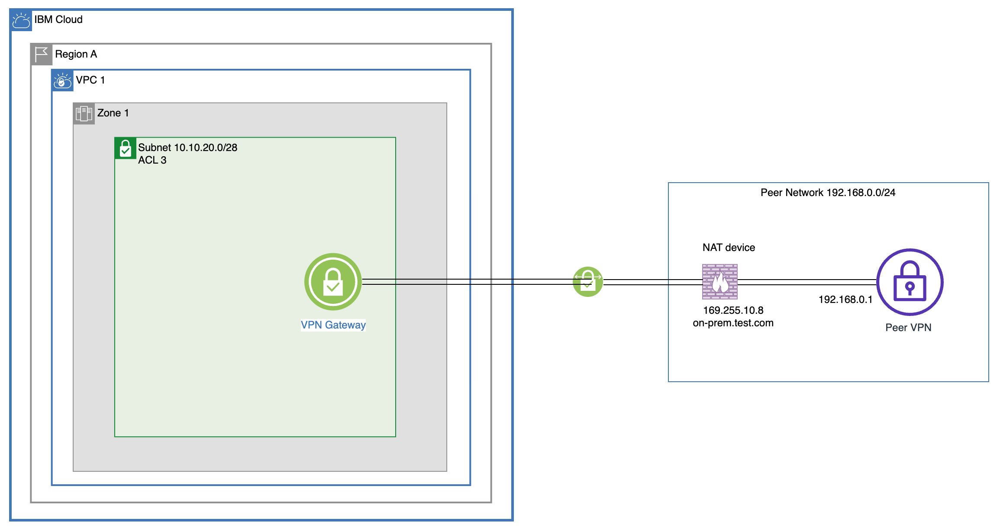

---

copyright:
  years: 2019, 2025
lastupdated: "2025-04-25"

keywords: VPN, VPN gateways, encryption, IKE, IPsec, gateway, auto-negotiation, Diffie-Hellman, dead peer detection, PFS

subcollection: vpc

---

{{site.data.keyword.attribute-definition-list}}

# About site-to-site VPN gateways
{: #using-vpn}

You can use the IBM Cloud VPN for VPC service to securely connect your Virtual Private Cloud (VPC) to another private network. Use a static, route-based VPN, or a policy-based VPN to set up an IPsec site-to-site tunnel between your VPC and your on-prem private network or another VPC.
{: shortdesc}

Route-based VPN is now available in addition to policy-based VPN. To get started, select **Route-based** as the mode when you create a VPN gateway and [create routes](/docs/vpc?topic=vpc-create-vpc-route) by using the VPN connection type.
{: note}

## VPN for VPC features
{: #vpn-features}

The IBM Cloud VPN for VPC service includes the following features:

MD-5 and SHA-1 authentication algorithms, 2 and 5 DH groups, and the 3-DES encryption algorithm were deprecated on 20 September 2022 and are no longer supported in the UI.
{: deprecated}

* **Authentication** - IBM Cloud VPN for VPC supports a pre-shared key for Phase 1 peer authentication. Supported authentication algorithms for both phases include SHA-256, SHA-384, and SHA-512.
* **Dead peer detection** - Configurable mechanism to detect availability of an IPsec peer.
* **Diffie-Hellman (DH)** - Key exchange protocol used in Phase 1 to generate a shared secret key between VPN peers. Optionally, users can enable Perfect Forward Secrecy (PFS) and a DH group for Phase 2 IPsec negotiation. IBM Cloud VPN for VPC supports DH groups 14-24 and 31.
* **Encryption** - IBM Cloud VPN for VPC supports AES-128, AES-192, and AES-256 for data encryption during both IKE Phase 1 and Phase 2.
* **High availability** - IBM Cloud VPN for VPC is built on two VPN devices to provide appliance-level redundancy. A policy-based VPN operates in Active-Standby mode with a single VPN gateway IP shared between the members, while a route-based VPN offers Active-Active redundancy with two VPN gateway IPs.

   A static, route-based VPN deploys in Active-Active redundancy mode. Two VPN tunnels are connected with the peer VPN gateway; however, the IBM gateway always uses the tunnel with the small public IP as the primary egress path. The tunnel with the large public IP is the secondary egress path. Traffic from the IBM VPC to the on-prem network goes through the primary egress path if both tunnels are active. Traffic goes through the secondary egress path if the primary egress path is disabled. The on-prem VPN gateway must use route priority to choose the same preferred path. {: #important-notice}
   {: important}

* **Internet Key Exchange (IKE)** - IKE is a part of the IPsec protocol that is used to establish VPN connections. In IKE Phase 1, VPN peers use Diffie-Hellman (DH) key exchange to create a secure, authenticated communication channel. In IKE Phase 2, the peers use the secure channel from Phase 1 to negotiate parameters for IPsec tunnels. IBM Cloud VPN for VPC supports both IKEv1 (main mode) and IKEv2. See [About policy negotiation](/docs/vpc?topic=vpc-using-vpn#policy-negotiation) for the supported combinations.
* **IPsec** - Protocol suite that provides secure communication between devices. IBM Cloud VPN for VPC uses UDP Encapsulation of IPsec Encapsulating Security Protocol (ESP) Packets in tunnel mode, which offers authentication and entire packet encryption.
* **Modes** - IBM Cloud VPN for VPC offers static-route-based, and policy-based VPN modes. With a policy-based VPN, traffic that matches negotiated CIDR ranges passes through the VPN. For a static-route-based VPN, virtual tunnel interfaces are created and any traffic that is routed toward these logical interfaces with custom routes passes through the VPN. Both VPN options provide the same features.
* **Perfect Forward Secrecy (PFS)** - PFS makes sure that DH-generated keys aren't used again during IPsec renegotiation. If a key is compromised, only data in transit during the protected security association's lifetime is accessible.

## Getting started with VPN gateways
{: #vpn-getting-started}

Before you create a VPN, you must first [create a VPC and one or more subnets](/docs/vpc?topic=vpc-getting-started) for your VPN and other resources.

Although not required, it is recommended to dedicate a subnet of at least 16 IPs (prefix 28 or lower) for your VPN gateway. If you decide to provision extra resources within the VPN subnet, make sure that there are always at least 4 IPs available for recovery and maintenance tasks for use by the VPN gateway. In addition to the 4 IPs needed by the VPN gateway, up to 5 IPs in a subnet are reserved for internal network use so make sure that the subnet is large enough.
{: tip}

To create a VPN gateway, follow these general steps:

1. Make sure that the [network ACLs](/docs/vpc?topic=vpc-configuring-acls-vpn) for VPN traffic to flow are in place.
1. Make sure that your peer device supports NAT traversal and that it is enabled on the peer device. For more information, see [VPN gateway limitations](/docs/vpc?topic=vpc-vpn-limitations).
1. Review planning considerations and [create your VPN gateway](/docs/vpc?topic=vpc-vpn-create-gateway).
1. [Create VPN connections](/docs/vpc?topic=vpc-vpn-adding-connections).

   IBM Cloud VPN for VPC supports only one route-based VPN per zone per VPC.
   {: note}

1. For static, route-based VPNs, select or [create a routing table for static routing](/docs/vpc?topic=vpc-create-vpc-routing-table), then [create routes](/docs/vpc?topic=vpc-create-vpc-route) by using the **VPN connection** type.
1. [Connect to an on-premises network through a VPN tunnel](/docs/vpc?topic=vpc-vpn-onprem-example).
1. Verify that your VPN connection is available by sending ping or data traffic across the tunnel to devices that are on the peer network.

## Architecture
{: #vpn-architecture-diagram}

This diagram illustrates an example VPN setup with multiple on-premises networks. The VPN is configured on a subnet within a user's VPC, but can be shared by instances on all subnets within the zone. The IKE and IPsec policies also can be used by one or more VPN connections.

{: caption="VPN setup example" caption-side="bottom"}

## About policy negotiation
{: #policy-negotiation}

For both phases of IKE negotiation, the IPsec peers must exchange proposals of security parameters that each is configured to support, and to agree on a set of configurations. The custom IKE and IPsec policies allow IBM Cloud VPN for VPC users to configure these security parameters used during this negotiation.

The use of IKE and IPsec policies to configure a VPN connection is optional. When a policy is not selected, default proposals are chosen automatically through a process that is known as _auto-negotiation_.

The main security parameters that are involved in this negotiation process are as follows:

* IKE phase
* Encryption algorithm
* Authentication algorithm
* Diffie-Hellman Group (encryption key exchange protocol)

Because {{site.data.keyword.cloud_notm}} auto-negotiation uses **IKEv2**, the on-premises device must also use **IKEv2**. Use a customized IKE policy if your on-premises device does not support **IKEv2**.
{: tip}

### IKE auto-negotiation (Phase 1)
{: #ike-auto-negotiation-phase-1}

You can use the following encryption, authentication, and Diffie-Hellman Group options in any combination:

|    | Encryption | Authentication | DH group |
|----|------------|----------------|----------|
| 1   | aes128 | sha256 | 14-24, 31 |
| 2   | aes192 | sha384 | 14-24, 31 |
| 3   | aes256 | sha512 | 14-24, 31 |
{: caption="Encryption, authentication, and DH group options for IPsec auto-negotiation Phase 1" caption-side="bottom"}

### IPsec auto-negotiation (Phase 2)
{: #ipsec-auto-negotiation-phase-2}

You can use the following encryption and authentication options in any combination, or use the following combined-mode encryption options that require authentication to be disabled.

By default, PFS is disabled for IBM Cloud VPN for VPC. Some vendors require PFS enablement for Phase 2. Check your vendor instructions and use custom policies if PFS is required.
{: important}

|    | Encryption | Authentication | DH group |
|----|------------|----------------|----------|
| 1  | aes128      | sha256   | Disabled  |
| 2  | aes192      | sha384   | Disabled  |
| 3  | aes256      | sha512   | Disabled  |
{: caption="Encryption and authentication options for IPsec auto-negotiation Phase 2" caption-side="bottom"}

|    | Encryption | Authentication | DH group |
|----|------------|----------------|----------|
| 1  | aes128gcm16 | Disabled | Disabled  |
| 2  | aes192gcm16 | Disabled | Disabled  |
| 3  | aes256gcm16 | Disabled | Disabled  |
{: caption="Combined-mode encryption options for IPsec auto-negotiation Phase 2" caption-side="bottom"}

## {{site.data.keyword.vpn_vpc_short}} use cases
{: #vpn-use-cases}

### Use case 1: VPN connection to single remote peer device of the same type that is associated with one or more peer networks
{: #use-case-1-vpn}

Both route-based and policy-based VPNs allow users to connect to a single remote peer device associated with one or more networks.

This use case does not apply for connections between a policy-based VPN and a route-based VPN. For more information, see [Known limitations](/docs/vpc?topic=vpc-vpn-limitations).
{: important}

{: caption="Single peer VPN use case" caption-side="bottom"}

### Use case 2: VPN connections to multiple remote peer devices
{: #use-case-2-vpn}

Both policy-based and route-based VPNs allow users to connect to multiple remote peer devices associated with different VPCs/environments by using multiple VPN connections

{: caption="Multiple Peers VPN use case" caption-side="bottom"}

### Use case 3: VPN advanced configuration using an FQDN
{: #use-case-3-vpn}

The following use case illustrates a customer that has one VPC in IBM Cloud and wants to connect their on-prem site with a single VPN gateway. The on-prem site VPN gateway is behind a NAT device and has no public IP address. The local IKE identity of the on-prem VPN gateway is the private IP address it owns. One FQDN is associated with the public IP address of the NAT device.

{: caption="VPN advanced configuration with FQDN" caption-side="bottom"}

### Use case 4: Distributing traffic for a route-based VPN
{: #use-case-4-vpn}

A route-based VPN has 2 tunnels active in the backend. When both VPN tunnels are up, only 1 tunnel is used to route the VPN traffic over the tunnel.

The VPN uses the tunnel with the small public IP as the primary egress path. When the primary egress path is disabled, traffic flows through the secondary path. The reason for using only one tunnel to route the traffic is to avoid the asymmetric routing problem. The following diagram depicts the default configuration. When you create a route with destination `10.1.0.0/24` and the next hop is the VPN connection, if both `tunnel 1` and `tunnel 2` are up, the private IP `10.254.0.2` of the VPN appliance is returned for route creation.

Protocol state filtering on a virtual network interface provides options to address the asymmetric routing problem. For more information, see [Protocol state filtering mode](/docs/vpc?topic=vpc-vni-about&interface=ui#protocol-state-filtering).
{: note}

{: caption="Distributed traffic feature is disabled" caption-side="bottom"}

When creating connections for a route-based VPN, you can now enable the distribution of traffic between the `Up` tunnels of the VPN gateway connection when a VPC route's next hop is the VPN connection. To accomplish this active/active redundancy mode, you must enable the "distribute traffic" feature when [creating](/docs/vpc?topic=vpc-vpn-create-gateway&interface=ui) or [adding connections to a VPN gateway](/docs/vpc?topic=vpc-vpn-adding-connections&interface=ui).

As shown in the following diagram, the traffic egress is routed to the 2 tunnels dynamically. When the tunnels are `Up`, the private IP addresses `10.254.0.2` and `10.254.0.3` are returned and the VPC network service creates 2 routes. Because these routes have the same priority, traffic flows to `tunnel 1` and `tunnel 2` dynamically.

{: caption="Distributed traffic feature is enabled" caption-side="bottom"}

To use this feature, the on-premise device should support asymmetric routing to get higher network performance. Also, keep in mind that not all on-premises VPN gateways support this use case. For example, if the VPN traffic egress and ingress are from different tunnels, the traffic might be blocked by on-premise VPN devices or firewalls.
{: note}

## Related links
{: #vpn-related-links}

These links provide additional information about IBM Cloud VPN for VPC:

* [VPN CLI reference](/docs/vpc?topic=vpc-vpc-reference#vpn-clis)
* [VPN API reference](/apidocs/vpc/latest#list-ike-policies)
* [VPN Terraform reference](https://registry.terraform.io/providers/IBM-Cloud/ibm/latest/docs/resources/is_vpn_gateway){: external}
* [Managing IAM access for VPC Infrastructure Services](/docs/vpc?topic=vpc-iam-getting-started&interface=ui)
* [Activity Tracker events](/docs/vpc?topic=vpc-at_events#events-vpns)
* [FAQs for VPN gateways](/docs/vpc?topic=vpc-faqs-vpn)
* [Troubleshooting VPN gateways](/docs/vpc?topic=vpc-troubleshoot-gateway-unable-to-establish-vpn-connection)
* [VPN gateway quotas](/docs/vpc?topic=vpc-quotas#vpn-quotas)
