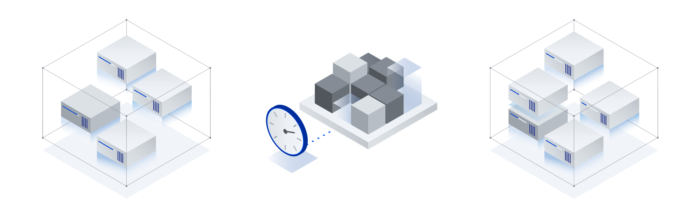

---

copyright:
  years: 2020, 2021 
lastupdated: "2021-06-30"

keywords: auto scale, autoscale, virtual server instance, creating, UI, console, instance group

subcollection: vpc


---

{:shortdesc: .shortdesc}
{:codeblock: .codeblock}
{:screen: .screen}
{:new_window: target="_blank"}
{:pre: .pre}
{:tip: .tip}
{:note: .note}
{:important: .important}
{:preview: .preview}
{:table: .aria-labeledby="caption"}
{:ui: .ph data-hd-interface='ui'} 
{:cli: .ph data-hd-interface='cli'} 

# Creating an instance group for auto scaling 
{: #creating-auto-scale-instance-group}

With Auto Scale for VPC you can create an instance group to scale according to your requirements. Based on the target utilization metrics that you define, the instance group can dynamically add or remove instances to achieve your specified instance availability. 
{:shortdesc}

## Auto scale for VPC
{: #auto-scale-vpc}

With Auto Scale for VPC, you can improve performance and costs by dynamically creating virtual server instances to meet the demands of your environment. You set scaling policies that define your desired average utilization for metrics like CPU, memory, and network usage. The policies that you define determine when virtual server instances are added or removed from your instance group. 

As an example, imagine that the fictitious company, Acme Web Retailer, has set up an instance group for auto scaling. They  define that they always want to maintain a minimum of 3 instances and a maximum of 7 instances. They create a dynamic scaling policy for CPU usage with their desired average utilization for instances at 70%. They set an aggregation window of 10 minutes, so the instance group manager monitors each instance for 10 minutes before calculating the average utilization. If adjustments are needed to meet the target utilization across instances, the instance group manager provisions or reclaims more instances as needed.   

Auto scale uses the following computation to determine how many instances are running at any given time:

```
Σ(Current average utilization of each instance)/target utilization = membership count
```

If Acme Web Retailer has four virtual server instances running when the aggregation window elapses, the formula looks like this: *VSI1 + VSI2 + VSI3 + VSI4 / 70% = membership count*. CPU utilization for the four running instances is 80%, 70%, 65%, and 85%, so the following computation takes place:

```
80% + 70% + 65% + 85% / 70% = 4.29 
```

Based on this calculation, the instance group manager rounds **4.29** up to **5** and provisions another instance. Now Acme Web Retailer has a total of five instances and maintains their desired average CPU utilization across the instances in the group. 

{: caption="Figure 1. Auto scale instance group adds new instance" caption-side="bottom"}

When an instance group scales up to create an instance, a subnet is selected randomly from the subnets that are defined for the instance group. When an instance group scales down to remove instances, it uses a first in first out (FIFO) strategy. The oldest instances are deleted first. If at any time an instance in the instance group fails, it is replaced with a new, healthy instance.

You have the option to configure your instance group with a load balancer to balance incoming requests across instances. With a load balancer you can configure specific health checks for the pool members that are associated with instances in your instance group. If an instance fails health checks, a new instance is created in the instance group to replace the failed membership. When the new instance is available, the instance that failed health checks is deleted. 

The monitoring service reflects the same health information for instances that health checks access.

## Setting up auto scale with the UI
{: #setting-up-autoscale-overview}
{: ui}

Before you can create an instance group, you need to [create an {{site.data.keyword.vpc_short}}](/docs/vpc?topic=vpc-creating-a-vpc-using-the-ibm-cloud-console).
{:important}

To create an instance group for auto scale, you must complete the following tasks:
1. Create an instance template that is used to provision instances in your group.
2. Create an instance group in a single region that is made up of like virtual server instances. 
3. Choose a scaling method (static or dynamic) and create scaling policies. 

### Creating an instance template
{: #creating-instance-template}

An instance template is required before you can create an instance group for auto scaling. The instance template defines the 
details of the virtual server instances that are created for your instance group. For example, specify the profile (vCPU and 
memory), image, attached volumes, and network interfaces for the image template. All of the virtual server instances that are 
created for an instance group use the instance template that is defined in the instance group.

All resources that are defined in an instance template must all be in the same resource group as the instance group.
{: tip}

To create an instance template, complete the following steps.
1. In the [{{site.data.keyword.cloud_notm}} console ](https://{DomainName}/vpc-ext), go to **Menu icon  > VPC Infrastructure > Auto scale > Instance templates**. 
2. Click **New instance template** and enter the information in Table 1.
3. Click **Create instance template** when the information is complete.

| Field | Value |
|-------|-------|
| Name  | A name is required for your virtual server instance. |
| Virtual private cloud | Specify the IBM Cloud VPC where you want to create your instance. |
| Resource group | Select a resource group for the instance. | 
| Tags |  You can assign a label to this resource so that you can easily filter resources in your resource list. | 
| Location | Locations are composed of regions (specific geographic areas) and zones (fault tolerant data centers within a region). Select the location where you want your virtual server instance to be created. |
| Placement group | Select a placement group for the instance. If you add a placement group, the instance is placed according to the placement group strategy. For more information, see [About placement groups](/docs/vpc?topic=vpc-about-placement-groups-for-vpc). |
| Image | All images use cloud-init, which allows you to enter user metadata associated with the instance for post provisioning scripts. |
| Profile |  Select from popular profiles or all available vCPU and RAM combinations. The profile families are Balanced, Compute, and Memory. For more information, see [Profiles](/docs/vpc?topic=vpc-profiles). |
| SSH Key | You must select an existing SSH key or upload a new SSH key to use before you can create the instance. SSH keys are used to securely connect to the instance after it's running.<br />**Note:** Alpha-numeric combinations are limited to 100 characters.<br />For more information, see [SSH keys](/docs/vpc?topic=vpc-ssh-keys). |
| User data | You can add user data that automatically performs common configuration tasks or runs scripts. For more information, see [User data](/docs/vpc?topic=vpc-user-data). |
| Boot volume | The default boot volume size for all profiles is 100 GB. |
| Data volumes | Data volumes are not supported for instance groups, so if you plan to use this instance template with an instance group do not include data volumes. Otherwise, you can add one or more secondary data volumes to be included when you provision the instance. To add volumes, click **New volume**. |
| Network interfaces | Defines the networking connection into the IBM Cloud VPC.  |
{: caption="Table 1. Instance template selections" caption-side="top"}

**Important:** Instance groups do not support instance templates that have the following configurations:
- Secondary network interfaces are not supported. Only one, primary network interface for an instance template is supported in an instance group.
- A primary IP address or floating IP addresses assigned to the primary interface is not supported.
- Attached data volumes are not supported.

When you create an instance template, validation steps are performed to ensure that you can use this template to provision a virtual server instance. 
{: tip}

### Creating an instance group
{: #creating-instance-group}

An instance group is a collection of like virtual server instances. You define how many instances to maintain in the group. 
You can set a static number of instances or choose to dynamically scale instances according to your requirements.

If you want to include a load balancer for your instance group to balance incoming requests across instances and configure specific health checks, you must create the load balancer before you create the instance group. For more information, see [About application load balancers](/docs/vpc?topic=vpc-load-balancers) and [Creating an IBM Cloud Application Load Balancer for VPC](/docs/vpc?topic=vpc-load-balancer). For more information about health checks for load balancer pools, see [Working with health checks](/docs/vpc?topic=vpc-alb-health-checks).
{:important}

1. Make sure that you have the required IBM {{site.data.keyword.iamshort}} (IAM) permissions to create an instance group. For more information, see [Required permissions for VPC resources](/docs/vpc?topic=vpc-resource-authorizations-required-for-api-and-cli-calls). 
2. In the [{{site.data.keyword.cloud_notm}} console ](https://{DomainName}/vpc-ext), go to **Menu icon  > VPC Infrastructure > Auto scale > Instance groups**.
3. Click **New instance group** and enter the information in Table 2. 
4. If you want to create dynamic scaling policies as part of instance group creation, for more information, see [Creating scaling policies](#creating-scaling-policies). You can also [add policies later](/docs/vpc?topic=vpc-managing-instance-group#creating-target-policies), after you create your instance group. 
5. Click **Create instance group** when the information is complete.

| Field | Value |
|-------|-------|
| Name  | A name is required for your virtual server instance. |
| Resource group | Select a resource group for the instance. |
| Region | Select the location where you want your virtual server instance to be created. |
| Placement group | Select a placement group for the instance. If you add a placement group, the instance is placed according the the placement group policy. For more information, see [About placement groups](/docs/vpc?topic=vpc-about-placement-groups-for-vpc). |
| Subnets | Select the subnets where you want to create your instance group. To maximize the availability of your applications, select subnets in different zones. For the best performance of an auto scale instance group, ensure that you use a subnet size of 32 or greater. |
| Use a load balancer | Select this checkbox if you plan to use a load balancer to balance incoming requests across instances in your instance group. The load balancer must already be configured, attached to the subnets that you select for this instance group, and have at least one back-end pool. |
| Instance template |  Select the instance template that you want to use for provisioning the virtual server instances in your auto-scale instance group. All virtual server instances in the group are provisioned with the same instance template. |
| Scaling method | Select whether you want to use a dynamic or static scaling method. With the dynamic scaling method, instances are added or removed based on the metric targets that you specify. With the static scaling method, you can specify a fixed number of instances that you always want to maintain. |
| Instance group size | For a static group, enter the number of instances that you want to constantly have in this instance group. For a dynamic group, enter the minimum and maximum number of instances for your group. The number of instances will scale automatically within that range based on the target metrics that you define. |
| Aggregation window (seconds) | For a dynamic group this value determines the time period that the instance group manager monitors each instance and determines the average utilization. |
| Cooldown period (seconds) | For a dynamic group, the period of time in seconds to pause further scaling actions after scaling has taken place. |
{: caption="Table 2. Instance group selections" caption-side="top"}

### Creating scaling policies
{: #creating-scaling-policies}

For the dynamic scaling method, you define certain metrics (like CPU utilization percent) and the desired target utilization for that metric. Together, the metric and the average target utilization, determine when your instance group should dynamically add or remove virtual server instances from your group. 

To add scaling policies, complete the following fields on the **New instance group for VPC** page. If you need to add policies after your instance group is already created, see [add policies](/docs/vpc?topic=vpc-managing-instance-group#creating-target-policies).

| Field | Value |
|-------|-------|
| Metric type | Select the metric type that you want to associate with a target utilization value to use for adding or removing instances from your group. You can choose one of these metrics: CPU utilization (%), RAM utilization (%), Network in (Mbps), Network out (Mbps). You can define more than one target metric policy, but only one policy for each type of metric. |
| Average target utilization | Specify a desired average utilization for the metric that you select. This target value defines when the instance group manager should scale up instances or scale down instances in your group. At the end of each aggregation window, the instance group manager adds the current utilization of each instance and divides it by this target utilization value to determine the membership count. |
{: caption="Table 3. Scaling policies selections" caption-side="top"}

## Setting up auto scale with the CLI
{: #setting-up-autoscale-cli}
{: cli}

You can create an instance group in your {{site.data.keyword.vpc_short}} to auto scale according to your requirements by using the {{site.data.keyword.cloud_notm}} CLI.

### Before you begin
{: #before-cli-tutorial}

Make sure that you set up your [{{site.data.keyword.cloud}} CLI environment](/docs/vpc?topic=vpc-set-up-environment#cli-prerequisites-setup) and your [{{site.data.keyword.vpc_short}}](/docs/vpc?topic=vpc-creating-a-vpc-using-cli).
{:important}

To create an auto scale instance group using the CLI, you must complete the following tasks:

1. Make sure that you have the required IBM {{site.data.keyword.iamshort}} (IAM) permissions to create instance group resources. For more information, see [Required permissions for VPC resources](/docs/vpc?topic=vpc-resource-authorizations-required-for-api-and-cli-calls). 
2. Create an instance template that is used to provision instances in your group.
3. Create an instance group in a single region that is made up of like virtual server instances. 
4. Create an instance group manager so that you can apply your scaling policies.
5. Create scaling policies to dynamically add or remove instances from your group based on the target utilization metrics that you define. 

### Creating an instance template
{: #creating-instance-template-cli}

All resources that are defined in an instance template must all be in the same resource group as the instance group.
{: tip}

#### Gathering information to create an instance template
{: #cli-command-options-instance-template-create}

Ready to create an instance template? Before you can run the `ibmcloud is instance-template-create` command, you need to know the details about your instance template and command options, such as what profile or image you want to use. Follow these steps to prepare for running the command.

Gather the following required instance template details.

|    Instance template details   |       Listing command           |
| ----------------------------- | -------------------------------- |
| VPC | `ibmcloud is vpcs` |
| Zone | `ibmcloud is zones` |
| Profile | `ibmcloud is instance-profiles` |
| Subnet | `ibmcloud is subnets` |
| Image | `ibmcloud is images` |
{: caption="Table 1. Required instance template details" caption-side="top"}

Use the following commands to determine the required information for creating a new instance template.

1. List the {{site.data.keyword.vpc_short}}s that are associated with your account.
   ```
   ibmcloud is vpcs
   ```
   {:pre}

   For this example, you'd see a response similar to the following output:
   ```
   ID                                          Name                                  Default          Status      Tags
   0738-xxx1xx23-4xx5-6789-12x3-456xx7xx123x   my-vpc                                yes              available   -
   0738-xxxx1234-5678-9x12-x34x-567x8912x3xx   my-other-vpc                          no               available   -
   ```
   {:screen}

   If you don't have one available, you can create an {{site.data.keyword.vpc_short}} by using the `ibmcloud is vpc-create` command. For more information about creating an {{site.data.keyword.vpc_short}}, see [IBM Cloud VPC CLI reference](/docs/vpc?topic=vpc-infrastructure-cli-plugin-vpc-reference#vpcs).

2. List the regions associated with your account.
   ```
   ibmcloud is regions
   ```
   {:pre}

   For this example, you'd see a response similar to the following output:
   ```
   Name       Endpoint               Status   
   us-south   /v1/regions/us-south   available
   ```
   {:screen}

3. List the zones associated with the region.
   ```
   ibmcloud is zones us-south
   ```
   {:pre}

   For this example, you'd see a response similar to the following output:
   ```
   Name         Region     Status   
   us-south-1   us-south   available   
   us-south-3   us-south   available   
   ```
   {:screen}

4. List the available profiles for creating your instance template.
   ```
   ibmcloud is instance-profiles
   ```
   {:pre}

   For this example, you'd see a response similar to the following output:
   ```
   Name           Architecture   Family     vCPUs   Memory(G)   Network Performance (Gbps)   GPUs   
   bx2-2x8        amd64          balanced   2       8           4                            -   
   bx2-4x16       amd64          balanced   4       16          8                            -   
   bx2-8x32       amd64          balanced   8       32          16                           -   
   bx2-16x64      amd64          balanced   16      64          32                           -   
   bx2-32x128     amd64          balanced   32      128         64                           -   
   bx2-48x192     amd64          balanced   48      192         80                           -   
   cx2-2x4        amd64          compute    2       4           4                            -   
   cx2-4x8        amd64          compute    4       8           8                            -   
   cx2-8x16       amd64          compute    8       16          16                           -   
   cx2-16x32      amd64          compute    16      32          32                           -   
   cx2-32x64      amd64          compute    32      64          64                           -   
   mx2-2x16       amd64          memory     2       16          4                            -   
   mx2-4x32       amd64          memory     4       32          8                            -   
   mx2-8x64       amd64          memory     8       64          16                           -  
   ```
   {:screen}

5. List the subnets that are associated with the {{site.data.keyword.vpc_short}}.
   ```
   ibmcloud is subnets
   ```
   {:pre}

   For this example, you'd see a response similar to the following output:
   ```
   ID                                          Name                     Status
   0076-2249dabc-8c71-4a54-bxy7-953701ca3999   subnet1                  available
   0767-173bn4aa-060b-47e7-am45-b3395a593897   subnet2                  available
   ```
   {:screen}
   
   For the best performance of an auto scale instance group, ensure that you use a subnet size of 32 or greater.

   If you don't have one available, you can create a subnet by using the `ibmcloud is subnet-create` command. For more information about creating a subnet, see [IBM Cloud VPC CLI reference](/docs/vpc?topic=vpc-infrastructure-cli-plugin-vpc-reference#subnets).

6. List the available images for creating your instance template.
   ```
   ibmcloud is images   
   ```
   {:pre}

   For this example, you'd see a response similar to the following output:
   ```
   ID                                          Name                                               Status       Arch
   r007-60d279a0-b328-40eb-a379-595ca53bff89   ibm-redhat-7-6-amd64-sap-hana-1                    available    amd64
   r008-54e9238a-feaa-4f90-9742-7424cb2b9ff1   ibm-windows-server-2016-full-standard-amd64-3      available    amd64
    ```
   {:screen}


After you know these values, use them to run the `instance-template-create` command. In addition to the information that you gathered, you must specify a name for the instance. 

```
ibmcloud is instance-template-create INSTANCE_TEMPLATE_NAME VPC ZONE_NAME PROFILE_NAME SUBNET --image-id IMAGE_ID
```
{: pre}

For example, if you create an instance template that is called _my-instance-template_ in _us-south-1_ and use the _bx2-2x8_ profile, your `instance-template-create` command would look similar to the following sample.

```
ibmcloud is instance-template-create my-instance-template r134-680c56cb-7fbb-41e6-833b-029beb7b6ba3 us-south-3 bx2-2x8 0076-2249dabc-8c71-4a54-bxy7-953701ca3999 --image-id r008-54e9238a-feaa-4f90-9742-7424cb2b9ff1
```
{: pre}

Where:
   - `INSTANCE_TEMPLATE_NAME` is _my-instance-template_
   - `VPC` is _r134-680c56cb-7fbb-41e6-833b-029beb7b6ba3_
   - `ZONE_NAME` is _us-south-3_
   - `PROFILE_NAME` is _bx2-2x8_
   - `SUBNET_ID` is _0076-2249dabc-8c71-4a54-bxy7-953701ca3999_
   - `--image_ID` is _r008-54e9238a-feaa-4f90-9742-7424cb2b9ff1_
   

For this example, you'd see a response similar to the following output **Note:** The following response varies depending on what values you use.

```
ID                             0738-c3809e5b-8d48-4629-b258-33d5b14fa84f   
Name                           my-instance-template   
CRN                            crn:v1:staging:public:is:us-south-3:a/2d1bace7b46e4815a81e52c6ffeba5cf::instance-template:0738-c3809e5b-8d48-4629-b258-33d5b14fa84f   
Resource group                 Default   
VPC ID                         r134-680c56cb-7fbb-41e6-833b-029beb7b6ba3   
Image ID                       r008-54e9238a-feaa-4f90-9742-7424cb2b9ff1   
Profile                        bx2-2x8   
Primary Network Interface ID   Name      Subnet ID                                   Security Groups      
                               primary   0076-2249dabc-8c71-4a54-bxy7-953701ca3999   r134-9fd0b586-6876-4e8a-a0a1-586aeff5167c
```
{:screen}

For more examples of the `ibmcloud is instance-template-create` command, see the [VPC CLI reference](/docs/vpc?topic=vpc-infrastructure-cli-plugin-vpc-reference#instance-template-create).

When you create an instance template, validation steps are performed that ensure you can use your template to provision a virtual server instance. Need more help? You can always run `ibmcloud is help instance-template-create` to display help for creating an instance template.
{: tip}

### Creating an instance group
{: #creating-instance-group-cli}

Once you have your instance template in hand, your next step is to create an instance group. Before you can run the `instance-group-create` command, you must specify a name for the instance group and determine values for the command options, such as what instance template you want to use.  

If you want to include a load balancer for your instance group to balance incoming requests across instances and configure specific health checks, you must create the load balancer before you create the instance group. For more information, see [About application load balancers](/docs/vpc?topic=vpc-load-balancers) and [Creating an IBM Cloud Application Load Balancer for VPC](/docs/vpc?topic=vpc-load-balancer). For more information about health checks for load balancer pools, see [Working with health checks](/docs/vpc?topic=vpc-alb-health-checks).
{:important}

Gather the following information.

|    Instance group details  |       Description                |
| ---------------------- --- | -------------------------------- |
| Instance template | ID of the instance template that you created in the previous task |
| Subnet IDs | Comma separated IDs of subnets that you must select from the `ibmcloud is subnets` command in the previous task |
| --membership-count | Number of members in the instance group |
{: caption="Table 2. Required instance group details" caption-side="top"}

After you know these values, use them to run the `instance-group-create` command. In addition to the information that you gathered, you must specify a name for the instance group. 

```
ibmcloud is instance-group-create INSTANCE_GROUP_NAME --instance-template INSTANCE_TEMPLATE --subnet-ids IDS --membership-count MEMBERS
```
{: pre}

For example, if you create an instance group that is called _my-instance-group_ with instance template ID _72251a2e-d6c5-42b4-97b0-b5f8e8d1f479_ and _1_ member intially, your `instance-group-create` command would look similar to the following sample.

```
ibmcloud is instance-group-create my-instance-group --instance-template 72251a2e-d6c5-42b4-97b0-b5f8e8d1f479 --subnet-ids 0076-2249dabc-8c71-4a54-bxy7-953701ca3999,0767-173bn4aa-060b-47e7-am45-b3395a593897 --membership-count 1
```
{: pre}

Where:
   - `INSTANCE_GROUP_NAME` is _my-instance-group_
   - `--instance-template` is _72251a2e-d6c5-42b4-97b0-b5f8e8d1f479_
   - `--subnet IDs` are _0076-2249dabc-8c71-4a54-bxy7-953701ca3999_ and _0767-173bn4aa-060b-47e7-am45-b3395a593897_
   - `--membership-count is 1 initially

For this example, you'd see a response similar to the following output:

```
ID                  r134-4f7d0010-33f5-40bf-9f21-ab5bee04fd71   
Name                my-instance-group   
Status              healthy   
Instances           1
Instance Template   72251a2e-d6c5-42b4-97b0-b5f8e8d1f479   
Subnets             Name       Subnet ID      
                    subnet-1   0076-2249dabc-8c71-4a54-bxy7-953701ca3999
                    subnet-2   0767-173bn4aa-060b-47e7-am45-b3395a593897
                       
Resource group      ID                                 Name      
                    11caaa983d9c4beb82690daab08717e9   Default      
```
{:screen}

For more examples of the `ibmcloud is instance-group-create` command, see the [VPC CLI reference](/docs/vpc?topic=vpc-infrastructure-cli-plugin-vpc-reference#instance-group-create).

Need more help? You can always run `ibmcloud is instance-group-create --help` to display help for creating an instance group.
{: tip}

### Creating an instance group manager
{: #creating-instance-group-manager-cli}

Now you can create an instance group manager so that you can apply your scaling policies in the next and final task.  Before you can run the `ibmcloud is instance-group-manager-create` command, you need to determine values for the command options, such as what instance group you want to manage.  

Gather the following information.

|    Instance group manager option  |       Description                |
| --------------------------------- | -------------------------------- |
| INSTANCE_GROUP | ID of the instance group you created in the previous task |
| --max-members | The maximum number of members in a managed instance group; range 1 to 100 |
{: caption="Table 3. Required instance group manager details" caption-side="top"}


After you know these values, use them to run the `instance-group-manager-create` command.

```
ibmcloud is instance-group-manager-create INSTANCE_GROUP --max-members MAX_MEMBERS
```
{: pre}

For example, if you create an instance group manager with instance group ID _72251a2e-d6c5-42b4-97b0-b5f8e8d1f479_ and options --max-members = _20_, your `instance-group-manager-create` command would look similar to the following sample.

```
ibmcloud is instance-group-manager-create 72251a2e-d6c5-42b4-97b0-b5f8e8d1f479 --max-members 20
```
{: pre}

Where:
   - `INSTANCE_GROUP` is _72251a2e-d6c5-42b4-97b0-b5f8e8d1f479_
   - `--max-members` is _20_

For this example, you'd see a response similar to the following output:

```
ID                     r134-bcf54494-f63a-41a7-8368-9f7d002c9020   
Status                 enabled  
Max Membership Count   20   
```
{:screen}

For more examples of the `ibmcloud is instance-group-manager-create` command, see the [VPC CLI reference](/docs/vpc?topic=vpc-infrastructure-cli-plugin-vpc-reference#instance-group-manager-create). 

Need more help? You can always run `ibmcloud is instance-group-manager-create --help` to display help for creating an instance group manager.
{: tip}

### Creating scaling policies
{: #creating-scaling-policies-cli}

Now you're ready to take full advantage of autoscaling! For the dynamic scaling method, you define certain metrics like CPU utilization percent and your desired target utilization for that metric. Together, the metric and the average target utilization determine when your instance group should dynamically add or remove virtual server instances from your group. This target value defines when the auto scale manager should scale up instances or scale down instances in your group. At the end of each aggregation window, the auto scale manager adds the current utilization of each instance and divides it by the target utilization value that you specify to determine the membership count.

Before you can run the `group-manager-policy-create` command, you need to specify an instance group and a group manager, then specify values for the metric type and the average target utilization.

Gather the following information.

|    Instance group manager policy option  |       Description                |
| ---------------------------------------- | -------------------------------- |
| INSTANCE_GROUP | ID of the instance group | 
| MANAGER | ID of the manager |
| --metric-type | The type of metric to be evaluated:  cpu (utilization percent), memory (utilization percent), network_in (Mbps), network_out (Mbps) |
| --metric-value | The metric target value to be evaluated |
{: caption="Table 4. Required instance group manager policy details" caption-side="top"}

Use the following commands to determine the required information for creating a new instance template.

1. List the available instance groups for creating your scaling policy.
   ```
   ibmcloud is instance-groups   
   ```
   {:pre}

   For this example, you'd see a response similar to the following output:
   ```
   ID                                          Name                     Status           Instances
   72251a2e-d6c5-42b4-97b0-b5f8e8d1f479        my-instance-group        healthy          1
   72271a2e-d6c7-64b6-99c7-ac7426ew3495        my-other-instance-group  healthy          1

   ```
   {:screen}

2. List the available instance groups managers for creating your scaling policy.
   ```
   ibmcloud is instance-group-managers 72251a2e-d6c5-42b4-97b0-b5f8e8d1f479
   ```
   {:pre}

   Where:
   - `INSTANCE_GROUP` is _2251a2e-d6c5-42b4-97b0-b5f8e8d1f479_

   For this example, you'd see a response similar to the following output:

   ```
   ID                                          Status    Aggregation Window   Cooldown   Max Membership Count   Min Membership Count   
   72b27b5c-f4b0-48bb-b954-5becc7c1dcb3        enabled   90                   300        20                     1   

   ```
   {:screen}

After you know these values, run the following command to create a scaling policy.

```
ibmcloud is instance-group-manager-policy-create INSTANCE_GROUP MANAGER --metric-type METRIC_TYPE --metric-value METRIC_VALUE
```
{: pre}

For example, if you create a scaling policy with instance group ID _72251a2e-d6c5-42b4-97b0-b5f8e8d1f479_ and manager ID _72b27b5c-f4b0-48bb-b954-5becc7c1dcb3_ with options --metric-type _cpu_ and --metric-value = _50_, your `ibmcloud is instance-group-manager-policy-create` command would look similar to the following sample.

```
ibmcloud is instance-group-manager-policy-create 2251a2e-d6c5-42b4-97b0-b5f8e8d1f479 72b27b5c-f4b0-48bb-b954-5becc7c1dcb3 --metric-type cpu --metric-value 50
```
{: pre}

Where:
   - `INSTANCE_GROUP` is _2251a2e-d6c5-42b4-97b0-b5f8e8d1f479_
   - `MANAGER` is _72b27b5c-f4b0-48bb-b954-5becc7c1dcb3_
   - `--metric-type` is _cpu_
   - `--metric-value` is _50_

For this example, you'd see a response similar to the following output:

```
ID             r134-5f5c1127-da5c-4c7a-a8ae-9a539b56fa56   
Metric Type    cpu   
Metric Value   50   
Policy Type    target  
 
```
{:screen}

The response indicates that the auto scale manager should scale up the number of instances in your group when the average CPU utilization reaches 50 percent. Likewise, the auto scale maanger will also scale down the number of instances in your group when the average CPU utilization drops below 50 percent. 

For more examples of the `ibmcloud is instance-group-manager-policy-create` command, see the [VPC CLI reference](/docs/vpc?topic=vpc-infrastructure-cli-plugin-vpc-reference#instance-group-manager-policy-create).

You can define more than one target metric policy, but only one policy for each type of metric. Need more help? You can always run `ibmcloud is instance-group-manager-policy-create --help` to display help for creating a scaling policy.
{: tip}
