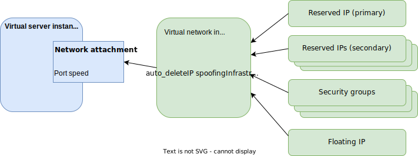

---

copyright:
  years: 2018, 2025
lastupdated: "2024-02-29"

keywords:

subcollection: vpc

---

{{site.data.keyword.attribute-definition-list}}

# Managing network interfaces
{: #using-instance-vnics}

After you create a virtual server instance, you can add two styles of new network interfaces (child network interfaces and virtual network interfaces) or edit the interfaces that are already associated with the instance. When you edit a network interface, you can change its name, associate or unassociate a floating IP address, or access the security group that is associated with an interface.
{: shortdesc}

## About network interfaces
{: #about-network-interfaces}

A network interface connects a virtual server instance to a network. When you create a virtual server instance, you can use network interfaces to assign multiple IP addresses.

The following list highlights how network interfaces work with your instance.

* You can create and assign multiple network interfaces for each virtual server instance. The number of network interfaces that you can assign to a virtual server instance depends on the vCPU count that is included in the [profile](/docs/vpc?topic=vpc-profiles) that is used to provision an instance.
   * 2 - 16 vCPUs: Up to five network interfaces
   * 17 - 48 vCPUs: Up to 10 network interfaces
   * 49 or more vCPUs: Up to 15 network interfaces
* You can attach each network interface to a different subnet in the same zone.
* Each network is assigned a unique and immutable Media Access Control (MAC) address and receives a private IP address from the subnet range.
* You can attach one floating IP address to each network interface on the virtual server instance. In the data path, network address translation (NAT) is applied between the floating IP address and the primary IP address of the network interface.
* By default the primary interface is `eth0` in {{site.data.keyword.cloud_notm}} console. Secondary interfaces are by default, `eth1`, `eth2`, and so on.
* You can assign security groups to each network interface.
* You can change the name of any existing network interface.

Bandwidth is distributed across the network interfaces that are attached to the virtual server instance. For more information, see [Bandwidth allocation](/docs/vpc?topic=vpc-profiles&interface=ui#bandwidth-allocation).

If you assign a new network interface to a virtual server instance while it is running, you must configure the network interface for the instance to use. You can either stop and then restart the instance, or you can manually configure the interface in the guest operating system. For example, on a Linux-based operating system, you can use the `ip link set dev <interface> up` to retrieve the IP address configuration for the interface.
{: note}

## Adding or editing network interfaces
{: #editing-network-interfaces}
{: ui}

To add or edit the network interfaces associated with your virtual server instances, complete the following steps.
1. In the {{site.data.keyword.cloud_notm}} console, go to **Navigation Menu** icon  **> Infrastructure**  **> Compute > Virtual server instances**.
2. Click the name of a virtual server instance that includes the network interface that you want to edit. Or you can add a network interface to the virtual server instance.
3. On the Instance details page, find the **Network interfaces** section.
4. For specific steps for adding a floating IP address or adding a network interface, see the following sections.

### Adding a floating IP address
{: #adding-floating-ip}

If you want to add a floating IP address to a network interface to allow traffic from the internet to access your virtual server instance, complete the following steps.

1. If you are adding a floating IP address to the virtual server instance for the first time, identify a network interface in the **Network interfaces** section of the **Instance details** page. Typically, the instance's primary network interface is used for attaching a floating IP. By default, the first interface is named `eth0` in the guest operating system. Initially associating the floating IP address with the primary network interface helps establish the data path. Later, you can associate the floating IP to a different network interface on the instance, or associate separate floating IPs to secondary network interfaces.
2. Click the **Edit icon**  to edit the primary network interface.
3. On the **Edit network interface** page, locate the **Floating IP address** field. You can select **Reserve a new floating IP** or you can select an existing floating IP address.
4. After you make your selection, click **Save**.

### Adding a network interface
{: #add-network-interface}

You can add up to 15 network interfaces to your virtual server instance, depending on the vCPU count that is included in the instance profile. A network interface establishes a unique IP address,
giving the option of multiple IP address for your virtual server instance. Before you begin adding an interface, make sure that
you created a unique subnet to associate with the new network interface. Each network interface must be on a different subnet within
the same zone.

To add a network interface to your virtual server instance, complete the following steps.

1. In the **Network interfaces** section of the **Instance details** page, click **New interface**.
2. On the **New network interface** page, the interface name defaults to an incremented number. If this instance is the first new interface after your primary interface, the default name is `eth1`. You can change the name if you want.
3. Select a unique subnet from the subnets that are assigned to your existing network interfaces.
4. Select the security group that you want to associate with the network interface.
5. Click **Create**.
6. If your virtual server instance was running when you added the network interface, you must configure the network interface for the instance. You can either stop and then restart the instance, or you can manually configure the interface in the guest operating system. For example, on a Linux-based operating system, you can use the `ip link set dev <interface> up` to retrieve the IP address configuration for the interface.

### Adding a virtual network interface
{: #add-virtual-network-interface}

You can create a virtual network interface without attaching it to a target. The virtual network interface can exist even when its target is removed. For more information, see [Working with virtual network interfaces](/docs/vpc?topic=vpc-vni-create&interface=ui).

Virtual network interfaces can be attached to new virtual server instances, and cannot be added to existing virtual server instances with child network interfaces.
{: note}

{: caption="Diagram of a virtual server instance with a network attachment connected to a virtual network interface" caption-side="bottom"}

1. In the {{site.data.keyword.cloud_notm}} console, go to **Navigation Menu** icon  **> Infrastructure**  **> Compute > Virtual server instances**.
1. Click **Create** to begin creating a new virtual server instance capable of using a virtual network interface.
1. In the **Networking** section, select whether to create one of the following:
   * **Network attachment with a virtual network interface**: a network interface that has additional features, such as secondary IP addresses and a lifecycle separate from the virtual server instance you are creating.
   * **Instance network interface**: a child network interface.

## Configuring a virtual server instance with multiple interfaces
{: #configure-multiple-interfaces}
{: ui}

Sometimes virtual servers instances communicate with other instances through multiple network interfaces, for example, to use different subnets for different communication purposes. You might want one subnet for data communication and another subnet for control communication. Because a virtual server instance is configured with a single default route that is associated with the primary network interface, communication on other interfaces might not work initially. (IP spoofing checks for security purposes can also prevent the communication flow on nonprimary network interfaces.)

You can establish communication for a secondary network interface by using one of the following options. These examples are for a Linux platform such as `Ubuntu`.

* Add a static route for the second subnet.
* Add a separate routing table for the second subnet.

The routing tables for virtual server instances are generated by default when an instance is provisioned. Modifying the generated routing table is a nontrivial task. If you need to modify the routing table of a virtual server instance, when you provision the instance you can include user-data to describe and reconfigure the instance's routing table. Another option is to use a custom image to provision an instance and control what is created for multiple network interfaces. When you use the default images to provision instances, the network configuration is created for you. You have limited control of what is generated.
{: important}

The following sections describe these solutions in more detail.

Example virtual server setup:

* Two virtual servers (`Virtual-server-1` and `Virtual-server-2`) where both virtual servers belong to the same VPC.
* Each virtual server has two interfaces from two subnets:
   * _Virtual-server-1_ has interface `eth0` from `net_1_0`, and interface `eth1` from `net_1_1`.
   * _Virtual-server-2_ has interface `eth0` from `net_2_0`, and interface `eth1` from `net_2_1`.
* Each virtual server's `net_*_0` is set up with a default route.
* Each subnet's gateway IP and CIDR are known.

   Alphabetic names are used here. The real gateway ID would be similar to `192.168.100.1`, the CIDR `192.168.100.0/24`, and the IP address `192.168.100.6`.
   {: note}

| Subnet | Gateway IP | Subnet CIDR | Interface IP |
| --- | --- | --- | --- |
| `net_1_0` | `gw_ip_1_0` | `cidr_1_0` | `ip_1_0` |
| `net_1_1` | `gw_ip_1_1` | `cidr_1_1` | `ip_1_1` |
| `net_2_0` | `gw_ip_2_0` | `cidr_2_0` | `ip_2_0` |
| `net_2_1` | `gw_ip_2_1` | `cidr_2_1` | `ip_2_1` |
{: caption="Example of a virtual server instance with multiple interfaces" caption-side="bottom"}

### Adding a static route for the second interface
{: #adding-static-route-second-interface}

This solution makes one subnet the default gateway (automatically by virtual server instance creation), and adds a static route for the second subnet:

* On `Virtual-server-1`:

   ```sh
   ip route add cidr_2_1 via gw_ip_1_1 dev eth1
   ```
   {: pre}

* On `Virtual-server-2`:

   ```sh
   ip route add cidr_1_1 via gw_ip_2_1 dev eth1
   ```
   {: pre}

### Adding a separate routing table for the second interface
{: #adding-route-table-second-interface}

* On `Virtual-server-1`:

```sh
   echo 201 eth1tab >> /etc/iproute2/rt_tables
   ip route add cidr_1_1 dev eth1 proto kernel scope link src ip_1_1 table eth1tab
   ip route add default via gw_1_1 dev eth1 table eth1tab
```
{: codeblock}

* On `Virtual-server-2`:

```sh
echo 201 eth1tab >> /etc/iproute2/rt_tables
ip route add cidr_2_1 dev eth1 proto kernel scope link src ip_2_1 table eth1tab
ip route add default via gw_2_1 dev eth1 table eth1tab
ip rule add from ip_2_1 table eth1tab
```
{: codeblock}

Though this approach is a bit more complicated than adding a static route, it provides a way to customize routing policies for different interfaces.


## Creating a virtual network interface from the CLI
{: #create-virtual-network-interface-cli}
{: cli}

Virtual network interfaces can be attached to new virtual server instances, and cannot be added to existing virtual server instances with child network interfaces.
{: note}

You can create a virtual network interface by using the command-line interface (CLI). For more information about capabilities, planning considerations, getting started, and use cases, see [About virtual network interfaces](/docs/vpc?topic=vpc-vni-about).

To create a virtual network interface by using the CLI, use the **ibmcloud is virtual-network-interface-create** command.

```sh
ibmcloud is virtual-network-interface-create [--name NAME] [--allow-ip-spoofing false | true] [--auto-delete false | true] [--enable-infrastructure-nat false | true] [[--rip RIP | [--rip-address RIP_ADDRESS --rip-auto-delete RIP_AUTO_DELETE --rip-name RIP_NAME]]] [--subnet SUBNET] [--ips RESERVED_IPS_JSON | @RESERVED_IPS_JSON_FILE] [--sgs SGS] [--resource-group-id RESOURCE_GROUP_ID | --resource-group-name RESOURCE_GROUP_NAME] [--vpc VPC] [--output JSON] [-q, --quiet]
```
{: pre}

The following example creates a virtual network interface that is based off of the settings of the reserved IP. The virtual network interface name is `cli-vni-1`. The ID of the reserved IP address is `7208-d4c0abbe-3fc2-4696-9fe1-4eb3dc9af976`. The ID of the primary reserved IP address is `7208-d83b7e58-3c3d-47d0-89c5-02d9a20c72fd`. The secondary reserved IP addresses is `10.240.64.13`. The security group IDs to associate with the virtual network interface are `r134-aa7c7658-e503-4456-b342-8d6a89e05115` and `r134-4fb388f1-2b6e-4013-b279-7a8748f4d6ca`. The ID for the resource group where the virtual network interface is created is `11caaa983d9c4beb82690daab08717e9`.

```sh
ibmcloud is virtual-network-interface-create --name cli-vni-1 --allow-ip-spoofing true --auto-delete false --enable-infrastructure-nat true --rip 7208-d4c0abbe-3fc2-4696-9fe1-4eb3dc9af976  --ips '[{"id":"7208-d83b7e58-3c3d-47d0-89c5-02d9a20c72fd"},{"address":"10.240.64.13", "auto_delete": false, "name": "srip2"}]' --sgs r134-aa7c7658-e503-4456-b342-8d6a89e05115,r134-4fb388f1-2b6e-4013-b279-7a8748f4d6ca --resource-group-id 11caaa983d9c4beb82690daab08717e9
```
{: pre}

For more information, see [ibmcloud is virtual-network-interface-create](/docs/vpc?topic=vpc-vpc-reference#virtual-network-interface-create) in the VPC CLI reference page.

## Creating a virtual server with an existing virtual network interface
{: #create-vsi-vni-cli}
{: cli}

You can create a virtual server instance that uses an existing virtual network interface by using the command-line interface (CLI).

To create a virtual server instance with an existing virtual network interface by using the CLI, use the **ibmcloud is instance-create** command.

The following example creates a virtual server that includes an existing virtual network interface. The virtual server name is `my-instance-name`. The ID of the VPC is `72b27b5c-f4b0-48bb-b954-5becc7c1dcb8`. The zone name is `us-south-1`. The profile for the virtual server is `bx2-2x8`. The subnet is `72b27b5c-f4b0-48bb-b954-5becc7c1dcb8`.  The primary network attachment name is `cli-pnac-1`. The ID of the virtual network interface that is associated with the primary network interface is `7322-1293a27a-7178-4e62-ba5b-272623c989aa`. The network attachment configuration includes the name `instance-snac-1` and the virtual network interface ID `02h7-56705448-c9d9-43dc-aa11-20d42333cd87`. The image ID for the virtual server is `r123-72b27b5c-f4b0-48bb-b954-5becc7c1dcb8`.

```sh
ibmcloud is instance-create my-instance-name 72b27b5c-f4b0-48bb-b954-5becc7c1dcb8 us-south-1 bx2-2x8 72b27b5c-f4b0-48bb-b954-5becc7c1dcb8 --pnac-name cli-pnac-1 --pnac-vni 7322-1293a27a-7178-4e62-ba5b-272623c989aa --network-attachments [{"name": "instance-snac-1","virtual_network_interface": {"id":"02h7-56705448-c9d9-43dc-aa11-20d42333cd87"}}] --image r123-72b27b5c-f4b0-48bb-b954-5becc7c1dcb8
```
{: pre}

For more information, see [ibmcloud is instance-create](/docs/vpc?topic=vpc-vpc-reference#instance-create) in the VPC CLI reference page.

## Creating a virtual network interface with the API
{: #create-virtual-network-interface-api}
{: api}

Virtual network interfaces can be attached to new virtual server instances, and cannot be added to existing virtual server instances with child network interfaces.
{: note}

You can create a virtual network interface by using the API. For more information about capabilities, planning considerations, getting started, and use cases, see [About virtual network interfaces](/docs/vpc?topic=vpc-vni-about).

To create a virtual network interface with the API, follow these steps:

1. Set up your API environment [with the right variables](/docs/vpc?topic=vpc-set-up-environment#api-prerequisites-setup).
1. Store any additional variables to be used in the API commands; for example:

    * `version` (string): The API version, in format `YYYY-MM-DD`.

1. When all variables are initiated, create the virtual network interface. The following example includes sample information for the primary IP address, security groups, and subnet.

    ```sh
    curl -X POST \
    "$vpc_api_endpoint/v1/virtual_network_interfaces?version=$version&generation=2" \
    -H "Authorization: Bearer $iam_token"
    -d '{
          "name": "my-virtual-network-interface",
          "primary_ip": {
            "address": "10.0.0.5"
          },
          "security_groups": [
            {
              "id": "be5df5ca-12a0-494b-907e-aa6ec2bfa271"
            },
            {
              "id": "032e1387-71ba-4e83-b268-a53edf94af19"
            }
          ],
          "subnet": {
            "id": "032e1387-71ba-4e83-b268-a53edf94af19"
          }
    }'
    ```
    {: codeblock}

For more information, see [Create a virtual network interface](/apidocs/vpc/latest#create-virtual-network-interface).

If you want to attach the virtual network interface to a new virtual server instance, see [Create an instance](/apidocs/vpc/latest#create-instance).


## Creating a virtual network interface with Terraform
{: #create-virtual-network-interface-tf}
{: terraform}

Virtual network interfaces can be attached to new virtual server instances, and cannot be added to existing virtual server instances with child network interfaces.
{: note}

For more information about capabilities, planning considerations, getting started, and use cases, see [About virtual network interfaces](/docs/vpc?topic=vpc-vni-about).

The following example creates a virtual network interface by using Terraform:

```terraform
resource "ibm_is_virtual_network_interface" "my_virtual_network_interface_instance" {
  allow_ip_spoofing = true
  auto_delete = false
  enable_infrastructure_nat = true
  name = "my-virtual-network-interface"
  subnet = ibm_is_subnet.my_subnet.id
}
```
{: codeblock}

For more information, see the [Terraform registry](https://registry.terraform.io/providers/IBM-Cloud/ibm/latest/docs/data-sources/is_virtual_network_interface){: external}.

If you want to attach the virtual network interface to a new virtual server instance, see the [Terraform registry](https://registry.terraform.io/providers/IBM-Cloud/ibm/latest/docs/resources/is_instance){: external}.
